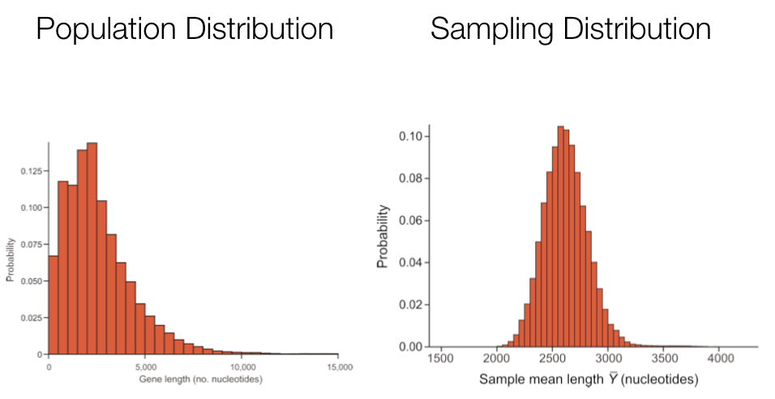
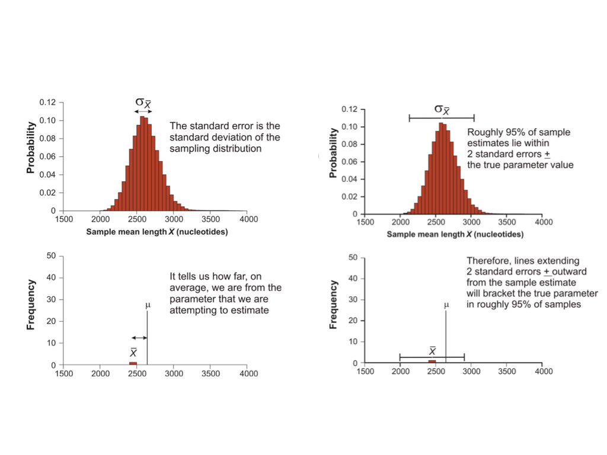

# Parameter Estimation Basics and the Sampling Process

## Background

A major goal of statistics is to estimate **parameters**, or features, of a population so that we can compare them to values that are of practical importance to our understanding of the system, or to compare parameter estimates between and among different populations. We may want to know whether the slope of a relationship between two variables is really different from zero (e.g. no relationship) or whether the average value of a trait in a population is especially extreme relative to other populations. Some of these tasks are getting into the territory of hypothesis testing (which we will get to later), but estimating the parameters we ultimately may want to compare is an important first step. In this chapter we will discuss how parameters are estimated from samples we, as scientists, collect. 


## Understanding populations and their parameters

From a probabilistic standpoint we often think about the systems we study as theoretical "populations" of entities, wherein each population is defined by a particular set of shared conditions. Almost always (unless we are simulating a population), it is simply not possible to measure or observe all of the entities in a population, so if we want to understand the population we need to estimate its parameters. As empiricists, how do we estimate parameters? As you probably know, we conduct studies and/or experiments in which we take random samples and measure variables in the sample that correspond to the population parameters of interest. It is important to consider whether these samples are random if we apply the probability distribution and random variable framework (from last chapter) to our statistical inference.

<br>

When we take a random sample from a population we can estimate a parameter by doing a calculation based on the sample itself. So, maybe we want to estimate the mean mass of all adult rainbow trout in a lake. We can't measure all fish, so we take a random sample and calculate a sample mean mass. In typed notation, we use letters from the greek alphabet to represent population parameters, and letters from the latin alphabet to represent sample attributes. For example, a population mean is represented by $\sigma$, and a sample mean by $\bar{x}$.   

<br>

A sample mean gives us an estimate of the true population mean, but because it is a random sample, we don't know how close our estimate is to the true parameter value. We do know from first principles of probability that as the size of our sample increases, so does the closeness of our estimate to the true value. That is, as our sample size approaches our actual population size (which may be infinitely large depending on how defined), our estimate approaches the true parameter value. We also know that the closeness of our estimate to the real parameter value depends on how much "spread" there is in the distribution of values that defines the population. These two values - the sample size and the spread of the distribution - contribute to what is known as the **standard error** of a random variable. The standard error for any given sample attribute (such as a sample mean), can be calculated either based on distributional assumptions, or by a process called "resampling." We will return to these procedures below. The important thing to understand for now, is that the standard error can be used to indicate how close a sample-based estimate is to the actual population parameter value.

<br>

One way to get a handle on how the sampling process relates to parameter estimation is to actually simulate a population, based on a known probability distribution for example, and take multiple samples of varying sizes from that population. You can calculate estimates (such as the mean and standard deviation) from each sample, then visualize how they vary and how close they are to the true parameter value. Here is a quick example, in which we simulate a random, normally distributed variable in a population of 1000 individuals, take 50 random samples of 10 individuals each time, and look at the distribution of sample means across those 50 samples.

```{r, echo=TRUE}
set.seed(32)
pop_var <- rnorm(1000, mean = 30, sd = 8) #Define our population random variable
samps_var <- replicate(50, sample(pop_var, 10)) #Take 50 samples of size 10
samps_var_means <- apply(samps_var, 2, mean) #Calculate the mean from each sample
hist(samps_var_means) #Plot the distribution of sample means
```
<br>
In the above example we see that we do most commonly get a sample mean near the expected population value of 30, but that there is quite a bit of variation! This **sampling** variation is what we have to deal with, and account for, as empircial scientists. If this had been a real-world scenario, we likely would be basing our estimate for $\sigma$ on just a single $\bar{x}$. In this simulation nine of our samples gave us an estimated mean < 28. Whether that estimate is "close enough" to the true value of 30 depends on a variety of questions we may have about the system, but this idea of uncertainty in our parameter estimation is important. Fortunately we can rely on a number of tools to evaluate how close we think our sample-based estimates are to population parameter values in the real world, which we visit below.


## More on parameter estimation and sampling distributions

The exercise above illustrates the concept of a sampling distribution. We sampled over and over again (50 times) and calculated the mean for each sample to demonstrate the sampling distribution for the mean, our original parameter of interest. One important point is that the sampling distribution for a given parameter is often very different from the variable's distribution in the population. In many cases, the sampling distribution is normal or approximately so.

```{r, echo=FALSE, out.width='100%', fig.align='center'}

```

<br>

For most real world data sets we can't empirically determine a sampling distribution by taking many actual samples, because we often have just the one sample. Fortunately we can rely on the Central Limit Theorem (discussed in the last chapter) to make some assumptions about sampling distributions, particularly when estimating a mean from a single sample, or when estimating most any parameter using a "pseudo" or re-sampling process we refer to as "bootstrapping." 

As noted, the **expected value** of a very large number of sample estimates is the value of the parameter being estimated. The sampling distribution of an estimate models all values we might have obtained from our sample and their probabilities of occurrence. The standard error of an estimate can be conceptualized as the standard deviation of a sampling distribution. So, whenever we obtain a parameter estimate, we need to include the standard error in some form or another, which is a measure of the precision of about our estimate.


## Calculating the standard error of the mean

Because distribution functions for sums of many independent events are approximately normal (the Central Limit Theorem), and because dividing any normally distributed random variable by a single value (constant) is also normally distributed, this leads to a special case for sample means. These assumptions work out very conveniently for means, because a mean is just that: a sum of observations divided by the total number of observations. Because we can assume that sampling distributions for means are effectively normal, we can use attributes of the normal probability density function to conveniently calculate the standard error of any mean estimated from a random sample.   


```{r, echo=FALSE, out.width='100%', fig.align='center'}

```


$$\huge \sigma_{\bar{x}} \approx s_{\bar{x}} = \frac{s}{\sqrt{n}} $$

- Where $s_{\bar{x}}$ is the estimated standard error of the distribution of the mean estimates
- This is usually just referred to as the 'standard error of the mean' (SEM)
- Note that this **is not** the standard deviation of the original distribution
- Importantly, the SEM will go down as the sample size increases

<br>

## The bootstrap to estimate parameters and the standard error

Unfortunately, most other kinds of estimates do not have this amazing property, but we can rely on another approach to calculate the standard error. This involves generating your own sampling distribution for the estimate using the “bootstrap," a method invented by Efron (1979). We call the bootstrap, and other methods that do not rely on distributional assumptions of the variable itself, "nonparametric" approaches.

<br>

We can actually quite easily use `R` to take a random sample of individuals (with replacement) from the original data to implement the bootstrap via the following steps:

- Calculate the estimate using the measurements in the bootstrap sample (step 1)
    - This is the first bootstrap replicate estimate 
- Repeat steps 1 and 2 a large number of times (1000 times is reasonable)
- Calculate the sample standard deviation of all the bootstrap replicate estimates obtained in step 3 
- The resulting quantity is called the "bootstrap standard error" 


The bootstrap is effective for a number of reasons. It can be applied to almost any sample statistic, including means, proportions, correlations, and regression parameters. It works when there is no ready formula for a standard error, for example when estimating the median, trimmed mean, correlation, eigenvalue, etc. Is nonparametric, so doesn’t require normally-distributed data, as mentioned. It works well for parameter estimates that are based on complicated sampling procedures or calculations. For example, it is used to assess confidence in local relationships within phylogenetic trees.


## Confidence intervals

A concept related to parameter estimates and their standard errors is the idea of the "confidence interval." A confidence interval is a range of values about a parameter **estimate**, such that we are X% certain that the true population parameter value lies within that interval. We will return to the topic again in the hypothesis testing section of this book, when we discuss the *t* distribution in the context of comparing two population means. For now, know that for a normally distributed sample, a confidence interval about the population mean can be calculated using the `t.test()` function in base `R`. The 95% confidence interval is commonly reported in statistical analysis results, by convention, but other values are occasionally reported as well.


## The relationship between mean and variance

To add one last, short note on the comparison of population standard deviations, it is important to understand that population means and variances (and hence standard deviations) tend to have a strong, positive relationship. This means that an otherwise similarly shaped distribution, but with a much larger mean, will by default have a much larger standard deviation as well. The positive mean-variance relationship tends to make direct comparisons of variation between populations with very different means difficult. For instance, comparing the standard deviation for a body measurement in a population of mice, with the same body measurement in a population of elephants is not meaningful. To make standard deviations comparable across populations with very different means, we can instead compare a standardized metric called the "coefficient of variation" (CV), which is simply the sample standard deviation divided by the sample mean (and usually expressed as a % by multiplying by 100).


## Exercises associated with this chapter:

- Problem Set 2

## Additional learning resources:

- Irizarry, R. A. Introduction to Data Science. https://rafalab.github.io/dsbook/ - A gitbook written by a statistician, with great introductions to key topics in statistical inference. 

- Logan, M. 2010. Biostatistical Design and Analysis Using R. - A great intro to R for statistical analysis

