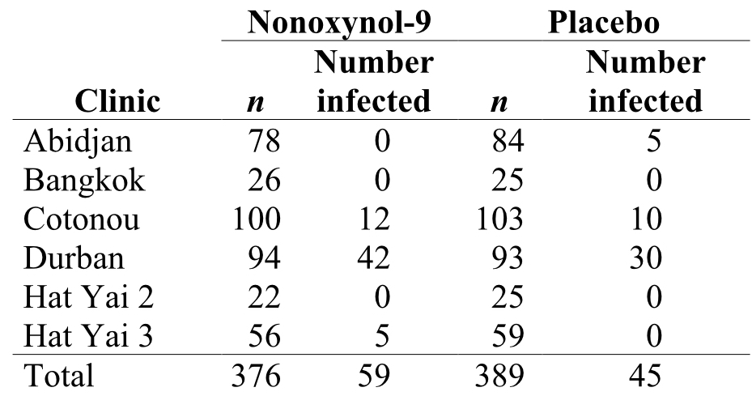
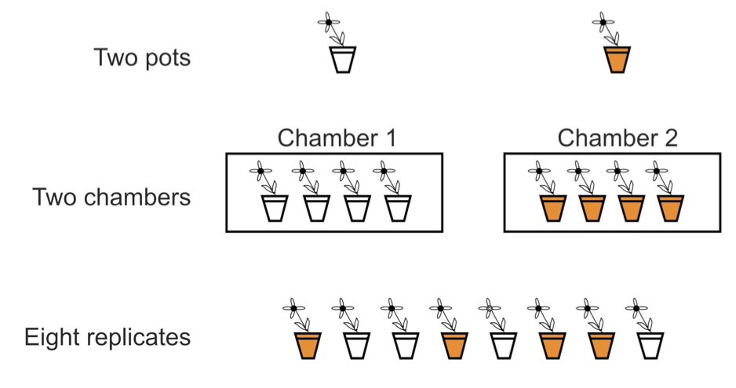
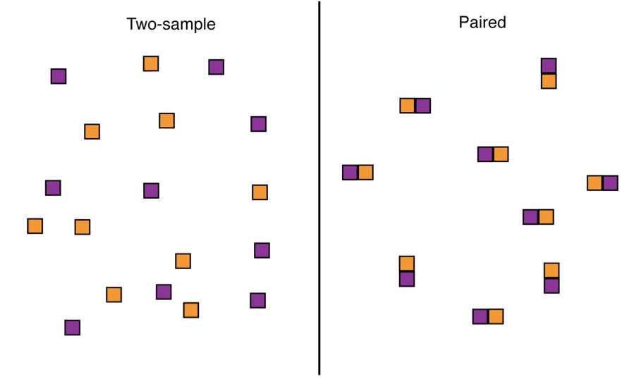

# Principles of Experiment and Study Design

## Background

In order to obtain proper estimates for the parameters we care about as scientists, we have to keep in mind the probability and sampling principles discussed in the preceeding chapters. Studies and experiments enable us to take samples and effectively make statistical inferences, but only if we design the studies in structured ways that adhere to (and therefore take advantage of) sampling theory assumptions. Two of the most important conepts along these lines are **replication** and **randomization**. 

As you learned in the last chapter, our uncertainty (as measured by the standard error) about estimation of a particular population parameter is high when our sample size is low, and this uncertainty decreases as we increase sample size. For this reason, the number of "replicates" in a study is intrinsically tied to uncertainty. We will return to this in the context of "statistical power" in the next chapter. If we require little uncertainty when estimating or comparing parameters, we need adequate replication. Furthermore, sampling has to be performed at the level of each population in question. For example, if we are comparing two treatments in an experiment, we need adequate replication within both of those treatments, because they represent two different populations. We also learned that sampling theory is based on the notion of the random variable, which is modeled by random draws of observations from a theoretical population. Individuals in a study or experiment need to be selected or assigned to groups randomly and independent of one another to avoid bias in our parameter estimates and comparisons. In this chapter we will discuss how these considerations, and related ones, have been formalized into conventions of experimental design that should be followed across the scientific community.


## What is an experimental study?

We should start by describing a few different categories of study. All categories usually involve, either directly or inderectly, the estimation of population parameters. In some studies, which we refer to as "experimental," the researcher assigns treatments to units is such a way to "isolate" the effects of the treatments on the variable(s) of interest.

<br>

*A quick aside: In study design parlance, we refer to these variables of interest as "dependent" or "response" variables. Response variables are usually the basis for the population parameters we are trying to estimate and compare. The variables we are manipulating (as in an experiment) or otherwise measuring for their explanatory potential, are called "independent" or "explanatory" variables.*

<br>

In an observational study, on the other hand, we let nature "do the assigning" of treatments to units, and we simply observe and measure the relationships among variables, whether they are causal or not. The crucial advantage of experiments over observational studies, then, derives from the random assignment of treatments to units. Random assignment, or randomization, minimizes the influence of confounding variables. To illustrate the advantage of randmonization, consider the following example.


### A hypothetical study example

Let's say that we know survival of climbers of Mount Everest is higher for individuals taking supplemental oxygen than those who don’t. As physiologists, or anthropologists, or exercise physiologists, or sociolgists, or tourism economists, we may want to know ***why*** this observation is true.  
  

One possibility is that supplemental oxygen (our explanatory variable) really does cause higher survival (our response variable). The other is that the two variables are associated because other variables affect both supplemental oxygen and survival. For instance, use of supplemental oxygen might be a benign indicator of a greater overall preparedness of the climbers that use it. Variables (like preparedness) that distort the causal relationship between the measured variables of interest (oxygen use and survival) are called **confounding variables**. They are correlated with the variable of interest, and therefore they prevent a decision about cause and effect. With randomized assignment, no confounding variables will be associated with treatment except by chance, so if sample sizes are large enough no spurious conclusions about cause and effect should be reached.


## Basic study design terminology

Many experimentalists, and indeed most statisticians working with experimental data, use a common set of terms to describe elements of a study. Those terms are used and defined in this section. For example, we defined response (or dependent) and explanatory (or independent) variables above, and more will be introduced below. It is good to become familiar with these terms, as they will continually pop up as you read the literature within your own study discipline, read technical publications and online posts regarding statistical analysis, and engage in discussions with collaborators and analysts. To start out, below is a table of some general terms we have covered already, with some more formal definitions.

```{r, echo=FALSE}
knitr::include_graphics("images/Logan_ExpTerms.jpg")
```

From Logan, M. 2010


## Clinical trials

The gold standard of experimental designs is the **clinical trial**. In fact, experimental design in all areas of biology have been informed by procedures used in clinical trials. A clinical trial is an experimental study in which two or more treatments are assigned to human subjects, usually with some design specifics we visit below. The design of clinical trials has been refined and approached with great care because the cost of making a mistake with human subjects is so high. Experiments on nonhuman subjects are simply called “laboratory experiments," or “field experiments” in cases where the experiment is not confined to a small, indoor space.

### A clinical trial example

Transmission of the HIV-1 virus via sex workers contributes to the rapid spread of AIDS in Africa. The spermicide nonoxynol-9 had shown *in vitro* activity against HIV-1, which motivated a clinical trial by van Damme et al. (2002). In this study the authors tested whether a vaginal gel containing the chemical would reduce the risk of acquiring the disease by female sex workers. Data were gathered on a volunteer sample of 765 HIV-free sex-workers in six clinics in Asia and Africa. Two gel treatments were assigned randomly to women at each clinic, one gel containing nonoxynol-9 and the other a placebo. Neither the subjects nor the researchers making observations at the clinics knew who received the treatment and who got the placebo. The table below shows the raw data.

<br>

```{r, echo=FALSE}

```

<br>

A major goal of experimental design is to eliminate bias and to reduce sampling error when estimating and testing effects of one variable on another. 

<br>

To reduce bias, the experiment described above included the following:

  - A **Simultaneous control group**: Inclusion of both the treatment of interest and a control group (the women receiving the placebo).
  - **Randomization**: Treatments were randomly assigned to women at each clinic.
  - **Blinding**: Neither the subjects nor the clinicians knew which women were assigned which treatment.
    
<br>

To reduce the effects of sampling error, the experiment included the following:

  - **Replication**: A study is carried out on multiple, independent subjects.
  - **Balance**: Equal sample sizes across treatment groups. In this case, the number of women was nearly equal in the two groups at every clinic.
  - **Blocking**: Treatments are applied systematically within larger groups that likely explain large amounts of variation. Here subjects were grouped according to the clinic they attended, yielding multiple repetitions of the same experiment in different settings (“blocks”).

<br>

Let's consider each of these design elements in turn, in a bit more depth.


### Simultaneous control groups

In clinical trials either a placebo or the currently accepted treatment should be provided. In experiments requiring intrusive methods to administer treatment, such as injections, surgery, restraint, confinement, etc., the control subjects should be perturbed in the same way as the other subjects, except for the treatment itself, as far as ethical considerations permit. The “sham operation”, in which surgery is carried out without the experimental treatment itself, is an example.vIn field experiments, applying a treatment of interest may physically disturb the plots receiving it and the surrounding areas, perhaps by trampling the ground by the researchers.Ideally, the same disturbance should be applied to the control plots.

### Randomization

The researcher should randomize assignment of treatments to units or subjects. Chance rather than conscious or unconscious decision determines which units end up receiving the treatment and which the control. A completely randomized design is one in which treatments are assigned to all units by randomization. Randomization breaks the association between possible confounding variables and the explanatory variable. It doesn't eliminate the variation contributed by confounding variables, only their correlation with the treatment variable. Randomization ensures that variation from confounding variables is similar between the different treatment groups.

<br>

Randomization should be carried out using a random process such as a random number generator. A general strategy might include the following steps:

  - List all n subjects, one per row, in a spreadsheet or computer programming object.
  - Use the computer to give each individual a random number.
  - Assign treatment A to those subjects receiving the lowest numbers and treatment B to those with the highest numbers.

<br>

Other procedures for assigning treatments to subjects are almost always inferior because they do not eliminate the effects of confounding variables. “Haphazard” assignment, in which the researcher chooses a treatment while trying to make it random, has repeatedly been shown to be non-random and prone to bias.


### Blinding

Blinding is the process of concealing information from participants (sometimes including researchers) about which subjects receive which treatment. Blinding prevents subjects and researchers from changing their behavior, consciously or unconsciously, as a result of knowing which treatment they were receiving or administering. For example, studies showing that acupuncture has a significant effect on back pain are limited to those without blinding (Ernst and White 1998). In a single-blind experiment, the subjects are unaware of the treatment that they have been assigned. Treatments must be indistinguishable to subjects, which prevents them from responding differently according to knowledge of treatment. Blinding can also be a concern in non-human studies where animals respond to stimuli

<br>

In a double-blind experiment the researchers administering the treatments and measuring the response are also unaware of which subjects are receiving which treatments. Researchers sometimes have pet hypotheses, and they might treat experimental subjects in different ways depending on their hopes for the outcome. Many response variables are difficult to measure and require some subjective interpretation, which makes the results prone to a bias. Researchers are naturally more interested in the treated subjects than the control subjects, and this increased attention can itself result in improved response. Reviews of medical studies have revealed that studies carried out without double- blinding exaggerated treatment effects by 16% on average compared with studies carried out with double-blinding (Jüni et al. 2001). Experiments on non–human subjects are also prone to bias from lack of blinding. Bebarta et al.(2003) reviewed 290 two-treatment experiments carried out on animals or on cell lines. The odds of detecting a positive effect of treatment were more than threefold higher in studies without blinding than in studies with blinding. Blinding can be incorporated into experiments on nonhuman subjects using coded tags that identify the subject to a “blind” observer without revealing the treatment (and who measures units from different treatments in random order).


### Replication

The goal of experiments is to estimate and test treatment effects against the background of variation between individuals (“noise”) caused by other variables. One way to reduce noise is to make the experimental conditions constant. In field experiments, however, highly constant experimental conditions might not be feasible nor desirable. By limiting the conditions of an experiment, for example, we also limit the generality of the results. There is always a tradeoff between the range of explanatory variables explored and the extent of replication required. For many different treatment types in an experiment, or a broad range of explanatory variable values in an observational study, we need adequate replication across the range of that explanatory variable, so more replication will be required. 

<br>

Replication in an experiment is the assignment of each treatment to multiple, independent experimental units. Without replication, we would not know whether response differences were due to the treatments or just chance differences between the treatments caused by other factors. As discussed, studies that use more units (i.e. that have larger sample sizes) will have smaller standard errors and a higher probability of getting the correct answer from a hypothesis test. Larger samples mean more information, and more information means better estimates and more powerful tests.


### A note on pseudoreplication

Replication is not about the total number of plants or animals used, but the number of independent units in the experiment. An “experimental unit” is the independent unit to which treatments are assigned. The figure below shows three experimental designs used to compare plant growth under two temperature treatments (indicated by the shading of the pots). The first two designs are actually un-replicated with respect to temperature and regarding growth as a random, independent variable. When individual observations in a study are erroneously treated as independent in subsequent statistical analysis, we call it "psuedoreplication." Pseudoreplication results in violation of the assumptions we rely on to conduct statistical hypothesis tests, and it will cause misleading conclusions to be drawn, usually in the form of rejection of the null hypothesis when the null hypothesis is actually true. 


```{r, echo=FALSE}

```

<br>

### Balance

A study design is balanced if all treatments have the same sample size. Conversely, a design is unbalanced if there are unequal sample sizes between treatments. Balance is a second way to reduce the influence of sampling error on estimation and hypothesis testing. To appreciate this, look again at the equation for the standard error of the difference between two treatment means

```{r, echo=FALSE}
knitr::include_graphics("images/images_6a.007.jpeg")
```

For a fixed total number of experimental units, n1 + n2, the standard error is smallest when n1 and n2 are equal. Balance has other benefits as well. For example, Analysis of Variance (discussed later in this book) is more robust to departures from the assumption of equal variances when designs are balanced or nearly so.


### Blocking

Blocking is the grouping of experimental units that have similar properties. Within each block, treatments are randomly assigned to experimental units. Blocking essentially repeats the same, completely randomized experiment multiple times, once for each block. Differences between treatments are only evaluated within blocks, and in this way the component of variation arising from differences between blocks is discarded. The cartoon below depicts two blocks.

```{r, echo=FALSE}
knitr::include_graphics("images/images_6a.008.jpeg")
```

<br>

#### Blocking | Paired designs

As an example of blocks with paired subjects, consider the design choices for a two-treatment experiment to investigate the effect of clear cutting on salamander density. In the completely randomized (“two-sample”) design we take a random sample of forest plots from the population and then randomly assign each plot to either the clear-cut treatment or the no clear-cut treatment. In the paired design we take a random sample of forest plots and clear-cut a randomly chosen half of each plot, leaving the other half untouched. In the paired design, measurements on adjacent plot-halves are not independent. This is because they are likely to be similar in soil, water, sunlight, and other conditions that affect the number of salamanders. As a result, we must analyze paired data differently than when every plot is independent of all the others, as in the case of the two-sample design. Paired design is usually more powerful than completely randomized design because it controls for a lot of the extraneous variation between plots or sampling units that sometimes obscures the effects we are looking for. 


```{r, echo=FALSE, out.width='90%', fig.asp=.75, fig.align='center'}

```

<br>

#### Blocking | Randomized complete block design

Randomized complete block (RCB) design is analogous to the paired design, but may have more than two treatments. Each treatment is applied once to every block. As in the paired design, treatment effects in a randomized block design are measured by differences between treatments exclusively within blocks. By accounting for some sources of sampling variation blocking can make differences between treatments stand out. Blocking is worthwhile if units within blocks are relatively homogeneous, apart from treatment effects, and units belonging to different blocks vary because of environmental or other differences.


## What if you can't do experiments?

Experimental studies are not always feasible, in which case we must fall back upon observational studies. The best observational studies incorporate as many of the features of good experimental design as possible to minimize bias (e.g., blinding) and the impact of sampling error (e.g., replication, balance, blocking, and even extreme treatments) except for one: randomization. Randomization is out of the question, because in an observational study the researcher does not assign treatments to subjects. Two strategies are used to limit the effects of confounding variables on a difference between treatments in a controlled observational study: matching, and adjusting for known confounding variables (covariates). Matching is similar to the idea of blocks, but there is no random assignment. To give an example of matching, pairs of indivduals with similar explanatory variable values (e.g. females in a specific age class) might be defined, such that one member of the pair has one level of the focal explanatory variable (e.g. "control") and the other member the other level (e.g. "treatment"). Study adjustment for known confounding covariates, on the other hand, simply restricts the study to subjects in such a way to exclude variation from confounding variable(s). With this strategy, groups of individuals, for example age rages, may be simply excluded from the study alltogether.   


## Exercises associated with this chapter:

- Problem Set 3

## Additional learning resources:

- Logan, M. 2010. Biostatistical Design and Analysis Using R. - A great intro to R for statistical analysis

