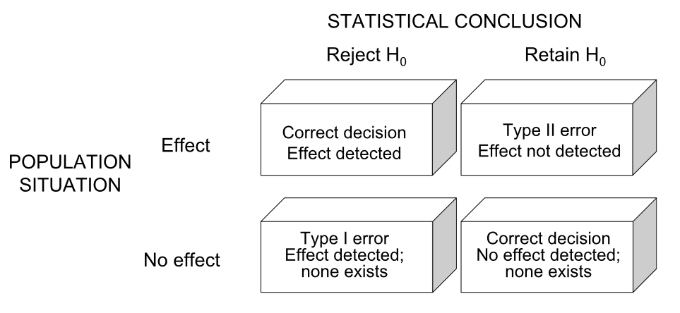
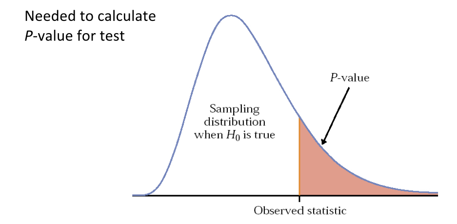

# Introduction to Hypothesis Tests

## Background

An extension from the concept of estimating a population parameter is the formal comparison of a such a parameter to a single value, or comparison to a value for another group, understood as another population. After all, if we can use probability and sampling theory to estimate a parameter and its uncertainty, we should also be able to compare parameter estimates, with inclusion of uncertainty about their true difference. The "frequentist" approach in statistics traditionally taken to perform these types of comparisons requires the definition of precise statements before we do the numerical comparisons. These statements are known as ***statistical hypotheses***, and how we frame them is very important because it dictates both how we calculate the test statistics required to compare populations and how we use probability distributions to determine how extreme the statistics are, relative to random chance. This notion of paying attention to an observed test statistic's value relative to "how frequently" we would expect to see a value that extreme or more extreme across multiple theoretical samples (under random expectations) is why we refer to this approach as "frequentist" statistical inference. We'll get more into what test statistics are and how they are calculated for various tests later in the book. For now, let's focus on how we frame hypotheses to enable the types of comparisons we wish to do as scientists.     


## Null and alternative hypotheses

Often as empiricists we want to know whether some parameter differs between groups (populations). Perhaps the populations are different because we have differentiated them in an experiment by applying a treatment to one and no treatment to another. And, if we expect a focal variable we are measuring (i.e. a response variable) to be fundamentally tied to the treatment based on our knowledge of the system, we can test the validity of that relationship. We might state very simply, for example, "I hypothesize that on average the variable *X* differs between the treatment and control groups." A hypothesis is really just a statement of belief about the world. One issue with hypotheses is that from a logic of deduction standpoint, we can't universally "prove" a hypothesis, only reject (i.e. falsify) it. For this reason we must frame a ***null hypothesis*** to complement our originally stated ***alternative hypothesis***. The null hypothesis represents all possibilities *except* the expected outcome under the alternative. A statistical test is then conducted with respect to the null hypothesis, and if we reject the null hypothesis we typically infer support for the alternative, provided the assumptions of the statistical test about our data were valid.

<br>

It's a good idea to practice the formal framing of null and alternative hypotheses, as this will help with the setting up of statistical tests and the reporting of tests in written reports or publications. Here is one example of a null and alternative hypothesis regarding trees of two different species (our populations) being of different heights.

<br>

$H_0$ : *Null hypothesis* : Ponderosa pine trees are the same height on average as Douglas fir trees

$H_A$ : *Alternative Hypothesis*: Ponderosa pine trees are not the same height on average as Douglas fir trees

<br>

You will often see the shorthand notation above for hypotheses ($H_0$ for null and $H_A$ for alternative), especially when hypotheses are expressed nonverbally. An nonverbal (quantitative) expression of the above hypotheses, assuming we choose to compare "averages" using the mean, would be:

<br>

$$H_0 : \mu_1 = \mu_2$$

$$H_A: \mu_1 \neq \mu_2$$

Where $\mu_1$ and $\mu_2$ are the population means for ponderosa pine and Douglas fir tree species, respectively. 

<br>

One important point to make here is that unlike the example above, hypotheses (and the statistical tests used to evaluate them) can be directional (also called "one-sided" or "one-tailed"). If, for instance, we really wanted to test whether ponderosa pines are shorter, on average, than Douglas firs because we suspect this directionality, we could frame the null and alternative hypotheses as follows:  

<br>

$$H_0 : \mu_1 \geq \mu_2$$

$$H_A: \mu_1 < \mu_2$$

<br>

Remember, the null hypothesis encapsulates all outcomes not specified by the alternative. The implications regarding uncertainty (*p*-values) when defining hypothesis tests as either non-directional (two-sided) or directional (one-sided) are important to understand and will be discussed below.


## Hypotheses tests

Statistical tests provide a way to perform formal evaluations we call *critical tests* of null hypotheses such as in the examples above. Statistical tests require the definition of ***test statistics*** that form the basis for comparison among populations. Just like raw data, test statistics are ***random variables*** and depend on sampling distributions of the underlying data. In the case of parametric statistical tests (those that make use of a particular probability distribution), test statistics are calculated from the data using a specialized formula. For example we may want to test the null hypothesis that two population means are equal. One option is to calculate what is called the *t*-statistic. (We will get into the details of the t-test shortly.) The *t*-statistic is a standardized difference between two sample means, so a value of *t* equal to zero indicates no difference between population means. We can then evaluate where our sample (data)-based value of *t* falls with respect to a known theoretical distribution for *t*, called the "*t*-distribution," for which the center and peak are at the value zero. If our observed value of the test statistic is sufficiently far from zero (i.e. in the "tail" of the *t*-distribution), we will decide to reject the null hypothesis. 

<br>

The *t*-distribution is just one example of probability distributions used in statistical hypothesis testing. The figure below shows the *t*-distribution and three others commonly used in statistical inference: the *z*, $\chi^2$, and *F* distributions, some drawn with multiple shape parameters defined.

```{r, echo=FALSE, out.width='50%', fig.align='center'}
knitr::include_graphics("images/week_3.003.jpeg")
```

<br>

The particular distribution and shape (such as those above) chosen for a statistical test depends on the whether the appropriate test statistic (such as the *t*-statistic) can be calculated from your data. That determination is ultimately made by the analyst, based on test assumptions about the sample (we will cover those in turn as we discuss different tests). The shape and associated parameters of a distribution used to evaluate a test statistic also depend on sample properties such as sample size. ***Degrees of freedom***, for example are an important parameter for critical tests. The degrees of freedom for a particular test convey how many independent observations are used to estimate a population parameter of interest. Because parameter estimates are used in test statistics, we need to account for degrees of freedom. You may ask, "shouldn't all observations in a sample be independent with respect to estimation of a parameter?" The answer is actually, "no" as it turns out, because estimates (like a sample mean, for example) are calculated from the individual observations in a sample. In a sample of 10, 9 of the observations can theoretically vary freely when calculating a given sample mean, but the final, 10th observation cannot, simply based on the nature of an arithmetic mean. In this case because only 9 observations can vary independently, we have *n* - 1 = 9 degrees of freedom. As mentioned, degrees of freedom determine the shape of the distributions used to evaluate test statistics. In particular, as the degrees of freedom increase (i.e. the sample size increases), the shape of the probability distribution gets narrower. This means that a test statistic calculated from large sample will be more extreme ("further in the tail"), relative to if that same test statistic value had been calculated from a smaller sample. Recall that as a test statistic is located further into the tail of its distribution, the more extreme it is relative to our null hypothesis expectation, and therefore the smaller the *p*-value is for our statistical test of the null hypothesis. In summary, we are more likely to reject the null hypothesis with a greater sample size. This gets to the concept of "statistical power" which we will return to below. 

<br>

To think about all of this at a high level, consider the plots below of two different population distributions for the same variable. In *a* the two different population distributions are in very different locations. If we took even a moderately sized sample from both populations, the difference in the sample mean between the blue and red populations would be large relative to their respective variances. This means that if we calculated a *t*-statistic from our samples, it would be quite large. In *b* on the other hand, the population distributions are nearly on top of one another. If we calculated a *t*-statistic from samples in that scenario, it would be near zero. Finally, by comparing our calculated *t*-statistic to a *t*-distribution with the appropriate degrees of freedom, we could deterimine (in both scenarios) how likely it is to have observed that particular value for *t* under the null hypothesis of *t* = 0. In *a* we would observe an extreme value for *t* and reject the null hypothesis, but in *b* we would observe a value for *t* close to the center of the distribution (at 0), and fail to reject the null hypothesis of no difference in means.


```{r, echo=FALSE, out.width='50%', fig.align='center'}
knitr::include_graphics("images/week_3.001.jpeg")
```

<br>

### *p*-values, Type I, and Type II error

At this point we should consider the possible outcomes of a hypothesis test. These include situations in which we may either falsely reject or falsely fail to reject the null hypothesis. The table below is a useful summary of the four possible outcomes we face when testing a null hypothesis.

```{r, echo=FALSE, out.width='50%', fig.align='center'}

```

<br>

As indicated, the columns correspond to our actual evaluation of the null hypothesis (whether we reject or fail to reject it), and the rows correspond to whether the null hypothesis is actually incorrect or correct (which of course we never know unless data are simulated). In the upper left-hand scenario, we reject the null hypothesis and correctly conclude that there is an effect (e.g. population means differ, etc.). In the upper right-hand scenario, we fail to reject the null hypothesis and conclude there is no effect, but that conclusion is wrong. In this scenario, what we call a ***Type II error*** ("false negative"), there is a real effect but we "miss" it with our test. In the lower left-hand situation we reject the null hypothesis but do so incorrectly, as there is no real effect. This is called ***Type I error*** ("false positive"), and is the error reflected in a *p*-value from a statistical test. Finally, in the lower right-hand situation we fail to reject the null hypothesis and have done so correctly, as there really is no effect. You will often see the probability of Type II error represented by $\beta$ (*beta*) and the probability of Type I error represented by $\alpha$ (*alpha*). As mentioned, we usually decide to reject a null hypothesis if the *p-value* for our statistical test is smaller than a given Type I error rate we are "willing" to tolerate. As you are probably well aware, a routinely used threshold for $\alpha$ is 0.05. The origin of this convention dates back to a paper published by one of the founders of frequentist statistics, R. A. Fisher in 1926. In the paper, titled, "The Arrangment of Field Experiments," Fisher proposed also considering more conservative $\alpha$ thresholds of 0.02 or 0.01 if desired, but expressed his "personal preference" of setting the $\alpha$ threshold at 0.05. The same passage in the paper does, however, imply that using an $\alpha$ threshold of 0.05 to assess significance should be done in the context of *multiple, repeated experiments*, in which the experimenter almost always observes *p*-values less than 0.05. The latter point is certainly worth thinking about carefully, as most experimentalists today stick with the "0.05" convention but do not commonly repeat experiments many times. 

<br>

The *p*-value for a statistical test, as we will re-visit below for *t*-tests in more detail, is simply the area under the probability distribution that lies outside (in the tail or tails) of the test statistic value(s), and is calculated using integral calculus. You can think of a *p*-value, then, as the probability of observing a test statistic at least as surprising as the one you observed based on your data, assuming the null hypothesis is correct. So, if your test statistic is far into the tail(s) of its probability distribution, it is a surprising observation under the null hypothesis. You can think of the null hypothesis as being characterized by the test statistic sampling distribution. If you were to take samples over and over again many, many times, and calculate the test statistic each time, it would follow the shape of the distribution. Again taking the *t* distribution as an example of the null expectation of "no difference between means," a value of zero is the most common outcome, with values in the tails much less likely. So the *p*-value reflects the probability that your null hypothesis is true, and very small values suggest that we reject the null hypothesis. Here is a generic schematic that illustrates the concept of *p*-values:

```{r, echo=FALSE, out.width='50%', fig.align='center'}

```

<br>

To summarize, if we reject the null hypothesis, we conclude that there is evidence in favor of the alternative hypothesis (again assuming assumptions of the test are met), but we keep in mind that there is a non-zero chance of Type I error, reflected in our *p*-value. If we fail to reject our null hypothesis, the current evidence suggests that we have little reason to believe our alternative is true, but again there is risk of committing Type II error. How we interpret whether we actually had enough data to confidently rule out our null hypothesis requires an estimate of ***statistical power***.   

### Statistical power

Power is the probability of rejecting a false null hypothesis, which is equivalent to 1 - $\beta$, where $\beta$ is the Type II error rate. So, the higher the power, the more confident we can be in detecting "an effect" with our hypothesis test when that effect truly exists. Power is commonly calculated before an experiment (*a priori*), using either simulated data, a "pilot" data set, or data from similar experiments. As you will see from the relationships below, pre-study power analyses can be extremely useful in determining the sample sizes required to detect an effect of a particular size. This is especially important if the resources to conduct a study are limited, and indeed, pre-study power analyses are often required for grant proposals, especially those that involve experiments with animals. As a benchmark, statisticians conventionally "aim" for a power of 0.8 or higher, but this is of course subject to the nature of the experiment at hand and how critical detecting true effects is. For example, certain clinical studies may need to be especially high-powered for ethical reasons. It all depends on the "cost" of committing Type II error. Power analyses can also be conducted after a study (*post hoc*), especially if experimenters don't want to be left wondering whether they may have detected the effect associated with their alternative hypothesis, had they only a larger sample size.

<br>

Just below is a generic expression for power, and how it varies given other variables associated with a particular hypothesis test. Adjustments to this expression may be required, depending on the particular statistical framework used, but it works as a good guide. Note that in this expression power is "proportional to" these variables as indicated, and not "equal to." In many relatively simple experimental design scenarios this expression will provide practical estimates. If not, there are more complicated formulae depending on the design of your study, and there is also frequently the prospect of doing simulations to understand the power relationships inherent in your study system.

$$ Power \propto \frac{(ES)(\alpha)(\sqrt n)}{\sigma}$$

<br>

In the above expression power is proportional to the combination of these parameters:

- *ES* = Effect size. This is the magnitude of the difference between populations you hope to detect with your test. For example, the difference in population means, etc. It can be expressed in different ways depending on the calculation, so pay attention to the input requirements of functions you are using for power analysis.

- $\alpha$ = Type I error rate tolerated (usually 0.05).

- *n* = Sample size. The number of observations per sample group.

- $\sigma$ = Standard deviation among the experimental units within the same group.


<br>

We often care about the relationships depicted in the example power relationships below. For instance, we may want to know what effect size we can detect at various power levels, assuming sample size and standard deviation are fixed. Likewise, we may want to identify the smallest sample size required to detect a particular effect size, assuming a given power (e.g. 0.8) and standard deviation.

```{r, echo=FALSE, out.width='90%', fig.asp=.75, fig.align='center'}
knitr::include_graphics("images/images_6b.002.jpeg")
```  

<br>

For a rough calculation under certain experimental design constraints, the following can be used as a "quick" sample size estimator when desired power and $\alpha$ are the conventional 0.8 and 0.05, respectively. 
 
```{r, echo=FALSE, fig.align='center'}
knitr::include_graphics("images/images_6b.003.jpeg")
```

### A note on *p*-values and Null-Hypothesis Significance Testing (NHST)

While Null-Hypothesis Significance Tests are a useful way of framing our hypotheses and results to efficiently draw conclusions, this approach has drawn quite a bit of valid criticism in recent years. For context, many fields of research, including sociology, psychology, the biomedical sciences, and others are experiencing a 'replication crisis', in which statistically significant findings have been unable to be replicated in subsequent studies, often despite similar methodologies. While there are various potential reasons for this, this crisis has revealed that it is far easier to reject a null hypothesis (at p < 0.05) with noisy data than might be assumed. If what has become a universal standard for evidence is inflating the risk of Type I errors (false positives), then how should we think about *p*-values when evaluating our hypotheses? It is helpful to first recall exactly what a *p*-value represents. The *p*-value is defined as the probability of finding an effect *at least* as extreme as the one observed, given (1) that the null hypothesis is true, and (2) that assumptions of the test are met. So what doesn't a *p*-value represent? 

- **A *p*-value doesn't tell you whether the magnitude of an observed effect is meaningful in the context of your hypotheses**. This point becomes particularly relevant when dealing with large amounts of data - you may have noticed by studying the above power law relationship that you might correctly reject your null hypothesis (and with a very low *p*-value at that) for an extremely small effect size if your sample size is very large. But small effect sizes may be irrelevant in a practical sense to your larger questions at hand. In a clinical study, for instance, a tiny effect size may not have any practical bearing on future patients' outcomes. Additionally, large sample sizes can exacerbate systematic problems in data. For example, if treatment groups are systematically biased in ways independent of your treatment, then you may detect a significant effect that reflects this bias rather than your treatment. While this can be a problem at all sample sizes, larger sample sizes increase the likelihood that even minor biases will influence your estimated effect. Small effect sizes derived from "well powered" studies should therefore be interpreted cautiously. 

- **A *p*-value doesn't tell you how well the assumptions of your analyses are met by your data**. No level of statistical significance is meaningful if the analysis is inappropriate for your data. Perhaps your data comes from a Poisson distribution but your analysis assumes normally distributed data. Perhaps there are grouping variables in your data that violate assumptions of independence if unaccounted for in your analysis. There are as many ways in which data analysis can produce invalid results as there are statistical methods. Understanding the best approach for analyzing your data and understanding the ways in which your data might violate related assumptions is a basic requirement for attaining meaningful *p*-values. 

- **A *p*-value doesn't tell you anything about the plausibility of your *a-priori* hypotheses**. Are you hypothesizing a brand new idea supported by no previous evidence, iterating off of a previous body of work in an incremental fashion, or replicating a hypothesis that's been tested multiple times in the past? How solid is the science under which you've built your hypothesis, and does your hypothesis logically follow from accepted knowledge? The more unlikely a hypothesis, the stronger standard of evidence it should be held to (in other words, exceptional claims mandate exceptional evidence). This does not mean that, say, a brand new idea or a finding that contradicts a prior body of work should be disregarded if the *p*-value = 0.05, but claims to its validity should be tempered accordingly and justified beyond a statistically significant result. If this feels subjective and idiosyncratic, that's because ultimately it is. Domain knowledge is essential to the interpretation of results, particularly when inferring a causal relationship between variables. 

Note that none of this is to suggest that *p*-values are irrelevant. Rather, that effective and responsible interpretation of results demands an appreciation of all relevant factors: the plausibility of hypotheses or proposed mechanisms, the methods and quality of data collection, the appropriateness of analyses for the data and questions at hand, and, of course, effect sizes and associated significance. While we have framed the issues associated with NHST in the context of Type I errors, it is just as possible that many of the issues discussed can lead to Type II errors (false negatives), in which *p*-values exceeding standard thresholds obscure meaningful effects. For this reason, it is not enough to simply require more exacting thresholds of significance. As you continue to learn foundational stats and eventually assess hypotheses using data of your own, hopefully you will treat *p*-values as one among many relevant factors to consider. 

## The *t*-test and *t* sampling distribution {.smaller}

Above we discussed that a difference between two population means can be compared using a test based on the *t* distribution. The *t*-test is also often referred to as "Student's *t*-test," because "Student" was the pseudonym used by a person who wrote a widely read paper (in 1908) in which the test's practical application was published for one of the first times. That person, whose real name was William Sealy Gosset, was a student of statistician Karl Pearson, but because Gosset's employer (Guinness Brewery) didn't allow their employees to publish work-related material, the pseudonym was used. 

<br>

As previously mentioned, the *t*-test is based on a test statistic (the *t*-statistic) that usually considers the difference between two sample means, to test the null hypothesis of no population difference in means. This is the so-called "two-sample *t*-test," and the one we will consider in this course. It is also possible to perform a "one-sample *t*-test," in which the sample mean from a single population is tested to differ from a fixed value (such as zero). Below we consider the calculation of the *t*-statistic and two forms of the hypothesis test (one- and two-tailed) for the two-sample comparison case. Note first that the *t*-statistic is simply the difference in sample means divided by the standard error for that difference, to account for variation within the two populations: 

$$\large t = \frac{(\bar{y}_1-\bar{y}_2)}{s_{\bar{y}_1-\bar{y}_2}} $$

where

```{r, echo=FALSE, out.width='60%', fig.align='center'}
knitr::include_graphics("images/week_3.016.jpeg")
```

As mentioned, the denominator is the calculation for the standard error of the mean difference, in which *s* denotes the sample standard deviations for populations 1 and 2, and *n* denotes the sample sizes for populations 1 and 2. The degrees of freedom (*df*) for this test are equal to $n_1+n_2-2$.

<br>

For a "one-tailed" test, recall that our hypothesis assumes directionality in the difference in means. So, if our alternative hypothesis is that $\mu_1>\mu_2$, a large value of *t* in the right tail of the distribution - one that is **greater** than the "critical value" - will result in a *p-value* of less than 0.05. The critical value simply marks the point beyond which the area under the probability density sums to 0.05. The generalized figure below illustrates where the critcal value $t_c$ falls. For a one-tailed test in this case, we would reject the null hypothesis if the observed *t* was greater than $t_c$.  

```{r, echo=FALSE, out.width='90%', fig.align='center'}
knitr::include_graphics("images/week_3.005_1_tailed.jpeg")
```

<br>

For a "two-tailed" test, our hypothesis allows for the possibility that the difference in population means might be greater or less than zero (i.e. we don't assume a directionality in the difference *a priori*). In this case, we simply have to consider our critical value at both tails of the *t* distribution, such that the areas under the probability density beyond the location in both tails **sum** to 0.05. And, if our observed *t* is either less than $-t_c$ or greater than $t_c$, we would reject the null hypothesis. 

```{r, echo=FALSE, out.width='60%', fig.align='center'}
knitr::include_graphics("images/week_3.005_2_tailed.jpeg")
```

<br>

In `R` we can easily perform a *t*-test using the `t.test()` function. For two samples we simply supply the function two vectors of values, one from sample 1 (argument `x`) and one from sample 2 (argument `y`). The default test is two-tailed, but if we want to run a one-tailed test we supply "less" to the `alternative` argument if we are testing whether $\mu_1<\mu_2$, or "greater" to the `alternative` argument if our alternative hypothesis is that $\mu_1>\mu_2$. Note that the `t.test()` function actually performs a "Welch's *t*-test," which is an adpatation of the Student's *t*-test. It is very similar, with only minor calculation differences, but more reliable for unequal sample sizes and/or slightly different variances.


### Assumptions of parameteric t-tests

As with any parametric statistical test, we should only use a *t*-test if our samples adhere to certain assumptions. Otherwise, our actual Type I and/or Type II error will not be accurately reflected by the test, and we will be more likely to draw the wrong conclusions than intended. The theoretical t-distributions for each degree of freedom were calculated based on the following assumptions:

- The response variable in the populations is normally distributed. This assumption is most easily assessed by looking at histograms for your data (samples). Confirm that your variable appears to be approximately normally distributed in your samples.
    
- The response variable in the populations has equal variances (if comparing two means). Informally this can be evaluated by looking at histograms or boxplots to see if the spread of distributions for both of your samples looks similar. Formally, you can perform something called an F Test for equal variances, using the `var.test()` function.
    
- The observations within each sample are independent. This assumption stipulates that you randomly sampled individuals from each of your populations. For example, if your populations represented different species in a specific location, you need to randomly select individuals of each species, as opposed to selecting individuals from one particular family, sub-location, shape, etc.
    
<br>

What should you do if the assumption of normality and/or equal variances is not met? There are a few alternatives. As mentioned, we call these alternatives "non-parametric" approaches because they do not rely on specific probability distributions, and consequently their assumptions. Nonparametric tests based on the "rank" of the values instead of the orignal values themselves are often an option. The Mann-Whitney *U* (also called "Mann-Whitney-Wilcoxon) Test tests for distributional differences bewtween the ranks of two samples. In `R` the function `wilcox.test()` can be used to perform it, in much the same way the `t.test()` function is used.

<br>

Another nonparametric option is to generate a null distribution of the appropriate test statistic from your samples, using either randomization, or resampling with replacement (i.e. a "bootstrap test"). These are briefly discussed below, with a simple coded example.


## Comparing means using resampling and randomization tests

In many cases when our sample data don't meet assumptions of parametric tests we can create a ***null statistical distribution*** that models the distribution of a test statistic under the null hypothesis. As in the parametric approaches described above, we first calculate an **observed test statistic value** for our data. In the situation of comparing two population means, for example, we can calculate the *t* statistic from our data, as above. To create the null distribution we can use either randomization or resampling. For randomization, and assuming a one-tailed test of a larger mean for population 1, we could:
<br>
1. Combine values from both populations into a single vector, 
<br>
2. Randomly shuffle the vector using the `sample()` function, 
<br>
3. Calculate a *t* statistic based on the first n1 and n2 observations as our "pseudo samples" from "populations" 1 and 2, respectively, and save the value, 
<br>
4. Repeat steps 2 and 3 many times (e.g. $\geq$1000),
<br>
5. Calculate the proportion of pseudo replicates in which *t* is $\geq$ to our original, observed value of *t*. This proportion is our estimated *p*-value for the test.
<br>
An example using simulated data in `R` is as follows:

```{r, echo=TRUE, eval=TRUE}
set.seed(56)
pop_1 <- rnorm(n=50, mean=20.1, sd=2)#simulate population 1 for this example
pop_2 <- rnorm(n=50, mean=19.3, sd=2)#simulate population 2 for this example

# Store the t statistic calculated from our samples, using t.test()
t_obs <- t.test(x=pop_1, y=pop_2, alternative="greater")$statistic

# Combine both population vectors into one
pops_comb <- c(pop_1, pop_2)

# Randomly shuffle and calculate t statistic 1000 times
t_rand <- replicate(1000, {
  pops_shuf <- sample(pops_comb)
  t.test(x=pops_shuf[1:50], y=pops_shuf[51:100], alternative="greater")$statistic
  })

# Plot the "null distribution" from the randomization-based t-values
hist(t_rand)

# Calculate the p-value for the test as the number of randomization t-values greater
# than or equal to our actual t-value observed from the data
p <- sum(t_rand>=t_obs)/1000

p
# p = 0.016, so we reject the null hypothesis of a population 1 mean less than or equal \
# to the population 2 mean. The population 1 mean is likely larger than the population 2 mean.
```
<br>

A similar approach may be taken by randomly resampling (with replacement) from the combined vector of values for both populations, provided that the sample sizes are equal, in order to generate a null distribution against which the observed *t* statistic may be compared. This approach would technically be considered a "bootstrap" *t*-test. Both randomization and resampling approaches should yield similar results for moderate to large sample sizes. For small sample sizes the randomization approach is preferable, as all values from both populations will be included in each pseudo-replicate.


## A summary of key components of hypothesis testing

- *p*-value = The long run probability of rejecting a true null hypothesis. If our observed test statistic is very extreme in relation to the distribution under the null hypothesis, the *p*-value will be very small.

- $\alpha$ = The Type I error rate for a hypothesis test. Often stated as a "critical p-value cutoff" for experiments, as in the Type I error we are willing to tolerate.

- $\beta$ = The Type II error rate for a hypothesis test. Often stated as a cutoff for probability of accepting a false null hypothesis.

- Power = The probability that a test will correctly reject the null hypothesis (1 - $\beta$). It depends on effect size, sample size, chosen $\alpha$, and population standard deviation.

- Multiple testing = Performing the same or similar tests multiple times. When we perform multiple hypothesis tests to answer a general study question (like in the case of analyzing many genes in an RNA-seq experiment), we need to adjust the $\alpha$ threshold to be lower than it would for a single test. There are multiple ways to correct *p*-values if multiple testing is used. One correction uses a "tax" (e.g. **Bonferonni** adjustment) based simply on the number of tests, while another is the direct estimation of a **False Discovery Rate (FDR)**. We will return to the multiple testing problem when we consider ANOVA.


## Exercises associated with this chapter:

- Problem Set 3

## Additional learning resources:

- Irizarry, R. A. Introduction to Data Science. https://rafalab.github.io/dsbook/ - A gitbook written by a statistician, with great introductions to key topics in statistical inference. 

- Logan, M. 2010. Biostatistical Design and Analysis Using R. - A great intro to R for statistical analysis

