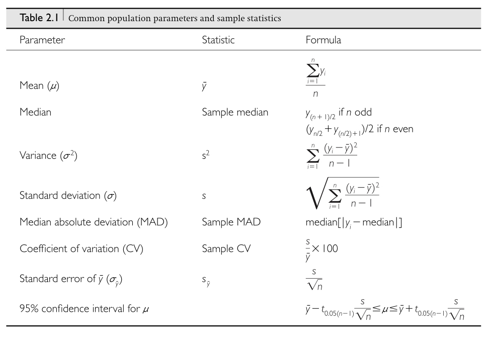
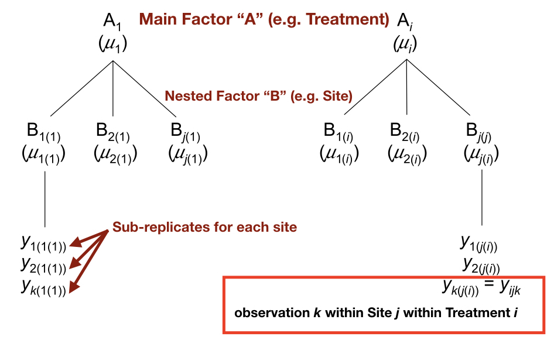
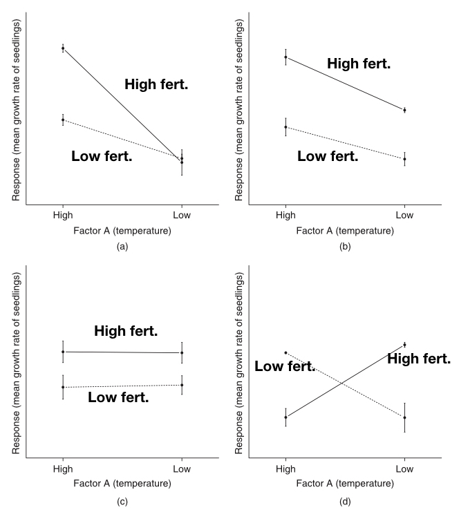

--- 
title: "Foundational Compuational and Statistical Tools for the Natural Sciences"
author: "Clayton M. Small, William A. Cresko, Andrew Muehleisen, Hope Healey and Sabrina Mostoufi"
date: "`r Sys.Date()`"
site: bookdown::bookdown_site
output: bookdown::gitbook
documentclass: book
bibliography: ["book.bib", "packages.bib"]
biblio-style: apalike
link-citations: yes
github-repo: rstudio/bookdown-demo
description: "This is the book of materials Foundational Computational and Statistical Tools for the Natural Sciences at the University of Oregon"
---

# Book Overview

This is the _associated book_ for the _Foundational Computational and Statistical Tools for the Natural Sciences Course_ at the University of Oregon. It is written in **Markdown** so that it can be easily updated. 

In this book you will find nearly all the information you will need to complete the course.


```{r include=FALSE}
# automatically create a bib database for R packages
knitr::write_bib(c(
  .packages(), 'bookdown', 'knitr', 'rmarkdown'
), 'packages.bib')
```

<!--chapter:end:index.Rmd-->

# Introduction to the course

This is the complete set of _course materials_ for the _Foundational Statistics Course_ at the University of Oregon for the Spring of 2020. It is written in **Markdown** so that it can be easily updated. 

In this book you will find nearly all the information you will need to complete the course.


## Instructors
Dr. Bill Cresko, wcresko@uoregon.edu

Hope Healey, hhealy@uoregon.edu

Sabrina Moustoufi, smostouf@uoregon.edu


## Course Information
Class Time: T-R 8:30 to 9:50

Working laboratory: xxxx

Cresko Office Hours: xxxx


## Software

- Latest version of R

- Latest version of RStudio

## Inclusion and Accessibility

Please tell us your preferred pronouns and/or name, especially if it differs from the class roster. We take seriously our responsibility to create inclusive learning environments. Please notify us if there are aspects of the instruction or design of this course that result in barriers to your participation! You are also encouraged to contact the Accessible Education Center in 164 Oregon Hall at 541-346-1155 or uoaec@uoregon.edu.

We are committed to making this course an inclusive and respectful learning space. Being respectful includes using preferred pronouns for your classmates. Your classmates come from a diverse set of backgrounds and experiences; please avoid assumptions or stereotypes, and aim for inclusivity. Let us know if there are classroom dynamics that impede your (or someone else’s) full engagement.

Because of the COVID-19 pandemic, this course is being delivered entirely remotely. We realize that this situation makes it difficult for some students to interact with the material, for a variety of reasons. We are committed to flexibility during this stressful time and emphasize that we will work with students to overcome difficult barriers as they arise.

Please see this page for more information on campus resources, academic integrity, discrimination, and harassment (and reporting of it).

<!--chapter:end:01-syllabus.Rmd-->

# Course Schedule

## Weeks 1-2

1. Data organization and management
    - best practices, reproducibility, etc.

2. Basic programming fundamentals for data curation
    - The Unix environment and fundamental commands
    - Formatting and manipulating tabular text files from the terminal

3. Introduction to R and Rstudio
    - Installation/Updates
    - R object types and assignment

4. Practice with R objects
    - vectors, matrices, data frames, etc.

5. Applying core programming fundamentals in R
    - vectorized operations
    - replicate, apply family, ifelse, for loops, etc.

## Week 3

1. Plotting/visualizing data as a means of exploration
    - Different plot types
    - Scale, transformations, etc.

2. Fundamentals of plotting in base R
    - par
    - using palettes, points, sizes, etc. to convey information
    - axes and labels
    
3. R markdown

## Week 4

1. Population parameters, samples, and sampling distributions
    - Central Limit Theorem and the normal dist.
    - Mean and st. dev.

2. Probability and probability distributions

3. Calculating summary statistics
    - Other common summary statistics (quantiles, etc.)

## Week 5

1. Parameter estimation
    - Simulating data sets with known parameters
    - Revisit probability distributions

2. Uncertainty in estimation
    - Parametric and nonparametric approaches to uncertainty

## Week 6

1. Experimental design
    - lexicon
    - considering sources of variance
    - types of variables (categorical, ordinal, rational)
    - confounding variables

2. Frequentist hypothesis testing
    - error types
    - p-values
    - degrees of freedom
    - statistical power
    - multiple testing problem

## Week 7

1. Comparing means between groups
    - Student’s t-test

2. Bootstrapping and randomization to compare means

## Week 8

1. Relationships between quantitative variables
    - correlation and covariance

2. Simple linear regression
    - residuals and least squares
    - fitting linear regression models

## Week 9

1. Analysis of variance
    - Table components and test statistics

2. General linear models in R
    - Model formulae
    - Interpretation of summary output

3. More complex ANOVA frameworks
    - Nested models
    - Factorial models

## Week 10

1. Frequency-based statistical tests
    - Chi-squared tests
    - Contingency tables and tests of independence

2. Brief introduction to generalized linear models (time permitting)
    - logistic regression
    

<!--chapter:end:02-schedule.Rmd-->

# Background material for the course

## Description of the course

This course in an introduction to data management, data visualization, and statistical
inference. It is intended for early-stage graduate students with no background in
statistics. No prior coursework (undergraduate or graduate) in statistics or
programming is assumed. The primary objective of the course is to get students up to
speed with respect to organization, manipulation, visualization, and analysis of data,
using the R statistical language. The emphasis on application is strong, with the goal
of enabling students (after the course) to analyze their own data sets with confidence
using reasonable approaches, and, when faced with more difficult analyses,
to be able to communicate their inference objectives clearly to expert analysts.
Students will learn to organize and analyze data sets in the form of RStudio projects,
using R Markdown files to reproducibly capture and render code, visualizations, and
analyses. In-class exercises will be delivered in the form of pre-formatted R
Notebooks, which can be interactively executed by students without having to write
all code from scratch.

The course is designed to acquaint students primarily with univariate (single
response variable) analysis. Multivariate analysis will be covered in the Advanced
Biostatics 2-course series offered during the Fall and Winter terms. Examples and
assignments in class will include data sets primarily from the biological sciences,
including studies of morphological and molecular traits, behaviors, ecological
questions, and clinical studies. For specific statistical topics covered in class, please
see the course goals and tentative schedule below.

## Course goals:

- Properly organize and format primary data and metadata files for analysis
- Learn programming fundamentals of the R statistical language, including
    objects, functions, iteration, and simulation.
- Make publication-quality data visualizations, including scatterplots, boxplots,
    frequency distributions, mosaic plots, etc.
- Understand Type I and Type II statistical error, including p-values and power analysis.
- Understand ordinary least-squares regression and linear models in general
- Learn the fundamentals of strong experimental design
- Learn to apply general linear models to basic univariate analysis problems,
    including Analysis of Variance (ANOVA)
- Learn nonparametric approaches to parameter estimate and statistical
    inference, including resampling (bootstrapping), permutation, and rank-
    based analysis.
- Understand how to analyze binary response variables and frequency-based
    (e.g. contingency table) data sets.

## Introduction to R and RStudio

R is a core computational platform for statistical analysis. It was developed a number of years ago to create an open source environment for advanced computing in statistics and has since become the standard for statistical analysis in the field, replacing commercial packages like SAS and SPSS for the most part. Learning R is an essential part of becoming a scientist who is able to work at the cutting edge of statistical analysis -- or even to perform conventional statistical tests (e.g. a t-test) in a standard way. An important part of R is that it is script-based, which makes it easy to create reproducible analysis pipelines, which is an emerging feature of the open data/open analysis movement in science. This is becoming an important component of publication and sharing of research results, so being able to engage fully with this effort is something that all young scientists should do.

RMarkdown is an extra layer placed on top of R that makes it easy to integrate text explanations of what is going on, native R code/scripts, and R output all in one document. The final result can be put into a variety of forms, including webpages, pdf documents, Word documents, etc. Entire books are now written in RMarkdown and its relatives. It is a great way to make quick webpages, like this document, for instance. It is very easy to use and will be the format that I use to distribute your assignments to you and that you will use to turn in your assignments.

R Projects are a simple way of designating a working directory in which to house files related to a given, well, project. Those files might include primary data and metadata files ready for reading into R, `.R` scripts, Rmarkdown files, and output such as Rmarkdown-rendered .html files or individual plots, for example. The nice thing about organizing your work with R Projects is that you can keep everything needed to reproduce an analysis in a single directory on your computer. You can open an R Project in RStudio by opening the project's index (`.RProj`) file, which will automatically set your working directory to that of the project and facilitate loading any saved environments, etc.

In Chapter 6 we will begin working in R and RStudio, but you can get them installed now (in that order) on your computer, if you haven't already. Get the most recent *released* R version by following this link:
https://www.r-project.org/

We will do our work using Rstudio, which is a powerful and convenient user interface for R, and can be downloaded from here for installation:
https://rstudio.com/products/rstudio/

### Learning resources

There are tons of resources for learning R and RMarkdown on the internet. Here are just a few, but you will no doubt find your own favorites as you become routine R users.

There is an organized group that is dedicated to training in R called DataCamp (https://www.datacamp.com/). They provide all of the basics for free. They actually have training for most data science platforms. RStudio provides links for training directly related to R and RMarkdown here:
https://education.rstudio.com/

There are also many, many R training videos on YouTube. Most of them are very well meaning but may not be as in-depth as you want. 

You can also go the old "paper" manual route by reading the materials provided by R itself:
https://cran.r-project.org/doc/manuals/r-release/R-intro.pdf

In reality, if you want to do almost anything in R, simply type in what you are interested in doing into Google and include "in R" and a whole bunch of links telling you exactly what to do will magically appear. Most of them appear as discussions on websites like StackOverflow and Stats.StackExchange. In that case, the first thing that you see is the question--usually someone doing it just a bit wrong--so you should scroll down to see the right way to do it in the answers. It is really an amazing resource that will speed you along in nearly every form of analysis that you are interested in.

Please do not hesitate to contact us if you have questions or run into obstacles. The point of this class is to learn by doing, but our aim is that the doing should involve reasonable first efforts supplemented with help if needed. Also, many of your classmates have some experience with R, writing code, or statistics in general, so they are an excellent resource as well!

<!--chapter:end:03-background.Rmd-->

# Organizing and manipulating data files

## Introduction

Many of you will already be familiar with data file organizaiton, editing, and formatting for analysis. If so, much of the following material may be review. If not, some of the following guidelines and tools should prove to be quite useful. In biology, and many other fields, primary data are routinely stored as "flat" text files. The exact formatting depends on the type of data, of course, but often we are working with text files organized into rows and columns. Rows can naturally be defined by lines in a file, and columns can be defined by separators (also called delimiters) such as spaces, tabs, or commas, to name a few commonly used ones. Fortunately there are some very powerful and simple-to-use (with a little practice) tools that can be invoked directly from a computer's command line, or included in written "scripts" that your computer's operating system can interpret upon you running them. These command line tools are now nearly ubiquitous on all personal computer platforms. Computers running a LINUX operating system allow direct access to these tools via the command line, as does the macOS operating system of Apple computers via the Terminal. Computers running Microsoft Windows 10 now also facilitate use of these conventional "UNIX tools" through a Windows Subsystem for Linux.

In the following sections, we provide a *very brief* introduction to using some of these tools in order to organize your data files, parse them for information, and perform some basic text manipulations. Mastering these activities is not necessary for this course (in fact, many of the text manipulation tasks can be done in R!), but if you learn to adopt at least some of these skills you will become a better, more organized analyst, and it will help you become comfortable with the command line and programming in general. 


## Navigating file systems from the command line

### Access to the command line

The first step to using command line tools is to get access to the command line! On Mac and Linux systems you can simply do this by finding and opening the `Terminal` application. On Windows 10 systems, you'll have to install a Linux Bash Shell if you haven't already. To do this you will need to follow the instructions here: https://itsfoss.com/install-bash-on-windows/
When you get to the point of choosing the Linux distribution to install, I recommend Ubuntu.

At this point you should have command line access through a terminal prompt, which should look something like my Mac Terminal below:


You are now ready to navigate and explore files simply by typing!

### Navigating directories and files

When you are at the command line, just think of your computer as you would if you were navigating using a graphical application (e.g. Mac Finder or Windows Explorer). You are always in a directory in your file system, and you can move to any other directory by typing the appropriate command and destination, then hitting Enter.

The first crucial UNIX command to learn is `pwd`. This command stands for "print working directory," and it will literally print the path of the directory you are currently in.

Another important command is `ls`. This lists the files and directories (by default) in your working directory. If you specify a different directory, it will list the files and/or directories there. Most UNIX commands (and indeed command-line programs in general), can be run with options. One way to invoke an option is to type a "flag" along with the command. In the case of `ls`, we can type `ls -l`, for example, which will print the output line-by-line. We can also add another flag: `ls -lh` (equivalent to `ls -l -h`), which will print items line-by-line but also make sure the item sizes are "human readable." If you ever have questions about how to use a UNIX program, including the flags and other options, you can type `man program_name` and a wonderful help manual will appear. To exit and return to the command prompt, just hit "q". These `man` pages are extremely useful and should be your first go-to if you need information for a particular command. Please use these regularly!

The command `cd` will change your location from the current directory to another directory. Like many other programs (UNIX and otherwise) requiring you to input directory and file locations, with `cd` you can specify your desired location using either the *absolute* or *relative* path. An absolute path is the full "address" of a directory or file, starting from the root of your file system. An example of an absolute path to a directory in my file system is `/Users/csmall/Dropbox/sculpin_project/images/`. Regardless of where my current working directory is in my file system, I can change to this `images/` directory using `cd` and the full path. I can also use a relative path, which is a sort of "shortcut," to specify the location of a directory or file. Let's say I am in `/Users/csmall/Dropbox/BiostatsFound_S2020/` and I want to get to the `images/` directory above. I could type `cd ../sculpin_project/images`, which uses a relative path to take me "up" one directory (as denoted by `../`) into `Dropbox/` and back "down" into `sculpin_project/images`. In fact, `..` is a special file in every directory that just means "the directory above." The special file `.` is the current directory. And to mention one final useful designation for navigation shortcuts, you can use the `~` to denote your home directory.

The schematic below should help you visualize how to think about file system navigation from the commmand line:


And for another example, take a look at this series of navigation commands from my terminal and see if you can follow along:


If you want to create a new directory, you can use the `mkdir` command, including the desired name of the new directory. By default this will create the directory in your current working directory, but you can use absolute or relative paths to instead write the directory somewhere else. If you want to delete an empty directory, `rmdir` is the appropriate command. 

Now let's briefly cover some UNIX commands that are useful for managing files. Some of these apply to directories as well, which I will point out as we go. The command `touch` can be used to create a new, empty file, which you can add to using a plain text editor. Examples of popular plain text editors with advanced user interfaces are BBEdit and Atom. You can also use command line text editors, such as `nano`, `emacs`, and `vim`. Most UNIX/LINUX systems have `nano` installed by default. To copy or change the name and/or location of a file (or directory), use `cp` and `mv` commands, respectively. Note that by using absolute or relative paths, you can specify where you want the file or directory to end up. Be especially careful with these, however, because you will overwrite any existing file or directory if you specify the same name and location. Another command you should be extremely cautious with is `rm`, which removes (permanently deletes) a file. `rm -r` can be used to delete a non-empty directory AND all of its contents.

In many cases you will want to look at files, or parts of them at least, from the command line. `cat` will print the entire contents of a file, but can also be used to combine ("concatenate") multiple files in a line-wise manner. `less` and `more` will display specific lines of a file (starting with the first ones), with single- or multi-line "scrolling," respectively, activated using the return or down-arrow keys. To leave the display, you need to hit the "q" key. `head` and `tail` will display the first or last, respectively, *n* lines of the file, where *n* is provided as a flag (e.g. `head -200 file.tsv`). The "word count" command `wc` can quantify elements of a text file in various ways, but one common application is `wc -l`, which counts the number of lines in a file.

An aside: If you are working from the command line and want to terminate a process (say you accidentally start a task that will take way too long), press Ctrl-C.

#### A quick review of important UNIX commands for navigation and viewing

`pwd` - prints working directory

`ls` - lists contents of a directory

`cd` - changes the working directory

`mkdir` - creates a new directory

`rmdir` - deletes an empty directory

`touch` - creates an empty file

`cp` - copies a file or directory

`mv` - changes the name of a file or directory

`rm` - deletes a file, or a directory and everything inside with `-r`

`cat` - prints the entire file to the terminal, or concatenates and prints multiple files

`less` - displays the first lines of a file, with scrolling line-by-line

`head` - prints the first 10 lines (default) of a file

`tail` - prints the last 10 lines (default) of a file

`wc -l` - prints the number of lines in a file

### Useful UNIX commands for file manipulation

In many cases you will want to search for specific characters or combinations of characters, and do various things with that information. Maybe you want to isolate the lines of a file that contain the query, or perhaps you want to count how many lines contain the query. The tool `grep` is extremely useful in this regard. We don't have time for a comprehensive dive into the utilities of `grep`, but a few common applications are worth mentioning. Character patterns we search for using `grep` may or may not involve special characters that are not interpreted literally. Here we will discuss just a few common cases of `grep` searches and the special characters involved. Some examples of these special characters include `^` (beginning of a line), `$` (end of a line), `.` (any single character except a newline), `*` (zero or more instances of the preceding character), and `\s` (any white space). The standard syntax for `grep` from the command line is `grep "expression" filename`. So, if you wanted to return all of the lines in the data file `zfish_data.tsv` (assuming it is in the current directory) that begin with "embryo_10", you could try ```grep "^embryo_10" zfish_data.tsv```. This search would also (unintentionally) find lines beginning with "embryo_100" or "embryo_101", etc., if they exist. So, you have to be careful, and learning the rules just takes practice. In this case ```grep "^embryo_10\s" zfish_data.tsv``` would achieve the desired result, assuming that there is a whitespace delimiter between fields ("columns") in the data file. Useful flags for `grep` include `-c` (which counts the number of lines containing the query), `-v` (which returns the lines that _do not_ contain the query), and `-n` (which prints the line number for each line containing the query). I encourage you to look at many different `grep` use cases online as your demand for complex searches grows.

The program `sed` has reasonably complex applications, but is commonly used as a sort of "search and replace" tool. The syntax for `sed` use is similar to `grep`, except that the query and replacement expressions are organized (with other information) using slashes. For "search and replace" functionality, that syntax looks like this: ```sed 's/query/replacement/flag' filename```. One common option for the "flag" component is "g", meaning "global", which replaces all instances. If no flag designation is made only the first instance in the file is replaced. Building on our toy example from above, ```sed 's/^embryo_/^larva_/g' zfish_data.tsv``` would perform a global replacement and print the output to the terminal. To change the contents in the original file on the fly, including `sed -i` would do the trick, but is riskier than redirecting the output to a new file.

`cut` is quite straightforward, and can be used to isolate individual fields (think of them like "columns") from a text file, provided the fields are consistently separated by a delimiter on each line. So, if I had a comma-separated file and I just wanted the first two columns I could type ```cut -f1,2 -d"\t" filename```. Note that if you don't specify a delimiter using the `-d` flag, then it is assumed to be tab-delimited. If you want to bring together fields in separate files, `join` can be used to accomplish this. The two files should have equivalent rows, however, for this action to work properly.

If you want to sort text files alphanumerically, in a field-wise fashion, `sort` is quite useful. If a file contains a single field, minimal specification is required, aside from tuning numerical sorting. For example, if you want to sort numerically, use the `-n` flag, and if you want to sort from largest to smallest, add the `-r` flag. If you want to sort a multi-field file based on just one field, you can use the "key" flag. For instance, if you have a tab-delimited file and want to sort by the second field in reverse numerical order, ```sort -k2,2 -nr filename.tsv``` would give you the desired result. Finally, if you want to eliminate lines with the same value for a given field, you can use the `-u` "unique" flag.

The UNIX program `awk` is an extremely powerful tool, and can itself be used essentially as a mini programming language. We will not get into the myriad uses of `awk` here, but the reference at the bottom of the chapter is a great resource if you want to learn more. `awk` is extremely efficient at parsing and capturing text files in a column-wise manner, with the ability to also evaluate logical statements applied to rows. The structure of `awk` commands is more complex than that of other UNIX programs we have discussed, but it is still very intuitive. One unique feature is that `awk` contains its own internal functions, which are typed inside curly braces. The "print" function can be used to extract fields, much like `cut`. For instance, ```awk -F: '{print $1,$6}' filename.tsv``` would print the first and sixth field from `filename.tsv`, assuming a ":" delimiter. With `awk`, fields are specified using the `$` character. If you want also to select only specific rows from a set of columns (like those with a certain value), you can incorporate logical operators. In the above example if we had wanted fields 1 and 6, but only those rows with a value of at least 610 in field 4, we could type the following ```awk -F: '$4 >= 610 {print $1,$6}' filename.tsv```. Again, this is just scratching the surface with `awk`, which boasts a great deal of potential for your text file manipulation needs.


#### A quick review of key UNIX commands for text file searching and manipulation

`grep` - searches a file for characters and character combinations

`sed` - stream edits characters and character combinations

`cut` - isolates specific fields ("columns") from a file using a delimiter

`join` - combines fields ("columns") from multiple files with equivalent rows

`sort` - orders the rows in a file based on one or more fields

`awk` - flexibly parses, evaluates, and selectively prints row- and column-wise 

### A quick word on pipes and carrots

One very convenient feature of UNIX commands is that you can control the flow of input and output from one command to another using the `|` ("pipe") character. For instance, I may want to search an entire file for rows that begin with "fish-1", and then replace the "-" with "\_". To do this I could do something like ```cat file.tsv | grep "^fish-1" | sed 's/fish-1/fish_1/g'``` This, of course, would print the output to the terminal, but I could actually capture that output into a file using the `>` character. ```cat filename | grep "^fish-1" | sed 's/fish-1/fish_1/g' > ./newfile.tsv``` would write this new file to my current working directory. Furthermore, if you want to append lines of text to an existing file, the "double sideways right-pointing carrot" character `>>` can be used.

The above lessons on UNIX commands for file manipulation truly just scratch the surface of what can be accomplished at the command line and in "shell scripts." You certainly will have further questions and be hungry for more, but we simply don't have time during this course. But to work on your UNIX skills for now, check out `Ex1_Unix_Intro.html` (on Canvas). We need to move on to R now, but at the bottom of this chapter are some UNIX command resources I have found to be especially useful.

## Data file and data file entry dos and don'ts

Do store a copy of your data in a nonproprietary format, such as plain ASCII text (aka a flat file). This is especially important if you are using tools (like UNIX commands) to parse and manipulate the files. Formats like Microsoft Excel are not acceptable as input for many analysis tools, and not everyone has access to proprietary software.

Do leave an un-edited copy of an original data file, even when main analyses require an edited version.

Do use descriptive names for your data files and variables, and use them consistently!

Do maintain effective metadata about the data.

Do add new observations to a data file as rows.

Do add new variables to a data file as columns.

Don't include multiple data types in the same column.

Don't use non-alphanumeric characters (other than the underscore) in file or directory names.

Don't use spaces, tabs, commas, colons, semicolons, or other characters commonly used as field (column) delimiters in names of individual data entries. For example, don't use something like `March 8` as a value for date in a data set.

Don't copy and paste data directly from rich-text-formatted files (like Microsoft Word) into primary data files.


## Exercises associated with this chapter:

- Exercise 1 (file: `Ex1_Unix_Intro.html`)

## Additional learning resources

- http://mally.stanford.edu/~sr/computing/basic-unix.html - A nice "cheat sheet"

- http://korflab.ucdavis.edu/Unix_and_Perl/ - Outstanding tutorial by Keith Bradnam and Ian Korf

- https://www.datacamp.com/courses/introduction-to-shell-for-data-science - DataCamp tutorial

- https://www.gnu.org/software/gawk/manual/gawk.html - A comprehensive guide to `awk`

<!--chapter:end:04-data_organization.Rmd-->

# An Introduction to the R language

## Background

`R` is a computer programming language and environment especially useful for graphic visualization and statistical analysis of data. It is an offshoot of a language developed in 1976 at Bell Laboratories called `S`. `R` is an interpreted language, meaning that every time code is run it must be translated to machine language by the `R` interpreter, as opposed to being compiled prior to running. `R` is the premier computational platform for statistical analysis thanks to its GNU open-source status and countless packages contributed by diverse members of the scientific community.

## Why use `R`?

- Good general scripting tool for statistics and mathematics
- Powerful and flexible and free
- Runs on all computer platforms 
- New packages released all the time
- Superb data management & graphics capabilities
- Reproducibility - can keep your scripts to see exactly what was done
- Can embed your `R` analyses in dynamic, polished files using R markdown
- You can write your own functions 
- Lots of online help available
- Can use a nice IDE such as `RStudio`

## Important `R` terms and definitions


From Logan, M. 2010. *Biostatistical Design and Analysis Using R*


Operators are symbols in programming that have a specific meaning


From Logan, M. 2010. *Biostatistical Design and Analysis Using R*

## Getting started with `R` via the RStudio Environment

To begin working with `R`, open RStudio. You should first see something that looks like this:


To open a new script editor (where you will keep track of your code and notes), go to File > New File > R Script. Note that there are other options for file types, which we will be using in the future. For now, though, we want a plain script, which when saved will have the extention `.R`.

It is easy to run code directly from the script editor. For single lines of code, simply make sure your cursor is on that line, and hit Ctrl-Enter. For multiple lines, highlight the block of code you want to run and hit Ctrl-Enter.

Now your display should look somehting like below (but without the red pane labels, of course):


Note that you can also type commands directly from the command line using the `R` Console (lower left pane), and the `R` interpreter will run them when you press Enter.

Any objects you define, and a summary of their values, will appear in the upper right pane, and the lower right pane differs in appearance depending on instructions you provide to `R Studio`. For instance, if you produce a plot, it will appear there by default. Another extremely important feature of R functions (we'll get to them in a bit) is the help file. Recall from Chapter 5 our discussion of `man` pages for UNIX programs. Help files the equivalent for `R` functions. They contain almost everything you need to know about a given function, and most of them even include and example at the bottom. These help files will appear in the lower right RStudio pane when you call them, for example when you run `help(function_name)` at the `R` Console.

### R Programming Basics

For the code examples below, it might be useful for you to start your own RStudio session, open a new `.R` file and type/run code while reading.

- Commands can be submitted through the terminal, console or scripts
- In your scripts, anything that follows `#` symbol (aka hash) is just for humans
- Notice on these slides I'm evaluating the code chunks and showing output
- The output is shown here after the two `#` symbols and the number of output items is in `[]`
- Also notice that `R` follows the normal priority of mathematical evaluation


```{r basic multiplication, echo=TRUE}
4*4
```

```{r more multiplication, echo=TRUE}
(4+3*2^2)
```

#### A note on `R` Markdown

This format provides a much better way to embed code and output, in an easily readable, reproducible manner. We will dive into `R` Markdown next week, so for now just be aware that it exists.

- http://kbroman.org/knitr_knutshell/pages/Rmarkdown.html

- You can insert `R` chunks into `Rmarkdown` documents

#### Assigning Variables

- To "store" information for later use, like the arithmetic operation above, we can assign variables in `R`.

- Variables are assigned values using the `<-` operator.

- Variable names must begin with a letter, and should not contain spaces or `R` operators (see above) but other than that, just about anything goes. It is good practice to avoid periods in variable names, as they have other functionality in related programming languages, like Python. 

- Do keep in mind that `R` is case sensitive.

```{r assigning variables, echo=TRUE, tidy=TRUE}

x <- 2
x*3
y <- x * 3
y-2

```

These do not work

```{r eval=FALSE, echo=TRUE}
3y <- 3
3*y <- 3
```

#### Arithmetic operations with functions

- Arithmetic operations can be used with functions as well as numbers.

- Try the following, and then your own.

```{r functions, eval = FALSE, echo = TRUE}
x+2
x^2
log(x) + log(x+1)
```

- Note that the last of these - `log()` - is a built in function of `R`, and therefore the argument for the function (in this case "x" or "x+1") needs to be put in parentheses.

- These parentheses will be important, and we'll come back to them later when we add other arguments after the object in the parentheses.  

- The outcome of calculations can be assigned to new variables as well, and the results can be checked using the `print()` function.

```{r, echo=TRUE}
y <- 67
print(y)

x <- 124
z <- (x*y)^2
print(z)
```

#### Strings

- Assignments and operations can be performed on characters as well.
- Note that characters need to be set off by quotation marks to differentiate them from numeric objects.

- The c(function) stands for 'concatenate'.
- Note that we are using the same variable names as we did previously, which means that we're overwriting our previous assignment.

- A good general rule is to use new names for each variable, and make them short but still descriptive

```{r, echo=TRUE}
x <- "I Love"
print (x)
y <- "Biostatistics"
print (y)
z <- c(x,y)
print (z)
```

The variable z is now a vector of character objects.

#### Factors

- Sometimes we would like to treat character objects as if they were units for subsequent calculations.

- These are called factors, and we can redefine our character object as one of class factor.

- This might seem a bit strange, but it’s important for statistical analyses where we might want to calculate the mean or variance for two different treatments. In that case the two different treatments would be coded as two different "levels" of a factor we designate in our metadata. This will become clear when we get into hypothesis testing in `R`.

```{r, eval = FALSE, echo = TRUE}
z_factor <- as.factor(z)
print(z_factor)
class(z_factor)
```

Note that factor levels are reported alphabetically. I used the `class()` function to ask `R` what type of object "z_factor" is. `class()` is one of the most important tools at your disposal. Often times you can debug your code simply by changing the class of an object. Because functions are written to work with specific classes, changing the class of a given object is crucial in many cases.

#### Null values

- R (and many programming languages) have special strings that mean 'no value', or 'null'. In R, the most common is `NA`, although there are others as well (`NULL` and `NaN`) 

- Typically, `NA` is used to indicate a lack of data for a given observation, or a missing value where there normally should be one. 

- Any instance of a blank entry in your data file will be read into R as an `NA`. 

- NA is a technically a logical data type, and is *not* equivalent to an empty string or the numeric 0. It is also a reserved word and can't be used as a variable name. 

```{r, echo = TRUE}
class(NA)
```

Many functions in R (e.g. `mean()`) will not work by default if passed any NA values as an argument. So if we want to determine the mean of a vector of numeric values, we need to ensure there are either no NA values in the vector, or specify an additional 'argument' to the function telling it to ignore `NA`. Additionally `NA`, like other 'null' values, are operated on by a number of unique functions in R.

```{r, echo = TRUE}
num <- c(0,1,2,NA,4)
mean(num)
mean(num, na.rm = TRUE)
is.na(num)
```

#### Vectors

- In general R thinks in terms of vectors (a list of characters factors or numerical values) and it will benefit any R user to try to write programs with that in mind.

- The simplest vectors in R are 'atomic' vectors, meaning that they consist of only one data type. 

- R operations, and therefore functions, are vectorized.

- This means an operation or function will be performed for each element in a vector.

- Vectors can be assigned directly using the 'c()' function and then entering the exact values.

```{r Example vectors, echo=TRUE}
x <- c(2,3,4,2,1,2,4,5,10,8,9)
print(x)
x_plus <- x+1
print(x_plus)
```

- Creating vectors of new data by entering it by hand can be a drag.

- However, it is also very easy to use functions such as `seq()` and `sample()`.

- Try the examples below. Can you figure out what the three arguments in the parentheses mean?

- Within reason, try varying the arguments to see what happens


```{r, echo = TRUE}
seq_1 <- seq(0.0, 10.0, by = 0.1)
print(seq_1)
seq_2 <- seq(10.0, 0.0, by = -0.1)
print(seq_2)
```


```{r, echo = TRUE}
seq_square <- (seq_2)*(seq_2)
print(seq_square)
```


```{r, echo = TRUE}
seq_square_new <- (seq_2)^2
print(seq_square_new)
```


- Here is a way to create your own data sets that are random samples.

- Again, on your own, play around with the arguments in the parentheses to see what happens.


```{r Samples from distributions 1, out.width='100%', echo = TRUE}
x <- rnorm (10000, 0, 10)
y <- sample (1:10000, 10000, replace = T)
xy <- cbind(x,y)
plot(x,y) 
```

- You’ve probably figured out that "y" from the last example is a draw of numbers with equal probability (what we call a flat, or uniform distribution).

- What if you want to draw from a defined probability distribution, like the normal distribution?

- Again, play around with the arguments in the parentheses to see what happens.

```{r Samples from distributions 2, out.width='100%', echo = TRUE}
x <-rnorm(100, 0, 100)
print (x)
hist(x, xlim = c(-50,50))
hist(x, xlim = c(-500,500))
```

Can you figure out what the three rnorm() arguments represent?


#### Basic Summary Statistics

We will get into the details regarding summary statistics later, but for now, check out several of the `R` functions that calculate them.

```{r, eval = FALSE, echo = TRUE}
mean(x)
median(x)
var(x)
log(x)
ln(x)
sqrt(x)
sum(x)
length(x)
sample(x, replace = T)
```

- Notice that the last function (`sample`) has an argument (`replace=T`)

- Arguments simply modify or direct the function in some way

- There are many arguments for each function, some of which are defaults

#### Getting help to understand functions

- Getting help on any function is very easy - just type a question mark and the name of the function.

- There are functions for just about anything within `R` and it is easy enough to write your own functions if none already exist to do what you want to do.

- In general, function calls have a simple structure: a function name, a set of parentheses and an optional set of arguments you assign parameters to and send to the function.

- Help pages exist for all functions that, at a minimum, explain what parameters exist for the function.

- Help can be accessed a few ways - try them :

```{r, eval = FALSE, echo = TRUE}
- help(mean)
- ?mean
- example(mean)
- help.search("mean")
- apropos("mean")
- args(mean)
```

## Exercises associated with this chapter:

- Exercise 2 (`rtutorial_1` in `foundstats` R package)

## Additional learning resources:

- Logan, M. 2010. Biostatistical Design and Analysis Using R. - A great intro to R for statistical analysis

- http://library.open.oregonstate.edu/computationalbiology/ - O’Neil, S.T. 2017. A Primer for Computational Biology

<!--chapter:end:05-R_introduction.Rmd-->

# More R Functions, Complex Objects, Basic Plotting, and RMarkdown

## Background

In this chapter we will cover a variety of topics, all of which will help you build your `R` programming skills and make you capable of dealing with data sets using `R`. We will explore additional base `R` functions that are extremely useful for generating and manipulating vectors, combining vectors into multidimensional `R` objects, and working with those objects. We will also cover base `R` plotting functions to get you started with making your own publication-quality plots. Finally, we will touch on the RMarkdown file format, how to write those files in `RStudio`, and how to render the `.Rmd` file into polished, readable `.html` documents.


## More on functions

In the last chapter we touched on functions in `R`, gave a few examples of commonly used functions, and covered how to learn more about a function using the `help()` function. As mentioned, functions and their use follow a basic structure. To call functions we type their name and include a set of parameters expressed as arguments, which specify what we want them to do, inside parentheses `()`. For example, to successfully call the function `mean()`, we need, at minimum, to supply a vector of numeric values. That vector can be an obect we have already assigned in our environment, or it can be the outcome of another function called within the `mean()` function. Below are these two alternatives.

```{r, echo=TRUE}
z <- c(10, 20, 30)
mean(z)

mean(c(10, 20, 30))
```

The second alternative illustrates the power of "nesting" functions within `R`. You don't need to perform tasks by defining a bunch of intermediate objects and calling functions in piecemeal manner. In many cases it is much more efficient to nest functions within one another, as long as it doesn't jeopardize the functionality or readability of your code.

Base `R` includes dozens of useful functions that will become part of your regular arsenal. We have already mentioned several of these and discussed how to discover and learn more about them. As you become a more advanced `R` user, and in particular as you begin performing tasks and analyses more specific to your field of study, you will need to use functions that are not included in the base `R` library. Fortunately, there are thousands of functions distributed in the form of `R` "packages," which you can easily install on your system. Packages especially easy to find and use are those distributed via the Comprehensive R Archive Network (CRAN): https://cran.r-project.org/web/packages/index.html. If you find a specific function or set of functions you are interested in trying out, for instance after a Google search of your problem, you can download and install the package those functions belong to by running the following command from your `R` Console:

```{r eval=FALSE, echo=TRUE}
install.packages("name_of_package")
```

Note that the name of the package has to be spelled correctly (and `R` is case sensitive), and that the name of the package should be in quotation marks. You will get a series of messages printed to the Console, and finally either a confirmation of installation or error message. Once you have installed a package successfully, you do not need to re-run the `install.packages()` function. If you want to check whether a package has already been installed, and look at the details of that installation, you can always run the following from the Console:

```{r eval=FALSE, echo=TRUE}
installed.packages("name_of_package")
```

To actually use the functions from an installed package, you have to "load" that package into your current working environment. To do that we use the `library()` function:

```{r eval=FALSE, echo=TRUE}
library(name_of_package)
```

Note that you do not include quotation marks around the package name for the `library()` function. Unlike package installation, you will need to invoke `library()` every time you start a new `R` session to load the package and its functions.

It is also possible, and quite straightforward, to write your own `R` functions, which you can define within your `.R` or `.Rmd` scripts for convenient usage. If you get the the point at which you want to distribute your own functions in the form of a package, that is possible too. Later during this course we will get a little experience in writing simple `R` functions. Writing more involved functions and publishing packages, however, are topics for a more advanced `R` course.

### More base `R` functions useful for working with vectors

Below are annotated lists of base `R` functions commonly used to work with vectors. We will not take the time here to give specific examples for each function, because their usage is quite straightforward and you will get plenty of practice with them in associated exercies. You can also practice using the `help()` function if you have specific questions.


**The following functions provide information about vectors:**

- `head()`: returns the first elements of an object (like a vector or data frame)

- `tail()`: returns the last elements of an object (like a vector or data frame)

- `length()`: returns the number of elements in a vector

- `class()`: returns the class of elements in a vector (e.g. "character", "numeric", "factor", etc.)


**The following functions can modify or generate vectors in structured ways:**

- `sort()`: returns a sorted vector from an orignal vector of numeric values

- `seq()`: returns a "series" of numeric values beginning at one value and ending at another, while also specifying the size of increments/decrements between values

- `rep()`: returns a vector of identical elements, repeated a specified number of times

```{r, echo=TRUE}
rep(1, 5)
rep("one", 5)
```

Note that `seq()` and `rep()` can be repeated and/or combined in various ways, in some cases using `c()`, to generate vectors in a multitude of patterned ways.  


**The following functions can generate vectors of random values, randomly shuffle vectors, or generate vectors of values drawn from defined probability distributions:**

- `sample()`: randomly selects and returns elements from a vector ("shuffles" a vector when size argument is set to original vector size and replace argument is set to "FALSE")

- `rnorm()`: randomly draws values from a theoretical normal distribution

- `rbinom()`: randomly draws values from a theoretical binomial distribution

- `set.seed()`: sets `R`'s random number generator seed so that operations with stochastic properties can be reproduced 


**The following functions can change the class of elements in a particular vector:**

- `as.numeric()`: changes the class of objects in a vector to "numeric".

- `as.factor()`: changes the class of objects in a vector to "factor".

- `as.character()`: changes the class of objects in a vector to "character".

The `as.xxx` family of `R` functions is especially useful if you need to convert the class of a particular object for a given function to use the object properly.


## Indexing vectors

Now that we are quite familiar with different ways for generating vectors, let's discuss how we isolate specific elements from those vectors. This process is called "indexing," and in `R` simple numeric (or "positional") indexing is intuitively based on integers, starting from "1". We use the square braces for numeric indexing in `R`: `[]`. For example if we want to index the first element in a vector, we simply type `[1]` after the vector. Indexing can be performed on a defined vector, or on the fly using the immediate output of a function call.

```{r, echo=TRUE}
## Using our vector z from above
z[1]

## On the fly using output from the c() function
c(10, 20, 30)[1]
```


To isolate a series of consecutive elements from a vector, we simply use the `:` character. For example, if we want to index the first (or last) 4 elements from the vector below we could do this, respectively:

```{r, echo=TRUE}
c(10, 20, 30, 40, 50, 100, 200)[1:4]

c(10, 20, 30, 40, 50, 100, 200)[4:7]
```


For indexing discontinuous elements, we can use our old friend, the `c()` function inside of the square braces. So, if we want to index the first 3 and the 5th elements:

```{r, echo=TRUE}
c(10, 20, 30, 40, 50, 100, 200)[c(1:3, 5)]
```


Finally, we can use the `-` character to index all elements of a vector, "minus" other elements. When excluding even consecutive elements, however, we have to include `c()`. For instance, if we want all **except** the first 2 elements, we could do:

```{r, echo=TRUE}
c(10, 20, 30, 40, 50, 100, 200)[-c(1:2)]
```


## More complex data objects in `R`

Vectors are extremely important object types in `R`, for the reasons and examples we have already discussed. Other types of objects in `R` are also important, and necessary to learn about to do meaningful and efficient work. These other types of objects are more complex than vectors, but they can, in many cases, be composed of vectors.


### Lists

Lists in `R` are aggregates of different objects, and those objects can be a mixed variety of types. For example, a list could be an aggregate of 3 different vectors, even if those vectors are different lengths and contain elements of a different class. We can generate lists using the `list()` function.

```{r, echo=TRUE}
vec1 <- c(10, 20, 30, 40, 50, 100, 200)
vec2 <- c("happy", "sad", "grumpy")
vec3 <- factor(c("high", "low"))

mylist <- list(vec1, vec2, vec3)

print(mylist)

class(mylist)

str(mylist)
```

Let's take note of a few things from the output above. First, notice that each of the three vectors in `mylist` has a numeric (positional) index. Unlike individual vectors, however, primary elements of lists are indexed by double square braces `[[]]`. So, if we want to index the `vec2` element of `mylist`, we type:

```{r, echo=TRUE}
mylist[[2]]
```

Taking it one step further, if we want to index the 2nd element of the `vec2` element of `mylist`, we type:

```{r, echo=TRUE}
mylist[[2]][2]
```

The other things we should note from our exploration of `mylist` above is that 1. It has a class when we call the `class()` function, and 2. We see a nice breakdown of the 3 components that make up `mylist` when we call the `str()` function. `str()`, which is short for "structure," is an especially useful function for trying to understand the organization of complex objects in `R`.


### Data frames

There is a special class of list we very often work with in `R` called a "data frame." You can think of data frames as an especially useful organizing structure for data sets. Data frames are lists of vectors, but the vectors have to be the same length. Also, the vectors (officially known as "columns") in data frames have names we refer to as "column names," and the rows also have names. For the types of analysis we will be dealing with in this course, it helps to organize our data so that variables in our study correspond to columns and observations correspond to rows. Let's explore some practical details regarding the generation and use of data frames.


#### Creating data frames in `R`

We can generate data frames manually, like we did with the list `mylist` above. Here, for example, we can set up three variables (habitat, temp and elevation) as vectors.

```{r, echo=TRUE}
habitat <- factor(c("mixed", "wet", "wet", "wet", "dry", "dry", "dry","mixed"))
temp <- c(3.4, 3.4, 8.4, 3, 5.6, 8.1, 8.3, 4.5)
elevation <- c(0, 9.2, 3.8, 5, 5.6, 4.1, 7.1, 5.3)
```

Then we can use the `data.frame()` function to incorporate the vectors into columns of the data frame.

```{r, echo=TRUE}
mydata <- data.frame(habitat, temp, elevation)
row.names(mydata) <- c("Reedy Lake", "Pearcadale", "Warneet", "Cranbourne", 
                       "Lysterfield", "Red Hill", "Devilbend", "Olinda")
```

Note above that we used a function called `row.names` to assign row names to `mydata`. The function `colnames()` does the same, but for column names.


#### Working with pre-loaded base `R` data frames.

There are a few data frames that are available to work with whenever you begin an `R` session. These can be a great way to practice plotting and analysis, and in fact many examples written to accompany `R` functions include these data frames to promote reproducibility and convenience. Two of these pre-loaded data frames that are especially popular are `mtcars` and `iris`.

```{r, echo=TRUE}
head(mtcars)
```

```{r, echo=TRUE}
head(iris)
```


#### Reading in data frames in `R`

A strength of `R` is being able to import data from an external source. For example, if you have a comma- or tab- separated text file (like the UNIX-friendly formats we discussed previously), it can be easily read into `R`, by default as a data frame. One function for accomplishing this is `read.table()`, although functions like `read.delim()` can be similarly applied. Two important arguments for `read.table()` are "header" and "row.names", which indicate that there is a header row (with column names) and row label column (with row names), respectively. You also need to supply the file path and name in quotation marks (no path necessary if the file is in the current working directory), and what character is used as the field (column) delimiter. Here is an example:

```{r, eval = FALSE, echo = TRUE}
YourFile <- read.table('yourfile.csv', header=T, row.names=1, sep=',')
YourFile <- read.table('yourfile.txt', header=T, row.names=1, sep='\t')
```

#### Exporting data frames in `R`

If you ever want to save a data frame in a format that you can work with outside of `R`, the `write.table()` function does pretty much the opposite of its "read" counterpart.

```{r, eval = FALSE, echo = TRUE}
write.table(YourFile, "yourfile.csv", quote=F, row.names=T, sep=",")
write.table(YourFile, "yourfile.txt", quote=F, row.names=T, sep="\t")
```

#### Indexing data frames
Indexing data frames can be acheived in two different ways. We can use numeric (positional) indexing as in the case of vectors and lists (see above). With a data frame, we can index any subset of it using two pieces of information: row coordinates and column coordinates. To accomplish this we use single square braces `[,]`, in which the row coordinate(s) are typed first, followed by a comma, followed by the column cooridate(s). If we want to index all rows or all columns, we just leave the space to the left or right of the comma blank, respectively. Here are some examples for indexing subsets of the `iris` data frame.

```{r, echo=TRUE}
## The first row, with all columns
iris[1,]
## The first 5 rows and the first 2 columns
iris[1:5,1:2]
```

With data frames, we can also use the column names to index subsets. To do this we use the `$` character after the name of the data frame, followed by the name of the column we want to index. Again, below is a demonstration using `iris`. Indexing using column names is perhaps the most useful when defining statistical models, a topic we will reach later in the course.

```{r, echo=TRUE}
## The first 5 rows of the first column
iris$Sepal.Length[1:5]
```


### Matrices

Matrices in `R` are somewhat similar to data frames, but mixed classes among columns are not permitted, and rows and columns are only positionally indexed as opposed to having names. Positional indexing for matrices, not surprisingly, follows the `[rownumber, columnnumber]` convention, similar to data frames. A matrix can be generated using the `matrix()` function, as demonstrated below.

```{r, echo=TRUE}
## Populate a 3x3 matrix with values 1 to 9
matrix(1:9, nrow=3, ncol=3)
```


### A few additional base `R` functions for working with complex `R` objects

To add to your foundational knowledge of `R` functions, below are a few more functions especially useful for working with objects like data frames and matrices. 

- `dim()`: returns the number of rows and columns of a data frame or matrix

- `View()`: opens up a GUI "viewer" for visual inspection of data frames (not recommended for large data frames)

- `cbind()`: combines columns into a single object, which can be used to define or build data frames or matrices

- `rbind()`: combines rows into a single object, which can be used to define or build data frames or matrices

- `t()`: transposes a data frame or matrix, such that rows become columns, and columns become rows


## Some brief notes on basic programming in `R`

At some point during your development as an `R` user you will want to programmatically manipulate `R` objects in an iterative, repeatable manner to automate tasks like plotting, simulations, and analysis. This use of the `R` language is especially relevant if you want to write your own functions. Here we touch on a few tools and approaches that will open the door to more powerful programming in `R`. These are skills that are great to practice and learn, but at a fairly foundational level for now. More advanced programming training in `R` is beyond the scope of this course.   


### conditional statements with `ifelse()`

One fundamental structural component of computer programming languages is the idea of conditional statements, which often take the form of "if/else" evaluation and execution. The idea is that we can write an algorithm to evaluate a particular statement using a logical operator, and if that statement is true have the program do one thing, but if the statement is false, have it do somehting "else." In `R` we can write these statements with a structure similar to other languages, but we can also use the single `R` function `ifelse()` to accomplish the same thing. The `ifelse()` function is very easy to use. The first argument is the logical evaluation, the second argument is the action to take if that statement is true, and the third argument is the action to take if false. It is also possible to nest multiple `ifelse()` function calls wihtin one another, if mulitiple evaluations need to be performed with different outcomes. Below is a simple example for using `ifelse()` to generate a vector of values ("colors"), based on another vector.

```{r, echo=TRUE}
## First define a character vector
char_vec <- c(rep("treatment",5), rep("control",3), rep("treatment", 4), rep("control", 6))
print(char_vec)

## Generate a vector that stores the color "red" for "treatment" and "blue" for "control"
col_vec <- ifelse(char_vec=="treatment", "red", "blue")
print(col_vec)
```

## The Split-Apply-Combine approach to data analysis

It can often feel like the specific tools and strategies required for data analysis are unique to any given combination of question and data. However, one motif does appear time and time again: the need to take a larger data set, summarize a key variable by one or more grouping variables, and return the result as a new, more directly useful data object. This work flow is often called the 'Split-Apply-Combine' approach to data analysis. You first (1) **Split** your data by some grouping variables of interest e.g. treatment, (2) **Apply** a function to another variable for each group separately e.g. the mean of some response variable, and (3) **Combine** the output into a new data object e.g. a named vector or data frame. Because this approach is so common, `R` has many ready-made functions and packages to make this as easy as possible. 

### `replicate()`, `apply()`, `tapply()`, and `aggregate()`

In some cases we want to repeat a given process over and over again. For example, maybe we want to simulate the sampling process and generate 100 random samples of 100 values from a normal distribution. Fortunately, the `R` function `replicate()` makes this very easy.

In the example below, we "shuffle" the order of the integers 1 through 10 five times using `replicate()`:

```{r, echo=TRUE}
replicate(5, sample(1:10, size=10, replace=FALSE))
```

Note that the first argument is the number of total iterations we want to reproduce, and that the function returns a matrix as output. 

The `replicate()` function belongs to a group of functions referred to informally as the "apply" family. Another, similar function from this family is simply called `apply()`, and it can be used to apply a function to either all rows (with the MARGIN argument set to 1) or all columns (with the MARGIN argument set to 2) in a data frame or matrix. This is especially useful for calculating summary statistics for what we call the "margins" of data in tables. 

You might be starting to see how this family of functions could emulate the **S-A-C** approach to data analysis. A very useful function from this group is `tapply()`, which allows you to apply a function to one vector (for example a numeric vector in a data frame), in a group-wise manner based on one or more factor vectors that correspond to the numeric vector. In other words, if we want to find the maximum value of variable x for each level of factor y in a data frame, we could use `tapply()` to do so. Below is an example, again using the `iris` data frame.

```{r, echo=TRUE}
## Find the maximum petal length for each species in the iris data frame
tapply(iris$Petal.Length, iris$Species, max)
```

Note that the first argument is the numerical column, and the second is a factor column. The third is the function we wish to apply, in this case to each species separately. 

One problem with `tapply()` is that it only allows you to apply a function to a single variable of interest. What if you would like to summarize *all* relevant variables based on one or more factors? For that, we can use `aggregate()`. For example, we could collapse the entire `iris` data frame by finding the average of each numeric column by species.

```{r, echo=TRUE, warning = FALSE}
## Find the mean of each variable for each species in the iris data frame
aggregate(iris, by = list(iris$Species), FUN = mean)
```

Much like `tapply()`, the first argument is the data we wish to summarize, the second argument is the grouping variable (which must be passed as a list), and the third argument is our function. Note that in this case, we end up with a pointless `Species` column, as the `aggregate()` function attempts to apply a function to *every* variable, including the grouping variable, producing a column of NAs in this case. `aggregate()` is a highly flexible function - you can choose to select only a subset of data to summarize, specify multiple grouping variables, and aggregate your data using formula notation as well (a topic that  will be covered later in this book). 


### For loops in `R`

Another fundamental concept in computer programming is the "for loop," which is an algorithmic strategy for iteratively performing a task according to a pre-defined counter or loop variable, then terminating when the "loop" is evaluated as complete. For example, we may want to perform a specific calculation again and again for successive elements of an `R` object (like a data frame), and build a vector that successively stores the calculation for each iteration of the "loop." We will not devote much time to for loops in `R` here, because a lot of looping functionality is accessible in `R` without ever needing to specify a loop. For example, the "apply" group of functions accomplish many of the tasks you would otherwise write a for loop to perform. Additionally, remember that `R` is a vectorized programming language, meaning that many basic operations, like addition or multiplication, are automatically performed iteratively to each element in vectors. Whenever you are considering writing a for loop, carefully consider whether there is a much faster alternative. 

However, the commented example below illustrates an application in which a for loop is warranted. Note that we "pre-allocate" output vectors by creating an empty data frame to store the results. This maximizes for loop speed by circumventing the need to re-write objects as we iteratively add elements. 

```{r, echo=TRUE}
## Calculate mpg/cyl and mpg/wt, for every row in mtcars and if the second is at least twice the size of the first include that ratio and another character value "Yes" in a growing 2-column dataframe. If the ratio is less than 2, then include "No" in the second column. 

## first pre-allocate our new data frame, which contains NAs initially
newdf <- data.frame(rep(NA, length(mtcars$mpg)), rep(NA, length(mtcars$mpg)))

## then write the for loop to do the above task for every row in mtcars
for(i in 1:length(mtcars$mpg)) {
  newdf[i,1] <- (mtcars$mpg[i]/mtcars$wt[i])/(mtcars$mpg[i]/mtcars$cyl[i])
  newdf[i,2] <- ifelse(newdf[i,1]>=2, "Yes", "No")
}
  print(newdf)
```

In the case above, we used the length of the `mtcars` data frame (number of rows) to build a pre-allocated (filled with NAs) data frame of the correct size. Then, we also used the values 1 through that length to set up our "counter" in the for loop. The loop stops after tasks have been completed for `i=32`, which corresponds to the final row in `mtcars`. As mentioned, it's probably better to rely on the other convenient `R` functions above for iterative processes, but pre-allocation of output objects is the way to go if you do need to rely on a for loop.


## Fundamentals of plotting in `R`

The world of plotting in `R` is incredibly diverse, and there are entire courses dedicated to data visualization using `R`. Here we will very briefly cover a few of the most useful plotting functions and strategies using base `R`. This should be enough of an introduction to get you jump started, but you will no doubt discover more appealing and finely tuned strategies to apply in your future as an `R` user. For example, some people will find that the highly flexible, customizable package `ggplot2` and its plotting functions are preferable over base `R`. I encourage you to explore tools like this on your own, once you feel comfortable with `R` in general. We will also introduce plot- and visualization-related lessons throughout the remainder of the course, as they pertain to the analysis topic at hand.


### Basic plotting with `plot()`

One "high level" plotting function in base `R` is simply called `plot()`. This function can accomplish many, many plotting goals, so we will start with it. Below, we start by calling `plot()` on a single vector that we have generated. Spend a little time examining the code, and the arguments passed to `plot()` in this example.

```{r, echo = TRUE}
seq_1 <- seq(0.0, 10.0, by = 0.1) 
plot(seq_1, xlab="space", ylab ="function of space", type = "p", col = "red")
```


We only supplied the one vector (`seq_1`) to `plot()` in this case, which resulted in the function just defining the x-axis values as the numeric positions (1 to 101) of `seq_1`. Also, this style of plot is known as a "scatterplot." There is usually more "scatter," for example when plotting two variables that not perfectly related. With `plot()`, we usually want to examine the relationship between two different variables, like below:

```{r, echo=TRUE}
seq_1 <- seq(0.0, 10.0, by = 0.1)
seq_2 <- seq(10.0, 0.0, by = -0.1)
plot(seq_1, seq_2, xlab="sequence 1", ylab ="sequence 2", type = "p", col = "red")
```

In this example, `plot()` takes the first argument as the x-axis variable, and the second argument as the y-axis variable. You can also use the `~` to specify variables, but in this case the y-axis variable comes first (`y ~ x`). Also note the other arguments, which are usually named pretty intuitively. Note the axis label arguments, the type of object plotted ("p" stands for "points"), and the color of the plotted objects. There are many possible arguments, and many are actually set by another function called `par()`, that `plot()` calls on internally. One great resource for understanding plotting function arguments is the help menu for `par()`. I promise, if you become familiar with the `par()` documentation, you will quickly ascend the ranks of plotting prowess, and it will save you many frustrating moments in the future! I encourage you to study the `plot()` and `par()` documentation and practice using some of the other arguments that are especially useful, including "main", "xlim", "ylim", and "cex", for example.

The nice thing about graphical parameters is that, like many things in `R`, they are vectorized. So, if we want to use different symbols (look into the "pch" argument), colors ("col"), or sizes (look at "cex") of points for different observations in something like a data frame, we can supply those in the form of a vector! Taking the example above, if we want to plot the first 10 observations as blue, and the remaining observations as red, we can supply a vector of "blues" and "reds" in the appropriate order to `plot()`.

```{r, echo=TRUE}
seq_1 <- seq(0.0, 10.0, by = 0.1)
seq_2 <- seq(10.0, 0.0, by = -0.1)
plot(seq_1, seq_2, xlab="sequence 1", ylab ="sequence 2", type = "p", 
     col = c(rep("blue", 10), rep("red", 91)))
```

You can see how this would be a nice way to differentiate among observation types in your data set, and produce an information-rich, single plot, as opposed to producing many plots that highlight single variables.


Sometimes we want to include multiple plots, as different panels, in the same figure. Fortunately this is made easy by the `mfrow` argument within `par()`. You simply set the dimensions, denoted by number of rows and number of columns in parentheses, before calling `plot()` repeatedly.

```{r, echo=TRUE}
seq_square <- (seq_2)*(seq_2)
seq_square_new <- (seq_2)^2

par(mfrow=c(2,2))
plot (seq_1, xlab="time", ylab ="p in population 1", type = "p", col = 'red')
plot (seq_2, xlab="time", ylab ="p in population 2", type = "p", col = 'green')
plot (seq_square, xlab="time", ylab ="p2 in population 2", type = "p", col = 'blue')
plot (seq_square_new, xlab="time", ylab ="p in population 1", type = "l", col = 'yellow')
```


### Histograms using `hist()`

We will talk more about frequency distributions and histograms later in the course, but for now it is a good idea to become familiar with one way to plot them. If we have a quantitative variable, like height, and we want to know what the distribution among individuals looks like, we can use a histogram. The function `hist()` will help us with this task. To illustrate, below we will sample values from a binomial distribution. Don't worry about what this means now, as we will return to it later, but the scenario is intuitive. Let's say we flip a coin 20 times and record the number of "heads" as "successes," and let's further say that we perform this "20 coin flips" activity 1000 times. And let's assume that our coin is "fair," such that the probability of getting heads on any given flip is 0.5. We can simulate this process using the `rbinom()` function and plot the results using `hist()`.

```{r binomial function, echo=TRUE}
hist(rbinom(n=1000, size=20, prob=0.5), xlab="number of heads", ylab="number of activities",
     main="Freq. Dist. of Coin Flip Successes")
```

Note that, as expected, our most frequent observation is that we get 10 heads out of 20 flips.


### Boxplots using `boxplot()`

In many cases we want to summarize the distribution of a qunatitiative variable using "quartiles" (we'll cover these in depth later), and perhaps we want to do this separately for different observation types in our data set. A boxplot (or "box and whisker plot," depending on how it is drawn), depicts the 1st, 2nd (median), and 3rd quartile for a vector of numeric values using a box. "Whiskers" are often added to define "fences" beyond which are putative "outliers." The `boxplot()` function of base `R` is convenient to use, particularly when your data set is organized in a data frame. Below is a series of simple examples to illustrate the utility of `boxplot()`

```{r, echo=TRUE}
## make a modified version of the iris data frame, which includes a "Region" factor
new_iris <- iris
new_iris$Region <- as.factor(rep(c(rep("West", 5), rep("East", 5)), 15))

## make a boxplot of Sepal.Length that plots individual boxes for the separate Species
boxplot(Sepal.Length ~ Species, data=new_iris)

## make a boxplot of Sepal.Length that shows all 6 combinations of factor levels from Species and Region, including a different color for each species
boxplot(Sepal.Length ~ Species*Region, col=c("blue", "red", "yellow", "blue", "red", "yellow"),
        data=new_iris, names=c("set_E","ver_E","vir_E","set_W","ver_W","vir_W"))

```


Above you can see that by using the `*` character between the factors "Species" and "Region in our plotting "formula" `boxplot()` produces a box for each factor level combination. Also, for `boxplot()` note that the "col" argument refers to the boxes themselves, so if we supply a vector of 6 colors, those will be applied to the boxes in order from left to right. Speaking of colors, an almost limitless array of colors can be specified in `R` plotting functions. Furthermore, colors can be coded using their names, or hexadecimal RGB specification. For a thorough treatment and great resources regarding colors in `R`, I recommend visiting the links at the bottom of the chapter. 


## A brief introduction to `RMarkdown`

`RMarkdown` is a language that is distinct from `R`, but that incorporates `R` code "chunks," which can be displayed and run if desired in the final, knitted output. The output can be knitted to a variety of file formats, such as `.html`, `.pdf`, or even Microsoft Word. For this course we will get into the habit of knitting to `.html`, which is the least buggy and error-prone in my experience. In the short section below, we will go over the simple steps required to write and knit your first `.Rmd` file, including the basic style elements of the language and some essential `R` chunk settings.

To get started using `RMarkdown`, you first need to make sure that you install the package `rmarkdown` from your Console, using `install.packages()`. Then, assuming you have an `RStudio` session running, click on File -> New File -> R Markdown. This will open a window in which you will type the name of your new file and the author's (your) name. A new file in your `RStudio` script editor pane (the upper left one) should appear. There will be a templated header, along with some other templated code, which you can modify based on your preferences. You may want to get rid of the pdf output line at the top for now, as we will knit to `.html` for this course. Knitting to `.pdf` requires some addtional software installation, which we don't have time to troubleshoot during this course. In any case, let's now cover some basic formatting code and code "chunk" types.  

Below I will provide the code you would type in your own `RMarkdown` file, followed by what it looks like rendered in this `Bookdown` document, which is built using a collection of `RMarkdown` files itself!


### `RMarkdown` formatting basics

You can include "nested" headers (like the one directly above) by using `#` symbols. For example this:

```{r engine = 'bash', eval = FALSE}
## Experiment with headers

### Try a third-level header

#### Or a fourth-level header
```

Renders as this:

## Experiment with headers

### Try a third-level header

#### Or a fourth-level header


Text can be rendered in bold, italics, or both like this:

```{r engine = 'bash', eval = FALSE}
Text can easilly be *italicized* or **bolded** or ***both***
```

Which renders as this:

Text can easilly be *italicized* or **bolded** or ***both***


Links can be included like this:

```{r engine = 'bash', eval = FALSE}
Here is a useful link: [Rmd intro by RStudio](https://rmarkdown.rstudio.com/articles_intro.html)

Here is another: [R Markdown cheat sheet](https://rmarkdown.rstudio.com/lesson-15.html)
```

Which render like this:

Here is a useful link: [Rmd intro by RStudio](https://rmarkdown.rstudio.com/articles_intro.html)

Here is another: [R Markdown cheat sheet](https://rmarkdown.rstudio.com/lesson-15.html)


For many more details on `RMarkdown` format and coding, I highly recommend the above links.


### `RMarkdown` code chunk options

Code chunks in `RMarkdown` exist to show `R` code, run the code, or both. In every `RMarkdown` file you write, you will demarcate code chunks with three "ticks" at the top of the chuck followed immediately by the chunk options in curly braces, on the same line, and another three ticks (on their own line) below the chunk of code. This is what a coded chunk looks like:


````markdown
`r ''````{r, eval = TRUE, echo = TRUE}
seq(1, 10, 1)
```
````


Which renders like this:

```{r, eval = TRUE, echo = TRUE}
seq(1, 10, 1)
```

Note that in the above example the `R` code will be both run ("evaluated") and displayed ("echoed") in the knitted `.html` file. If we want to suppress either or both of those from being rendered, we just set the chunk options to "FALSE".

When your `RMarkdown` file is completed, save any final changes, and click on the "Knit" icon in the toolbar, or click File -> Knit Document. Assuming there are no errors in your code, the rendered `.html` file should load in a new window for inspection, and the file should be saved in the same location as your `.Rmd` file. This has been a minimal treatment of `RMarkdown`, but it should be enough guidance to get you started writing your own `RMarkdown` scripts. Please consult the aforementioned `RMarkdown` resources for additional instruction, examples, and help.


## Exercises associated with this chapter:

- Exercise 2 (`rtutorial_1` in `foundstats` R package)
- Exercise 3 (`rtutorial_2` in `foundstats` R package)

## Additional learning resources:

- Logan, M. 2010. Biostatistical Design and Analysis Using R. - A great intro to R for statistical analysis

- http://library.open.oregonstate.edu/computationalbiology/ - O’Neil, S.T. 2017. A Primer for Computational Biology

- http://www.stat.columbia.edu/~tzheng/files/Rcolor.pdf - A nice `.pdf` menu for many `R` colors

- https://www.stat.ubc.ca/~jenny/STAT545A/block14_colors.html - A good introduction to colors in `R`

- https://medialab.github.io/iwanthue/ - A cool automated color palette selection tool

- https://rmarkdown.rstudio.com/articles_intro.html - `RStudio` guide to `RMarkdown`

- https://rmarkdown.rstudio.com/lesson-15.html - `RMarkdown` "cheat sheet"

<!--chapter:end:06-R_morefunc_dfs_plot.Rmd-->

# Introduction to Probability and Probability Distributions

## Background

In this chapter, we will cover the basics of probability and common probability distributions. Probabilistic thinking can mark a significant departure in how we typically consider mathematics, and the world around us more generally. We have to shelve our natural inclination toward determinism, and embrace random variables, shades of likelihood, and complexity. As we'll see, uncertainty in our estimates is a given. Indeed, the process of statistics is largely about quantifying and managing uncertainty - a process that begins with understanding probability distributions.  

Frequently, we want to understand how likely a particular observation or set of observations is (e.g. from a sample of a population), given some expectation. That expectation may be based on a theoretical probability distribution we can use to model variation in nature. In this chapter we will introduce some core concepts of probability and how those pertain to understanding observed **parameters**, or features, and variation within systems. 

## What is probability?

Statistical probability can be understood from two distinct perspectives: the "Frequentist" and the "Bayesian". 

- **Frequency interpretation** <br>
<br>
"Probabilities are mathematically convenient approximations to long run relative frequencies." <br>
<br>
- **Subjective (Bayesian) interpretation** <br>
<br>
"Probability statements are expressions of the opinion of some individual or of current understanding regarding how certain an event is to occur."
<br>

Both conceptions of probability are widely applied in data analysis, though most of the techniques discussed in this book are rooted in frequentist statistics. 

## Random variables & probability

<br>

**Probability** is the expression of belief in some future outcome based on information about a system, and is typically applied in statistics to variables we want to understand or estimate in the real world. Specifically, a **random variable** can take on different values at varying probabilities based on its underlying sample space and probability distribution. The **sample space** of a random variable is the universe of all possible values for that variable. It may be helpful to think of the sample space in the form of a plotted function, where possible values of the random variable make up the x-axis, and the probability of "drawing" a particular value at random makes up the y-axis. 

<br>

The **sample space** can be represented by a **probability distribution** when our random variable is discrete. By discrete we mean that the variable can take on a limited (finite) number of values. Meristic traits like the number of bristles on the abdomen of an insect or the number of action potentials a neuron experiences in a single window of time can only have positive integer values. Continuous random variables like human height, on the other hand, can in theory take on an infinite number of values, but are in practice limited by our measurement precision. For continuous variables, the sample space is represented by what we call a **probability density function** (PDF), also called a continuous probability distribution. Probabilities over a sample space **always sum to 1.0**, meaning that all possible values for that random variable are encompassed by its probability distribution, and we use tools from algebra (for probability distributions) and calculus (for probability density functions) to make use of their properties in statistical modeling and inference. 

<br>

Distributions of random variables can be expressed as functions that have **moments**. These moments are metrics of a function's shape, and these can be estimated. For example the 1st, 2nd, 3rd and 4th moments of a distribution correspond to the mean, variance, skewness, and kurtosis, respectively. For now let's just consider the first two.

- The expectation or mean of a random variable X is:

$$E[X] = \sum_{\text{all x}}^{}xP(X=x) = \mu$$
<br>

- Often we want to know how dispersed the random variable is around its mean
- One measure of dispersion is the variance:

$$Var(X) = E[X^2] = \sigma^2$$
<br>
 
There are many **families** or **forms** of probability distributions, and which ones we apply in statistics depend on the dynamical system we are trying to represent. We will return to the most commonly used ones below. Probability distributions are mathematically defined by features we call *parameters*, which correspond to the moments pointed out above. The parameters of the functions themselves are used to understand properties of the systems we use the functions to model. For example the normal distribution (also called the Gaussian distribution, depicted by a bell curve), which is probably the most famous distribution in statistics, is characterized by 2 parameters: $mu$ (the mean) and $sigma^{2}$ (the variance). In practical terms, those parameters dictate the central peak or "mode" and the spread (width), respectively. 

These parameters are clearly important for us in thinking about the systems we study. For example in biology we often think about random variables as values expressed by individual living things. We may consider, in theory, all possible individuals under a given set of circumstances, and one or more random variables associated with those individuals. In statistics we call this theoretical notion of all individuals a ***population***. If we can assume that a random variable in that population has a particular probability distribution, it opens the door to estimating the aforementioned population parameters from a ***random sample*** of that population. Mean height definitely tells us something about the most common values in a population of humans, as does the variability of height among individuals. So you can see how probability distributions, when applied under the appropriate assumptions, help us understand, quantify, and compare random variables in populations. We will further explore how population parameters are estimated from random samples in the next chapter. For now, we will introduce various probability distributions and the random variables they represent. 


## Probability and the Bernoulli distribution

To think about probability and probability distributions, let's start with the Bernoulli distribution. It describes the expected outcome of an event with probability `p`. A simple example of this scenario is the flipping of a coin. If that coin is **fair**, then the probabilities of heads or tails are

<br>

$$Pr(X=\text{Head}) = \frac{1}{2} = 0.5 = p $$

$$Pr(X=\text{Tails}) = \frac{1}{2} = 0.5 = 1 - p $$


If the coin isn't fair then $p \neq 0.5$. At this point, we don't know whether our coin is fair or not, so let's estimate the Bernoulli distribution of our coin flip by flipping our coin 1000 times and visualize the results. 

```{r, echo=FALSE, eval=TRUE, fig.width = 3, fig.align = 'center'}

x <- rbinom(1000,1,0.5)

barplot(table(x)/1000, 
        names.arg = c("Heads","Tails"),
        ylab = "Probability", 
        ylim = c(0,.75),
        col = "orangered")
```

We can see that our estimated Bernoulli distribution indicates a coin that is very close to fair (see Chapter 13: Frequency Analysis for how we might test this statistically). Note that the probabilities still sum to 1, a property of all probability distributions. 
<br>
<br>
$$ p + (1-p) = 1 $$
<br>
<br>
The Bernoulli distribution can be used to represent other binary possibilities, like success or failure, "yes" or "no" answers, choosing an allele at a biallelic locus from a population, etc...

## Probability rules

Let's take a moment to cover some basic rules of probability regarding the observation of multiple "events". 

Let's say we flip a fair coin twice. Represent the first flip as ‘X’ and the second flip as ‘Y’. `H` indicates a Heads and `T` a Tails. The probability for any given sequence of both flips is

<br>
<br>

$$ Pr(\text{X=H and Y=H}) = p*p = p^2 $$
$$ Pr(\text{X=H and Y=T}) = p*p = p^2 $$
$$ Pr(\text{X=T and Y=H}) = p*p = p^2 $$
$$ Pr(\text{X=T and Y=T}) = p*p = p^2 $$


<br>

While the probability of flipping both an `H` and `T` in any order is

<br>

$$ \text{Pr(X=H and Y=T) or Pr(X=T and Y=H)} = $$ 
$$ (p*p) + (p*p) = 2p^{2} $$
  <br>
  <br>

These are the **'and'** and **'or'** rules for the probability of multiple events:

- 'and' means multiply the probabilities to attain the probability of both events happening
- 'or' means sum the probabilities to attain the probability of either event happening
- most probability distributions can be built up from these simple rules


## Joint probability

The joint probability is the probability of two or more outcomes co-occurring. Following the 'and' rule,

<br>
<br>
$$Pr(X,Y) = Pr(X) * Pr(Y)$$    
<br>

As above,  this multiplication is true for two **independent** events. However, for two non-independent events we also have to take into account their **covariance**. To do this we need to determine their **conditional probabilities**. 

## Conditional probability

Variables that are non-independent have a shared variance, which is also known as **covariance**. You can think of this as two variables that consistently deviate from their respective means. Covariance standardized to a mean of zero and a unit standard deviation is **correlation**, which we'll discuss in detail in Chapter 12. To assess the probability of two events where they might not be independent, we must considering their conditional probability. 

<br>

- The conditional probability for two **independent** variables:

<br>

$$Pr(Y|X) = Pr(Y)$$ 
$$Pr(X|Y) = Pr(X)$$ 
<br>

This means that the probability of `Y` given `X` is just the probability of `Y`, and the reverse is true for the probability of `X` given `Y`. In other words, the occurrence of event `X` or `Y` has no influence on the occurrence of the other event. These variables are therefore independent. 

<br>

- The conditional probability for two **non-independent** variables: 

<br>

$$Pr(Y|X) \neq Pr(Y)$$
$$Pr(X|Y) \neq Pr(X)$$
<br>

In this case, the probability of `Y` given `X` *does not* equal the probability of just `Y`. Thus, one is influencing the probability of the other. More specifically, when we have two non-independent events, the equation for the conditional probability of one event given the other is

<br>

$$Pr(Y|X) = \frac{Pr(X|Y)Pr(Y)}{Pr(X)}$$
<br>

which is also known as **Bayes' Theorem**.

## A brief note on likelihood vs. probability

- The **probability** of an event is the proportion of times that the event would occur if we repeated a random trial over and over again under the same conditions.

- The **likelihood** is the probability of observing a particular set of data or outcome, given a particular parameter value.

`L[parameter|data] = Pr[data|parameter]`


Extending from this, the parameter value at which the likelihood is maximized is called the maximum likelihood estimate (MLE). You don't need to worry too much about likelihood in this course, but realize that many of our formualae for estimating parameters from data actually produce maximum likelihood estimates. The formula we use to calculate a mean from a sample of observations, for example, produces the maximum likelihood estimate for the population mean from which that sample was taken. The **likelihood function** (for a single parameter) or **likelihood surface** (for multiple parameters) describes the relationship between different parameter values and their likelihood. We can't always derive convenient equations to obtain maximum likelihood estimates, however, and in those cases we may have to rely on algorithmic searches of "parameter space" to find the MLE.


## Probability distributions commonly used in biological statistics 

(Many of these are thanks to Sally Otto at UBC)

### Discrete Probability Distributions

#### **Geometric Distribution**

If a single event has two possible outcomes at probability `p` and `1-p`, and is independent of past events (*i.e.* a Bernoulli trial), the probability of having to observe `k` trials before the first "success" appears is given by the **geometric distribution**. The probability that the first "success" would appear on the first trial is `p`, but the probability that the *first* "success" appears on the second trial is `(1-p)*p`. By generalizing this procedure, the probability that there will be `k-1` failures before the first success is:

$$P(X=k)=(1-p)^{k-1}p$$


- mean = $\frac{1}{p}$ 
- variance = $\frac{(1-p)}{p^2}$

##### The **Geometric Distribution** in practice

The geometric distribution applies in any scenario in which we want to know the probability of a certain number of failures before we observe an event (assuming each trial is independent). Dice rolls, free throws in basketball, sales pitches, and many more such sequential trials with two outcomes are modeled well by the geometric distribution.

For example, if the probability of extinction of an endangered population is estimated to be 0.1 every year, what is the expected time until extinction?

```{r, echo=FALSE, out.width='80%', fig.align='center'}
knitr::include_graphics("images/prob.017.jpeg")
```

Here we can see the probability of extinction in any given year. If we wanted to know the probability of extinction *by* a specific year, we can simply apply the 'or' rule and sum the probabilities up until the specified year. The probability of extinction by year 4 is equivalent to the probability of extinction in year 1 *or* year 2 *or* year 3, $0.1 + (1 - 0.1)*0.1 + (1 - 0.1)^2*0.1 = 0.271$.

#### **Binomial Distribution**

A **binomial distribution** represents the distribution of outcomes from the **combination** of several Bernoulli trials *i.e.* independent trials with only two outcomes. In fact, the Bernoulli distribution is just a special case of the binomial distribution for n = 1 Bernoulli trials. The distribution of probabilities for each combination of outcomes is     

$$\large f(k) = {n \choose k} p^{k} (1-p)^{n-k}$$
- `n` is the total number of trials
- `k` is the number of successes
- `p` is the probability of success
- `q` is the probability of not success
- For binomial as with the Bernoulli `p = 1-q`

##### The **binomial distribution** in practice

Pretend that you flip 20 fair coins (or collect alleles from a heterozygote). Now repeat that process 100 times and record the number of heads that show. We expect that most of the time we will get approximately 10 heads in 20 flips. However, sometimes we will get many fewer heads or many more heads. If we plot the frequency of the proportion of "successes", or heads, we get in each of our 100 replicates, we get the binomial distribution. Because our coin is fair, we can reasonably expect this distribution to center around 0.5.

```{r, echo=FALSE, out.width='100%', fig.align='center'}
knitr::include_graphics("images/week_2.003.jpeg")
```

The binomial distribution is the basis for frequency tests when outcomes are binary. 

#### **Negative Binomial Distribution**

The **negative binomial distribution** is an extension of the geometric distribution describing the expected time until not just one success but `r` "successes" have occurred. Mathematically, it is a generalization of the geometric distribution, where the probability of the $r^{th}$ "success" appearing on the $k^{th}$ trial is:


$$P(X=k)=(\frac{k-1}{r-1})p^{r-1}(1-p)^{k-r}p$$

<br>

which simplifies to 

$$P(X=k)=(\frac{k-1}{r-1})p^{r}(1-p)^{k-r}$$

- mean = $\frac{r}{p}$
- variance = $r(1-p)/p^2$

For example, if a predator must capture 10 prey before it can grow large enough to reproduce, what would be the expected age of onset of reproduction if the probability of capturing a prey on any given day is 0.1?

```{r, echo=FALSE, out.width='50%', fig.align='center'}
knitr::include_graphics("images/prob.018.jpeg")
```

Notice that the variance is quite high (~1000) and the distribution is fairly skewed. Generally, a low probability of success `p` and a high threshold of successes `r` leads to a highly dispersed distribution with considerable kurtosis ('tailedness'). 

#### **Poisson Probability Distribution**

Another common situation in biology is when each trial is discrete, but the number of observations of each outcome is observed/counted. Such scenarios are modeled well by the **Poisson distribution**. For example, counts of snails in several plots of land, observations of the firing of a neuron in a unit of time, or count of genes in a genome binned to units of 500 AA. Just like before, you have 'successes', but now you count them for each replicate where replicates are now units of area or time. Values can now range from 0 to a large number.

For example, you can examine 1000 genes and count the number of base pairs in the coding region of each gene. What is the probability of observing a gene with 'r' bp?

`Pr(Y=r)` is the probability that the number of occurrences of an event `y` equals a count `r` in the total number of trials.

<br>

$$Pr(Y=r) = \frac{e^{-\mu}\mu^r}{r!}$$


Note that this is a single parameter function because $\mu = \sigma^2$ - the two together are often just represented by $\lambda$. 

$$Pr(y=r) = \frac{e^{-\lambda}\lambda^r}{r!}$$

This means that for a variable that is truly Poisson distributed, the mean and variance should be roughly equal to one another. Variables that are approximately Poisson distributed but have a larger variance than the mean are called 'overdispersed', indicating that the observed variance is larger than appropriate for the theoretical distribution. This is quite common in RNA-seq and microbiome data. When overdispersion is a problem in count data, we often use the negative binomial distribution instead because it allows the variance to differ from the mean. 

##### Poisson Probability Distribution | gene length by bins of 500 nucleotides

```{r, echo=FALSE, out.width='80%', fig.align='center'}
knitr::include_graphics("images/week_2.004.jpeg")
```

##### Poisson Probability Distribution | increasing parameter values of $\lambda$

```{r, echo=FALSE, out.width='70%', fig.align='center'}
knitr::include_graphics("images/week_2.005.jpeg")
```

##### Horse kick deaths in the Prussian army

One of the earliest applications of the Poisson distribution was in 1898, when it was used to model the number of soldier deaths from horse kicks in 14 different corps of the Prussian army. As can be seen from the chart below, the Poisson distribution does a remarkable job at modeling these unfortunate events. Indeed, while it is useful for count data in general, it is particularly effective at modeling the distribution of unlikely, independent events. 

```{r, echo=FALSE, fig.align='center'}

kicks <- cbind(c(91,32,11,2,0),c(97,34,8,1,0))

barplot(t(kicks), beside = TRUE, 
        col = c('cadetblue','coral'), 
        names.arg = c('1','2','3','4','5'),
        ylim = c(0,100), ylab = 'Frequency',
        xlab = c('Deaths per Year'),
        main = "Number of Horse Kick Deaths in a Year (1875-1894)")
legend(x = 'topright', fill = c('cadetblue','coral'), legend = c('Observed','Predicted from Poisson'), bty = 'n')


```


### **Continuous probability distributions**

Up until this point, we have been looking at *discrete* probability distributions, where our measurements represent integer or categorical values (event outcomes, counts, etc...) and the probability of a specific observation can be directly quantified. We will now discuss probability density functions (PDFs), better known as **continuous probability distributions**. These represent the distribution of *continuous* values, from which a random sample can take on an infinite number of values within the range of the distribution (limited by measurement accuracy). As such, unlike discrete probability distributions, the probability of finding any *exact* value within a continuous distribution is effectively 0. We must instead look at the probability of a measurement falling between a range of values, `a` and `b` *i.e.* the integral of the density function (the area beneath the curve) between said values.

<br>

P(observation lies within dx of x) = f(x)dx

$$P(a\leq X \leq b) = \int_{a}^{b} f(x) dx$$

<br>

Remember that the indefinite integral sums to one

$$\int_{-\infty}^{\infty} f(x) dx = 1$$


<br>

The expected value of a random variable `X`, `E[X]`, may be found by integrating the product of `x` and the probability density function over all possible values of `x`:

$$E[X] = \int_{-\infty}^{\infty} xf(x) dx $$

<br>

$Var(X) = E[X^2] - (E[X])^2$, where the expectation of $X^2$ is

$$E[X^2] = \int_{-\infty}^{\infty} x^2f(x) dx $$

#### **Uniform Distribution**

The uniform distribution is rectangular, meaning that all values have equal probability between the bounds of the distribution $[a,b]$. Its PDF for an expected value of `X` is given by

<br>

$$E[X] = \int_{a}^{b} x\frac{1}{b-a} dx = \frac{(a+b)}{2} $$

<br>


```{r, echo=FALSE, out.width='100%', fig.align='center'}
knitr::include_graphics("images/prob.019.jpeg")
```

While we are introducing it here as a continuous probability distribution, the uniform distribution has a discrete application as well. Both are used to describe any scenario in which an outcome has equal probability to occur, like true random number generation, or a dice roll in the discrete case. 

#### **Exponential Distribution**

The **exponential distribution** can be thought of as the continuous alternative to the geometric distribution, describing the probability of the occurrence of an event or state change over time, given a continuous process. It is defined by a single parameter, the rate constant $\lambda$, which represents the instantaneous probability of an event occurring. The PDF is

<br>

$$f(x)=\lambda e^{-\lambda x}$$

`E[X]` can be found be integrating $xf(x)$ from 0 to infinity, leading to the result that

<br>

- $E[X] = \frac{1}{\lambda}$
- $E[X^2] = \frac{1}{\lambda^2}$

For example, let $\lambda$ represent the instantaneous death rate of an individual. The expected lifespan of that individual would be described by an exponential distribution (assuming that $\lambda$ does not change over time).

```{r, echo=FALSE, out.width='70%', fig.align='center'}
knitr::include_graphics("images/prob.020.jpeg")
```

More generally, the exponential distribution describes many situations in which the probability of an event is approximately constant and independent. It is widely applied in survival analysis, actuarial sciences, marketing, and the physical sciences (particularly any process exhibiting exponential decay).

#### **Gamma Distribution**

The gamma distribution generalizes the exponential distribution in the same way that the negative binomial distribution generalizes the geometric distribution. Instead of representing the probability of the first occurrence of an event, it models the waiting time until the $r^{th}$ event for a process that occurs randomly over time at a rate $\lambda$:

<br>

$$f(x) = \frac{e^{-\lambda x}\lambda x^{r-1}}{(r-1)!}\lambda$$

<br>

$$ Mean =  \frac{r}{\lambda} $$
$$ Variance = \frac{r}{\lambda^2} $$


<br>

For example, if in a PCR reaction, DNA polymerase synthesizes new DNA strands at a rate of 1 per millisecond, how long until 1000 new DNA strands are produced? Assume that DNA synthesis does not deplete the pool of primers or nucleotides in the chamber, so that each event is independent of other events in the PCR chamber.


#### The Gaussian or Normal Distribution

The 'Gaussian', or **Normal distribution** is one of the best known probability distributions. Many people whether statistically versed or not have an intuitive understanding of the normal distribution because it models the nature of random continuous variables in a population well - that is, they have a central tendency plus a constrained amount of deviation around this tendency (a "bell curve"). The normal distribution has two parameters, the mean $\mu$ and the standard deviation $\sigma$. The PDF of the normal distribution is defined as

```{r, echo=FALSE, out.width='40%', fig.align='center'}
knitr::include_graphics("images/week_2.032.jpeg")
```
where 
$$\large \pi \approx 3.14159$$

$$\large e \approx 2.71828$$

To write that a variable (v) is distributed as a normal distribution with mean $\mu$ and variance $\sigma^2$, we write the following:

$$\large v \sim \mathcal{N} (\mu,\sigma^2)$$

##### Normal PDF | estimates of mean and variance {.smaller}

Estimate of the mean from a single sample

$$\Large \bar{x} = \frac{1}{n}\sum_{i=1}^{n}{x_i} $$

Estimate of the variance from a single sample

$$\Large s^2 = \frac{1}{n-1}\sum_{i=1}^{n}{(x_i - \bar{x})^2} $$


```{r, echo=FALSE, out.width='90%', fig.align='center'}

```

##### Why is the Normal distribution special in biology?

```{r, echo=FALSE, out.width='100%', fig.align='center'}
knitr::include_graphics("images/week_2.013.jpeg")
```


```{r, echo=FALSE, out.width='100%', fig.align='center'}
knitr::include_graphics("images/week_2.015.jpeg")
```


```{r, echo=FALSE, out.width='60%', fig.align='center'}
knitr::include_graphics("images/week_2.014.jpeg")
```

##### Parent-offspring resemblance {.smaller}

```{r, echo=FALSE, out.width='45%', fig.align='center'}
knitr::include_graphics("images/week_2.016.jpeg")
```

##### Genetic model of complex traits {.smaller}

```{r, echo=FALSE, out.width='90%', fig.align='center'}
knitr::include_graphics("images/week_2.017.jpeg")
```

##### Distribution of $F_2$ genotypes | really just binomial sampling {.smaller}

```{r, echo=FALSE, out.width='70%', fig.align='center'}
knitr::include_graphics("images/week_2.018.jpeg")
```

##### The Central Limit Theorm

The normal distribution is immensely useful because of the **Central Limit Theorem**, which says that the mean or the sum of many random variables independently drawn from the same distribution is distributed approximately normally. One can think of numerous real-world situations in which this applies, such as when multiple genes contribute to a phenotype or when many factors contribute to a biological process. In addition, whenever there is variance introduced by stochastic factors the central limit theorem holds. Thus, normal distributions occur throughout genomics, while representing the basis of classical statistics.

##### A note on z-scores of normal variables

Often we want to make variables more directly comparable to one another, particularly when they have scales differing by one or more orders of magnitude. For example, consider measuring the leg length of mice and of elephants. Which animal has longer legs in absolute terms? What about proportional to their body size? A good way to answer these last questions is to use 'z-scores'.

A z-score is a statistic standardized to a mean of 0 and a standard deviation of 1. To attain the z-score for a given estimate, we can modify any normal distribution to have a mean of 0 and a standard deviation of 1 by normalizing the distribution to the population's standard deviation (another term for this is the standard normal distribution). The z-score, then, is the number of standard deviations from the mean (0) of this distribution. 

<br>

$$\huge z_i = \frac{(x_i - \bar{x})}{s}$$


## Exercises associated with this chapter:

- Problem Set 2

## Additional learning resources:

- Irizarry, R. A. Introduction to Data Science. https://rafalab.github.io/dsbook/ - A gitbook written by a statistician, with great introductions to key topics in statistical inference. 

- Logan, M. 2010. Biostatistical Design and Analysis Using R. - A great intro to R for statistical analysis


<!--chapter:end:07-probability_probdists.Rmd-->

# Parameter Estimation Basics and the Sampling Process

## Background

A major goal of statistics is to estimate **parameters**, or features, of a population so that we can compare them to values that are of practical importance to our understanding of the system, or to compare parameter estimates between and among different populations. We may want to know whether the slope of a relationship between two variables is really different from zero (e.g. no relationship) or whether the average value of a trait in a population is especially extreme relative to other populations. Some of these tasks are getting into the territory of hypothesis testing (which we will get to later), but estimating the parameters we ultimately may want to compare is an important first step. In this chapter we will discuss how parameters are estimated from samples we, as scientists, collect. 


## Understanding populations and their parameters

From a probabilistic standpoint we often think about the systems we study as theoretical "populations" of entities, wherein each population is defined by a particular set of shared conditions. Almost always (unless we are simulating a population), it is simply not possible to measure or observe all of the entities in a population, so if we want to understand the population we need to estimate its parameters. As empiricists, how do we estimate parameters? As you probably know, we conduct studies and/or experiments in which we take random samples and measure variables in the sample that correspond to the population parameters of interest. It is important to consider whether these samples are random if we apply the probability distribution and random variable framework (from last chapter) to our statistical inference.

<br>

When we take a random sample from a population we can estimate a parameter by doing a calculation based on the sample itself. So, maybe we want to estimate the mean mass of all adult rainbow trout in a lake. We can't measure all fish, so we take a random sample and calculate a sample mean mass. In typed notation, we use letters from the greek alphabet to represent population parameters, and letters from the latin alphabet to represent sample attributes. For example, a population mean is represented by $\sigma$, and a sample mean by $\bar{x}$.   

<br>

A sample mean gives us an estimate of the true population mean, but because it is a random sample, we don't know how close our estimate is to the true parameter value. We do know from first principles of probability that as the size of our sample increases, so does the closeness of our estimate to the true value. That is, as our sample size approaches our actual population size (which may be infinitely large depending on how defined), our estimate approaches the true parameter value. We also know that the closeness of our estimate to the real parameter value depends on how much "spread" there is in the distribution of values that defines the population. These two values - the sample size and the spread of the distribution - contribute to what is known as the **standard error** of a random variable. The standard error for any given sample attribute (such as a sample mean), can be calculated either based on distributional assumptions, or by a process called "resampling." We will return to these procedures below. The important thing to understand for now, is that the standard error can be used to indicate how close a sample-based estimate is to the actual population parameter value.

<br>

One way to get a handle on how the sampling process relates to parameter estimation is to actually simulate a population, based on a known probability distribution for example, and take multiple samples of varying sizes from that population. You can calculate estimates (such as the mean and standard deviation) from each sample, then visualize how they vary and how close they are to the true parameter value. Here is a quick example, in which we simulate a random, normally distributed variable in a population of 1000 individuals, take 50 random samples of 10 individuals each time, and look at the distribution of sample means across those 50 samples.

```{r, echo=TRUE}
set.seed(32)
pop_var <- rnorm(1000, mean = 30, sd = 8) #Define our population random variable
samps_var <- replicate(50, sample(pop_var, 10)) #Take 50 samples of size 10
samps_var_means <- apply(samps_var, 2, mean) #Calculate the mean from each sample
hist(samps_var_means) #Plot the distribution of sample means
```
<br>
In the above example we see that we do most commonly get a sample mean near the expected population value of 30, but that there is quite a bit of variation! This **sampling** variation is what we have to deal with, and account for, as empircial scientists. If this had been a real-world scenario, we likely would be basing our estimate for $\sigma$ on just a single $\bar{x}$. In this simulation nine of our samples gave us an estimated mean < 28. Whether that estimate is "close enough" to the true value of 30 depends on a variety of questions we may have about the system, but this idea of uncertainty in our parameter estimation is important. Fortunately we can rely on a number of tools to evaluate how close we think our sample-based estimates are to population parameter values in the real world, which we visit below.


## More on parameter estimation and sampling distributions

The exercise above illustrates the concept of a sampling distribution. We sampled over and over again (50 times) and calculated the mean for each sample to demonstrate the sampling distribution for the mean, our original parameter of interest. One important point is that the sampling distribution for a given parameter is often very different from the variable's distribution in the population. In many cases, the sampling distribution is normal or approximately so.

```{r, echo=FALSE, out.width='100%', fig.align='center'}
knitr::include_graphics("images/week_2.025.jpeg")
```

<br>

For most real world data sets we can't empirically determine a sampling distribution by taking many actual samples, because we often have just the one sample. Fortunately we can rely on the Central Limit Theorem (discussed in the last chapter) to make some assumptions about sampling distributions, particularly when estimating a mean from a single sample, or when estimating most any parameter using a "pseudo" or re-sampling process we refer to as "bootstrapping." 

As noted, the **expected value** of a very large number of sample estimates is the value of the parameter being estimated. The sampling distribution of an estimate models all values we might have obtained from our sample and their probabilities of occurrence. The standard error of an estimate can be conceptualized as the standard deviation of a sampling distribution. So, whenever we obtain a parameter estimate, we need to include the standard error in some form or another, which is a measure of the precision of about our estimate.


## Calculating the standard error of the mean

Because distribution functions for sums of many independent events are approximately normal (the Central Limit Theorem), and because dividing any normally distributed random variable by a single value (constant) is also normally distributed, this leads to a special case for sample means. These assumptions work out very conveniently for means, because a mean is just that: a sum of observations divided by the total number of observations. Because we can assume that sampling distributions for means are effectively normal, we can use attributes of the normal probability density function to conveniently calculate the standard error of any mean estimated from a random sample.   


```{r, echo=FALSE, out.width='100%', fig.align='center'}
knitr::include_graphics("images/week_2.028.jpeg")
```


$$\huge \sigma_{\bar{x}} \approx s_{\bar{x}} = \frac{s}{\sqrt{n}} $$

- Where $s_{\bar{x}}$ is the estimated standard error of the distribution of the mean estimates
- This is usually just referred to as the 'standard error of the mean' (SEM)
- Note that this **is not** the standard deviation of the original distribution
- Importantly, the SEM will go down as the sample size increases

<br>

## The bootstrap to estimate parameters and the standard error

Unfortunately, most other kinds of estimates do not have this amazing property, but we can rely on another approach to calculate the standard error. This involves generating your own sampling distribution for the estimate using the “bootstrap," a method invented by Efron (1979). We call the bootstrap, and other methods that do not rely on distributional assumptions of the variable itself, "nonparametric" approaches.

<br>

We can actually quite easily use `R` to take a random sample of individuals (with replacement) from the original data to implement the bootstrap via the following steps:

- Calculate the estimate using the measurements in the bootstrap sample (step 1)
    - This is the first bootstrap replicate estimate 
- Repeat steps 1 and 2 a large number of times (1000 times is reasonable)
- Calculate the sample standard deviation of all the bootstrap replicate estimates obtained in step 3 
- The resulting quantity is called the "bootstrap standard error" 


The bootstrap is effective for a number of reasons. It can be applied to almost any sample statistic, including means, proportions, correlations, and regression parameters. It works when there is no ready formula for a standard error, for example when estimating the median, trimmed mean, correlation, eigenvalue, etc. It is nonparametric, so doesn’t require normally-distributed data, as mentioned. It works well for parameter estimates that are based on complicated sampling procedures or calculations. For example, it is used to assess confidence in local relationships within phylogenetic trees.


## Confidence intervals

A concept related to parameter estimates and their standard errors is the idea of the "confidence interval." A confidence interval is a range of values about a parameter **estimate**, such that we are X% certain that the true population parameter value lies within that interval. We will return to the topic again in the hypothesis testing section of this book, when we discuss the *t* distribution in the context of comparing two population means. For now, know that for a normally distributed sample, a confidence interval about the population mean can be calculated using the `t.test()` function in base `R`. The 95% confidence interval is commonly reported in statistical analysis results, by convention, but other values are occasionally reported as well.


## The relationship between mean and variance

To add one last, short note on the comparison of population standard deviations, it is important to understand that population means and variances (and hence standard deviations) tend to have a strong, positive relationship. This means that an otherwise similarly shaped distribution, but with a much larger mean, will by default have a much larger standard deviation as well. The positive mean-variance relationship tends to make direct comparisons of variation between populations with very different means difficult. For instance, comparing the standard deviation for a body measurement in a population of mice, with the same body measurement in a population of elephants is not meaningful. To make standard deviations comparable across populations with very different means, we can instead compare a standardized metric called the "coefficient of variation" (CV), which is simply the sample standard deviation divided by the sample mean (and usually expressed as a % by multiplying by 100).


## Exercises associated with this chapter:

- Problem Set 2

## Additional learning resources:

- Irizarry, R. A. Introduction to Data Science. https://rafalab.github.io/dsbook/ - A gitbook written by a statistician, with great introductions to key topics in statistical inference. 

- Logan, M. 2010. Biostatistical Design and Analysis Using R. - A great intro to R for statistical analysis


<!--chapter:end:08-parameter_est.Rmd-->

# Principles of Experiment and Study Design

## Background

In order to obtain proper estimates for the parameters we care about as scientists, we have to keep in mind the probability and sampling principles discussed in the preceeding chapters. Studies and experiments enable us to take samples and effectively make statistical inferences, but only if we design the studies in structured ways that adhere to (and therefore take advantage of) sampling theory assumptions. Two of the most important conepts along these lines are **replication** and **randomization**. 

As you learned in the last chapter, our uncertainty (as measured by the standard error) about estimation of a particular population parameter is high when our sample size is low, and this uncertainty decreases as we increase sample size. For this reason, the number of "replicates" in a study is intrinsically tied to uncertainty. We will return to this in the context of "statistical power" in the next chapter. If we require little uncertainty when estimating or comparing parameters, we need adequate replication. Furthermore, sampling has to be performed at the level of each population in question. For example, if we are comparing two treatments in an experiment, we need adequate replication within both of those treatments, because they represent two different populations. We also learned that sampling theory is based on the notion of the random variable, which is modeled by random draws of observations from a theoretical population. Individuals in a study or experiment need to be selected or assigned to groups randomly and independent of one another to avoid bias in our parameter estimates and comparisons. In this chapter we will discuss how these considerations, and related ones, have been formalized into conventions of experimental design that should be followed across the scientific community.


## What is an experimental study?

We should start by describing a few different categories of study. All categories usually involve, either directly or inderectly, the estimation of population parameters. In some studies, which we refer to as "experimental," the researcher assigns treatments to units is such a way to "isolate" the effects of the treatments on the variable(s) of interest.

<br>

*A quick aside: In study design parlance, we refer to these variables of interest as "dependent" or "response" variables. Response variables are usually the basis for the population parameters we are trying to estimate and compare. The variables we are manipulating (as in an experiment) or otherwise measuring for their explanatory potential, are called "independent" or "explanatory" variables.*

<br>

In an observational study, on the other hand, we let nature "do the assigning" of treatments to units, and we simply observe and measure the relationships among variables, whether they are causal or not. The crucial advantage of experiments over observational studies, then, derives from the random assignment of treatments to units. Random assignment, or randomization, minimizes the influence of confounding variables. To illustrate the advantage of randmonization, consider the following example.


### A hypothetical study example

Let's say that we know survival of climbers of Mount Everest is higher for individuals taking supplemental oxygen than those who don’t. As physiologists, or anthropologists, or exercise physiologists, or sociolgists, or tourism economists, we may want to know ***why*** this observation is true.  
  

One possibility is that supplemental oxygen (our explanatory variable) really does cause higher survival (our response variable). The other is that the two variables are associated because other variables affect both supplemental oxygen and survival. For instance, use of supplemental oxygen might be a benign indicator of a greater overall preparedness of the climbers that use it. Variables (like preparedness) that distort the causal relationship between the measured variables of interest (oxygen use and survival) are called **confounding variables**. They are correlated with the variable of interest, and therefore they prevent a decision about cause and effect. With randomized assignment, no confounding variables will be associated with treatment except by chance, so if sample sizes are large enough no spurious conclusions about cause and effect should be reached.


## Basic study design terminology

Many experimentalists, and indeed most statisticians working with experimental data, use a common set of terms to describe elements of a study. Those terms are used and defined in this section. For example, we defined response (or dependent) and explanatory (or independent) variables above, and more will be introduced below. It is good to become familiar with these terms, as they will continually pop up as you read the literature within your own study discipline, read technical publications and online posts regarding statistical analysis, and engage in discussions with collaborators and analysts. To start out, below is a table of some general terms we have covered already, with some more formal definitions.

```{r, echo=FALSE}
knitr::include_graphics("images/Logan_ExpTerms.jpg")
```

From Logan, M. 2010


## Clinical trials

The gold standard of experimental designs is the **clinical trial**. In fact, experimental design in all areas of biology have been informed by procedures used in clinical trials. A clinical trial is an experimental study in which two or more treatments are assigned to human subjects, usually with some design specifics we visit below. The design of clinical trials has been refined and approached with great care because the cost of making a mistake with human subjects is so high. Experiments on nonhuman subjects are simply called “laboratory experiments," or “field experiments” in cases where the experiment is not confined to a small, indoor space.

### A clinical trial example

Transmission of the HIV-1 virus via sex workers contributes to the rapid spread of AIDS in Africa. The spermicide nonoxynol-9 had shown *in vitro* activity against HIV-1, which motivated a clinical trial by van Damme et al. (2002). In this study the authors tested whether a vaginal gel containing the chemical would reduce the risk of acquiring the disease by female sex workers. Data were gathered on a volunteer sample of 765 HIV-free sex-workers in six clinics in Asia and Africa. Two gel treatments were assigned randomly to women at each clinic, one gel containing nonoxynol-9 and the other a placebo. Neither the subjects nor the researchers making observations at the clinics knew who received the treatment and who got the placebo. The table below shows the raw data.

<br>

```{r, echo=FALSE}
knitr::include_graphics("images/images_6a.005.jpeg")
```

<br>

A major goal of experimental design is to eliminate bias and to reduce sampling error when estimating and testing effects of one variable on another. 

<br>

To reduce bias, the experiment described above included the following:

  - A **Simultaneous control group**: Inclusion of both the treatment of interest and a control group (the women receiving the placebo).
  - **Randomization**: Treatments were randomly assigned to women at each clinic.
  - **Blinding**: Neither the subjects nor the clinicians knew which women were assigned which treatment.
    
<br>

To reduce the effects of sampling error, the experiment included the following:

  - **Replication**: A study is carried out on multiple, independent subjects.
  - **Balance**: Equal sample sizes across treatment groups. In this case, the number of women was nearly equal in the two groups at every clinic.
  - **Blocking**: Treatments are applied systematically within larger groups that likely explain large amounts of variation. Here subjects were grouped according to the clinic they attended, yielding multiple repetitions of the same experiment in different settings (“blocks”).

<br>

Let's consider each of these design elements in turn, in a bit more depth.


### Simultaneous control groups

In clinical trials either a placebo or the currently accepted treatment should be provided. In experiments requiring intrusive methods to administer treatment, such as injections, surgery, restraint, confinement, etc., the control subjects should be perturbed in the same way as the other subjects, except for the treatment itself, as far as ethical considerations permit. The “sham operation”, in which surgery is carried out without the experimental treatment itself, is an example.vIn field experiments, applying a treatment of interest may physically disturb the plots receiving it and the surrounding areas, perhaps by trampling the ground by the researchers.Ideally, the same disturbance should be applied to the control plots.

### Randomization

The researcher should randomize assignment of treatments to units or subjects. Chance rather than conscious or unconscious decision determines which units end up receiving the treatment and which the control. A completely randomized design is one in which treatments are assigned to all units by randomization. Randomization breaks the association between possible confounding variables and the explanatory variable. It doesn't eliminate the variation contributed by confounding variables, only their correlation with the treatment variable. Randomization ensures that variation from confounding variables is similar between the different treatment groups.

<br>

Randomization should be carried out using a random process such as a random number generator. A general strategy might include the following steps:

  - List all n subjects, one per row, in a spreadsheet or computer programming object.
  - Use the computer to give each individual a random number.
  - Assign treatment A to those subjects receiving the lowest numbers and treatment B to those with the highest numbers.

<br>

Other procedures for assigning treatments to subjects are almost always inferior because they do not eliminate the effects of confounding variables. “Haphazard” assignment, in which the researcher chooses a treatment while trying to make it random, has repeatedly been shown to be non-random and prone to bias.


### Blinding

Blinding is the process of concealing information from participants (sometimes including researchers) about which subjects receive which treatment. Blinding prevents subjects and researchers from changing their behavior, consciously or unconsciously, as a result of knowing which treatment they were receiving or administering. For example, studies showing that acupuncture has a significant effect on back pain are limited to those without blinding (Ernst and White 1998). In a single-blind experiment, the subjects are unaware of the treatment that they have been assigned. Treatments must be indistinguishable to subjects, which prevents them from responding differently according to knowledge of treatment. Blinding can also be a concern in non-human studies where animals respond to stimuli

<br>

In a double-blind experiment the researchers administering the treatments and measuring the response are also unaware of which subjects are receiving which treatments. Researchers sometimes have pet hypotheses, and they might treat experimental subjects in different ways depending on their hopes for the outcome. Many response variables are difficult to measure and require some subjective interpretation, which makes the results prone to a bias. Researchers are naturally more interested in the treated subjects than the control subjects, and this increased attention can itself result in improved response. Reviews of medical studies have revealed that studies carried out without double- blinding exaggerated treatment effects by 16% on average compared with studies carried out with double-blinding (Jüni et al. 2001). Experiments on non–human subjects are also prone to bias from lack of blinding. Bebarta et al.(2003) reviewed 290 two-treatment experiments carried out on animals or on cell lines. The odds of detecting a positive effect of treatment were more than threefold higher in studies without blinding than in studies with blinding. Blinding can be incorporated into experiments on nonhuman subjects using coded tags that identify the subject to a “blind” observer without revealing the treatment (and who measures units from different treatments in random order).


### Replication

The goal of experiments is to estimate and test treatment effects against the background of variation between individuals (“noise”) caused by other variables. One way to reduce noise is to make the experimental conditions constant. In field experiments, however, highly constant experimental conditions might not be feasible nor desirable. By limiting the conditions of an experiment, for example, we also limit the generality of the results. There is always a tradeoff between the range of explanatory variables explored and the extent of replication required. For many different treatment types in an experiment, or a broad range of explanatory variable values in an observational study, we need adequate replication across the range of that explanatory variable, so more replication will be required. 

<br>

Replication in an experiment is the assignment of each treatment to multiple, independent experimental units. Without replication, we would not know whether response differences were due to the treatments or just chance differences between the treatments caused by other factors. As discussed, studies that use more units (i.e. that have larger sample sizes) will have smaller standard errors and a higher probability of getting the correct answer from a hypothesis test. Larger samples mean more information, and more information means better estimates and more powerful tests.


### A note on pseudoreplication

Replication is not about the total number of plants or animals used, but the number of independent units in the experiment. An “experimental unit” is the independent unit to which treatments are assigned. The figure below shows three experimental designs used to compare plant growth under two temperature treatments (indicated by the shading of the pots). The first two designs are actually un-replicated with respect to temperature and regarding growth as a random, independent variable. When individual observations in a study are erroneously treated as independent in subsequent statistical analysis, we call it "psuedoreplication." Pseudoreplication results in violation of the assumptions we rely on to conduct statistical hypothesis tests, and it will cause misleading conclusions to be drawn, usually in the form of rejection of the null hypothesis when the null hypothesis is actually true. 


```{r, echo=FALSE}
knitr::include_graphics("images/images_6a.006.jpeg")
```

<br>

### Balance

A study design is balanced if all treatments have the same sample size. Conversely, a design is unbalanced if there are unequal sample sizes between treatments. Balance is a second way to reduce the influence of sampling error on estimation and hypothesis testing. To appreciate this, look again at the equation for the standard error of the difference between two treatment means

```{r, echo=FALSE}
knitr::include_graphics("images/images_6a.007.jpeg")
```

For a fixed total number of experimental units, n1 + n2, the standard error is smallest when n1 and n2 are equal. Balance has other benefits as well. For example, Analysis of Variance (discussed later in this book) is more robust to departures from the assumption of equal variances when designs are balanced or nearly so.


### Blocking

Blocking is the grouping of experimental units that have similar properties. Within each block, treatments are randomly assigned to experimental units. Blocking essentially repeats the same, completely randomized experiment multiple times, once for each block. Differences between treatments are only evaluated within blocks, and in this way the component of variation arising from differences between blocks is discarded. The cartoon below depicts two blocks.

```{r, echo=FALSE}
knitr::include_graphics("images/images_6a.008.jpeg")
```

<br>

#### Blocking | Paired designs

As an example of blocks with paired subjects, consider the design choices for a two-treatment experiment to investigate the effect of clear cutting on salamander density. In the completely randomized (“two-sample”) design we take a random sample of forest plots from the population and then randomly assign each plot to either the clear-cut treatment or the no clear-cut treatment. In the paired design we take a random sample of forest plots and clear-cut a randomly chosen half of each plot, leaving the other half untouched. In the paired design, measurements on adjacent plot-halves are not independent. This is because they are likely to be similar in soil, water, sunlight, and other conditions that affect the number of salamanders. As a result, we must analyze paired data differently than when every plot is independent of all the others, as in the case of the two-sample design. Paired design is usually more powerful than completely randomized design because it controls for a lot of the extraneous variation between plots or sampling units that sometimes obscures the effects we are looking for. 


```{r, echo=FALSE, out.width='90%', fig.asp=.75, fig.align='center'}
knitr::include_graphics("images/images_6a.009.jpeg")
```

<br>

#### Blocking | Randomized complete block design

Randomized complete block (RCB) design is analogous to the paired design, but may have more than two treatments. Each treatment is applied once to every block. As in the paired design, treatment effects in a randomized block design are measured by differences between treatments exclusively within blocks. By accounting for some sources of sampling variation blocking can make differences between treatments stand out. Blocking is worthwhile if units within blocks are relatively homogeneous, apart from treatment effects, and units belonging to different blocks vary because of environmental or other differences.


## What if you can't do experiments?

Experimental studies are not always feasible, in which case we must fall back upon observational studies. The best observational studies incorporate as many of the features of good experimental design as possible to minimize bias (e.g., blinding) and the impact of sampling error (e.g., replication, balance, blocking, and even extreme treatments) except for one: randomization. Randomization is out of the question, because in an observational study the researcher does not assign treatments to subjects. Two strategies are used to limit the effects of confounding variables on a difference between treatments in a controlled observational study: matching, and adjusting for known confounding variables (covariates). Matching is similar to the idea of blocks, but there is no random assignment. To give an example of matching, pairs of indivduals with similar explanatory variable values (e.g. females in a specific age class) might be defined, such that one member of the pair has one level of the focal explanatory variable (e.g. "control") and the other member the other level (e.g. "treatment"). Study adjustment for known confounding covariates, on the other hand, simply restricts the study to subjects in such a way to exclude variation from confounding variable(s). With this strategy, groups of individuals, for example age rages, may be simply excluded from the study alltogether.   


## Exercises associated with this chapter:

- Problem Set 3

## Additional learning resources:

- Logan, M. 2010. Biostatistical Design and Analysis Using R. - A great intro to R for statistical analysis


<!--chapter:end:09-experimental_design.Rmd-->

# Introduction to Hypothesis Tests

## Background

An extension from the concept of estimating a population parameter is the formal comparison of a such a parameter to a single value, or comparison to a value for another group, understood as another population. After all, if we can use probability and sampling theory to estimate a parameter and its uncertainty, we should also be able to compare parameter estimates, with inclusion of uncertainty about their true difference. The "frequentist" approach in statistics traditionally taken to perform these types of comparisons requires the definition of precise statements before we do the numerical comparisons. These statements are known as ***statistical hypotheses***, and how we frame them is very important because it dictates both how we calculate the test statistics required to compare populations and how we use probability distributions to determine how extreme the statistics are, relative to random chance. This notion of paying attention to an observed test statistic's value relative to "how frequently" we would expect to see a value that extreme or more extreme across multiple theoretical samples (under random expectations) is why we refer to this approach as "frequentist" statistical inference. We'll get more into what test statistics are and how they are calculated for various tests later in the book. For now, let's focus on how we frame hypotheses to enable the types of comparisons we wish to do as scientists.     


## Null and alternative hypotheses

Often as empiricists we want to know whether some parameter differs between groups (populations). Perhaps the populations are different because we have differentiated them in an experiment by applying a treatment to one and no treatment to another. And, if we expect a focal variable we are measuring (i.e. a response variable) to be fundamentally tied to the treatment based on our knowledge of the system, we can test the validity of that relationship. We might state very simply, for example, "I hypothesize that on average the variable *X* differs between the treatment and control groups." A hypothesis is really just a statement of belief about the world. One issue with hypotheses is that from a logic of deduction standpoint, we can't universally "prove" a hypothesis, only reject (i.e. falsify) it. For this reason we must frame a ***null hypothesis*** to complement our originally stated ***alternative hypothesis***. The null hypothesis represents all possibilities *except* the expected outcome under the alternative. A statistical test is then conducted with respect to the null hypothesis, and if we reject the null hypothesis we typically infer support for the alternative, provided the assumptions of the statistical test about our data were valid.

<br>

It's a good idea to practice the formal framing of null and alternative hypotheses, as this will help with the setting up of statistical tests and the reporting of tests in written reports or publications. Here is one example of a null and alternative hypothesis regarding trees of two different species (our populations) being of different heights.

<br>

$H_0$ : *Null hypothesis* : Ponderosa pine trees are the same height on average as Douglas fir trees

$H_A$ : *Alternative Hypothesis*: Ponderosa pine trees are not the same height on average as Douglas fir trees

<br>

You will often see the shorthand notation above for hypotheses ($H_0$ for null and $H_A$ for alternative), especially when hypotheses are expressed nonverbally. An nonverbal (quantitative) expression of the above hypotheses, assuming we choose to compare "averages" using the mean, would be:

<br>

$$H_0 : \mu_1 = \mu_2$$

$$H_A: \mu_1 \neq \mu_2$$

Where $\mu_1$ and $\mu_2$ are the population means for ponderosa pine and Douglas fir tree species, respectively. 

<br>

One important point to make here is that unlike the example above, hypotheses (and the statistical tests used to evaluate them) can be directional (also called "one-sided" or "one-tailed"). If, for instance, we really wanted to test whether ponderosa pines are shorter, on average, than Douglas firs because we suspect this directionality, we could frame the null and alternative hypotheses as follows:  

<br>

$$H_0 : \mu_1 \geq \mu_2$$

$$H_A: \mu_1 < \mu_2$$

<br>

Remember, the null hypothesis encapsulates all outcomes not specified by the alternative. The implications regarding uncertainty (*p*-values) when defining hypothesis tests as either non-directional (two-sided) or directional (one-sided) are important to understand and will be discussed below.


## Hypotheses tests

Statistical tests provide a way to perform formal evaluations we call *critical tests* of null hypotheses such as in the examples above. Statistical tests require the definition of ***test statistics*** that form the basis for comparison among populations. Just like raw data, test statistics are ***random variables*** and depend on sampling distributions of the underlying data. In the case of parametric statistical tests (those that make use of a particular probability distribution), test statistics are calculated from the data using a specialized formula. For example we may want to test the null hypothesis that two population means are equal. One option is to calculate what is called the *t*-statistic. (We will get into the details of the t-test shortly.) The *t*-statistic is a standardized difference between two sample means, so a value of *t* equal to zero indicates no difference between population means. We can then evaluate where our sample (data)-based value of *t* falls with respect to a known theoretical distribution for *t*, called the "*t*-distribution," for which the center and peak are at the value zero. If our observed value of the test statistic is sufficiently far from zero (i.e. in the "tail" of the *t*-distribution), we will decide to reject the null hypothesis. 

<br>

The *t*-distribution is just one example of probability distributions used in statistical hypothesis testing. The figure below shows the *t*-distribution and three others commonly used in statistical inference: the *z*, $\chi^2$, and *F* distributions, some drawn with multiple shape parameters defined.

```{r, echo=FALSE, out.width='50%', fig.align='center'}
knitr::include_graphics("images/week_3.003.jpeg")
```

<br>

The particular distribution and shape (such as those above) chosen for a statistical test depends on the whether the appropriate test statistic (such as the *t*-statistic) can be calculated from your data. That determination is ultimately made by the analyst, based on test assumptions about the sample (we will cover those in turn as we discuss different tests). The shape and associated parameters of a distribution used to evaluate a test statistic also depend on sample properties such as sample size. ***Degrees of freedom***, for example are an important parameter for critical tests. The degrees of freedom for a particular test convey how many independent observations are used to estimate a population parameter of interest. Because parameter estimates are used in test statistics, we need to account for degrees of freedom. You may ask, "shouldn't all observations in a sample be independent with respect to estimation of a parameter?" The answer is actually, "no" as it turns out, because estimates (like a sample mean, for example) are calculated from the individual observations in a sample. In a sample of 10, 9 of the observations can theoretically vary freely when calculating a given sample mean, but the final, 10th observation cannot, simply based on the nature of an arithmetic mean. In this case because only 9 observations can vary independently, we have *n* - 1 = 9 degrees of freedom. As mentioned, degrees of freedom determine the shape of the distributions used to evaluate test statistics. In particular, as the degrees of freedom increase (i.e. the sample size increases), the shape of the probability distribution gets narrower. This means that a test statistic calculated from large sample will be more extreme ("further in the tail"), relative to if that same test statistic value had been calculated from a smaller sample. Recall that as a test statistic is located further into the tail of its distribution, the more extreme it is relative to our null hypothesis expectation, and therefore the smaller the *p*-value is for our statistical test of the null hypothesis. In summary, we are more likely to reject the null hypothesis with a greater sample size. This gets to the concept of "statistical power" which we will return to below. 

<br>

To think about all of this at a high level, consider the plots below of two different population distributions for the same variable. In *a* the two different population distributions are in very different locations. If we took even a moderately sized sample from both populations, the difference in the sample mean between the blue and red populations would be large relative to their respective variances. This means that if we calculated a *t*-statistic from our samples, it would be quite large. In *b* on the other hand, the population distributions are nearly on top of one another. If we calculated a *t*-statistic from samples in that scenario, it would be near zero. Finally, by comparing our calculated *t*-statistic to a *t*-distribution with the appropriate degrees of freedom, we could deterimine (in both scenarios) how likely it is to have observed that particular value for *t* under the null hypothesis of *t* = 0. In *a* we would observe an extreme value for *t* and reject the null hypothesis, but in *b* we would observe a value for *t* close to the center of the distribution (at 0), and fail to reject the null hypothesis of no difference in means.


```{r, echo=FALSE, out.width='50%', fig.align='center'}

```

<br>

### *p*-values, Type I, and Type II error

At this point we should consider the possible outcomes of a hypothesis test. These include situations in which we may either falsely reject or falsely fail to reject the null hypothesis. The table below is a useful summary of the four possible outcomes we face when testing a null hypothesis.

```{r, echo=FALSE, out.width='50%', fig.align='center'}
knitr::include_graphics("images/week_3.007.jpeg")
```

<br>

As indicated, the columns correspond to our actual evaluation of the null hypothesis (whether we reject or fail to reject it), and the rows correspond to whether the null hypothesis is actually incorrect or correct (which of course we never know unless data are simulated). In the upper left-hand scenario, we reject the null hypothesis and correctly conclude that there is an effect (e.g. population means differ, etc.). In the upper right-hand scenario, we fail to reject the null hypothesis and conclude there is no effect, but that conclusion is wrong. In this scenario, what we call a ***Type II error*** ("false negative"), there is a real effect but we "miss" it with our test. In the lower left-hand situation we reject the null hypothesis but do so incorrectly, as there is no real effect. This is called ***Type I error*** ("false positive"), and is the error reflected in a *p*-value from a statistical test. Finally, in the lower right-hand situation we fail to reject the null hypothesis and have done so correctly, as there really is no effect. You will often see the probability of Type II error represented by $\beta$ (*beta*) and the probability of Type I error represented by $\alpha$ (*alpha*). As mentioned, we usually decide to reject a null hypothesis if the *p-value* for our statistical test is smaller than a given Type I error rate we are "willing" to tolerate. As you are probably well aware, a routinely used threshold for $\alpha$ is 0.05. The origin of this convention dates back to a paper published by one of the founders of frequentist statistics, R. A. Fisher in 1926. In the paper, titled, "The Arrangment of Field Experiments," Fisher proposed also considering more conservative $\alpha$ thresholds of 0.02 or 0.01 if desired, but expressed his "personal preference" of setting the $\alpha$ threshold at 0.05. The same passage in the paper does, however, imply that using an $\alpha$ threshold of 0.05 to assess significance should be done in the context of *multiple, repeated experiments*, in which the experimenter almost always observes *p*-values less than 0.05. The latter point is certainly worth thinking about carefully, as most experimentalists today stick with the "0.05" convention but do not commonly repeat experiments many times. 

<br>

The *p*-value for a statistical test, as we will re-visit below for *t*-tests in more detail, is simply the area under the probability distribution that lies outside (in the tail or tails) of the test statistic value(s), and is calculated using integral calculus. You can think of a *p*-value, then, as the probability of observing a test statistic at least as surprising as the one you observed based on your data, assuming the null hypothesis is correct. So, if your test statistic is far into the tail(s) of its probability distribution, it is a surprising observation under the null hypothesis. You can think of the null hypothesis as being characterized by the test statistic sampling distribution. If you were to take samples over and over again many, many times, and calculate the test statistic each time, it would follow the shape of the distribution. Again taking the *t* distribution as an example of the null expectation of "no difference between means," a value of zero is the most common outcome, with values in the tails much less likely. So the *p*-value reflects the probability that your null hypothesis is true, and very small values suggest that we reject the null hypothesis. Here is a generic schematic that illustrates the concept of *p*-values:

```{r, echo=FALSE, out.width='50%', fig.align='center'}
knitr::include_graphics("images/week_3.009.jpeg")
```

<br>

To summarize, if we reject the null hypothesis, we conclude that there is evidence in favor of the alternative hypothesis (again assuming assumptions of the test are met), but we keep in mind that there is a non-zero chance of Type I error, reflected in our *p*-value. If we fail to reject our null hypothesis, the current evidence suggests that we have little reason to believe our alternative is true, but again there is risk of committing Type II error. How we interpret whether we actually had enough data to confidently rule out our null hypothesis requires an estimate of ***statistical power***.   

### Statistical power

Power is the probability of rejecting a false null hypothesis, which is equivalent to 1 - $\beta$, where $\beta$ is the Type II error rate. So, the higher the power, the more confident we can be in detecting "an effect" with our hypothesis test when that effect truly exists. Power is commonly calculated before an experiment (*a priori*), using either simulated data, a "pilot" data set, or data from similar experiments. As you will see from the relationships below, pre-study power analyses can be extremely useful in determining the sample sizes required to detect an effect of a particular size. This is especially important if the resources to conduct a study are limited, and indeed, pre-study power analyses are often required for grant proposals, especially those that involve experiments with animals. As a benchmark, statisticians conventionally "aim" for a power of 0.8 or higher, but this is of course subject to the nature of the experiment at hand and how critical detecting true effects is. For example, certain clinical studies may need to be especially high-powered for ethical reasons. It all depends on the "cost" of committing Type II error. Power analyses can also be conducted after a study (*post hoc*), especially if experimenters don't want to be left wondering whether they may have detected the effect associated with their alternative hypothesis, had they only a larger sample size.

<br>

Just below is a generic expression for power, and how it varies given other variables associated with a particular hypothesis test. Adjustments to this expression may be required, depending on the particular statistical framework used, but it works as a good guide. Note that in this expression power is "proportional to" these variables as indicated, and not "equal to." In many relatively simple experimental design scenarios this expression will provide practical estimates. If not, there are more complicated formulae depending on the design of your study, and there is also frequently the prospect of doing simulations to understand the power relationships inherent in your study system.

$$ Power \propto \frac{(ES)(\alpha)(\sqrt n)}{\sigma}$$

<br>

In the above expression power is proportional to the combination of these parameters:

- *ES* = Effect size. This is the magnitude of the difference between populations you hope to detect with your test. For example, the difference in population means, etc. It can be expressed in different ways depending on the calculation, so pay attention to the input requirements of functions you are using for power analysis.

- $\alpha$ = Type I error rate tolerated (usually 0.05).

- *n* = Sample size. The number of observations per sample group.

- $\sigma$ = Standard deviation among the experimental units within the same group.


<br>

We often care about the relationships depicted in the example power relationships below. For instance, we may want to know what effect size we can detect at various power levels, assuming sample size and standard deviation are fixed. Likewise, we may want to identify the smallest sample size required to detect a particular effect size, assuming a given power (e.g. 0.8) and standard deviation.

```{r, echo=FALSE, out.width='90%', fig.asp=.75, fig.align='center'}
knitr::include_graphics("images/images_6b.002.jpeg")
```  

<br>

For a rough calculation under certain experimental design constraints, the following can be used as a "quick" sample size estimator when desired power and $\alpha$ are the conventional 0.8 and 0.05, respectively. 
 
```{r, echo=FALSE, fig.align='center'}
knitr::include_graphics("images/images_6b.003.jpeg")
```

### A note on *p*-values and Null-Hypothesis Significance Testing (NHST)

While Null-Hypothesis Significance Tests are a useful way of framing our hypotheses and results to efficiently draw conclusions, this approach has drawn quite a bit of valid criticism in recent years. For context, many fields of research, including sociology, psychology, the biomedical sciences, and others are experiencing a 'replication crisis', in which statistically significant findings have been unable to be replicated in subsequent studies, often despite similar methodologies. While there are various potential reasons for this, this crisis has revealed that it is far easier to reject a null hypothesis (at p < 0.05) with noisy data than might be assumed. If what has become a universal standard for evidence is inflating the risk of Type I errors (false positives), then how should we think about *p*-values when evaluating our hypotheses? It is helpful to first recall exactly what a *p*-value represents. The *p*-value is defined as the probability of finding an effect *at least* as extreme as the one observed, given (1) that the null hypothesis is true, and (2) that assumptions of the test are met. So what doesn't a *p*-value represent? 

- **A *p*-value doesn't tell you whether the magnitude of an observed effect is meaningful in the context of your hypotheses**. This point becomes particularly relevant when dealing with large amounts of data - you may have noticed by studying the above power law relationship that you might correctly reject your null hypothesis (and with a very low *p*-value at that) for an extremely small effect size if your sample size is very large. But small effect sizes may be irrelevant in a practical sense to your larger questions at hand. In a clinical study, for instance, a tiny effect size may not have any practical bearing on future patients' outcomes. Additionally, large sample sizes can exacerbate systematic problems in data. For example, if treatment groups are systematically biased in ways independent of your treatment, then you may detect a significant effect that reflects this bias rather than your treatment. While this can be a problem at all sample sizes, larger sample sizes increase the likelihood that even minor biases will influence your estimated effect. Small effect sizes derived from "well powered" studies should therefore be interpreted cautiously. 

- **A *p*-value doesn't tell you how well the assumptions of your analyses are met by your data**. No level of statistical significance is meaningful if the analysis is inappropriate for your data. Perhaps your data comes from a Poisson distribution but your analysis assumes normally distributed data. Perhaps there are grouping variables in your data that violate assumptions of independence if unaccounted for in your analysis. There are as many ways in which data analysis can produce invalid results as there are statistical methods. Understanding the best approach for analyzing your data and understanding the ways in which your data might violate related assumptions is a basic requirement for attaining meaningful *p*-values. 

- **A *p*-value doesn't tell you anything about the plausibility of your *a-priori* hypotheses**. Are you hypothesizing a brand new idea supported by no previous evidence, iterating off of a previous body of work in an incremental fashion, or replicating a hypothesis that's been tested multiple times in the past? How solid is the science under which you've built your hypothesis, and does your hypothesis logically follow from accepted knowledge? The more unlikely a hypothesis, the stronger standard of evidence it should be held to (in other words, exceptional claims mandate exceptional evidence). This does not mean that, say, a brand new idea or a finding that contradicts a prior body of work should be disregarded if the *p*-value = 0.05, but claims to its validity should be tempered accordingly and justified beyond a statistically significant result. If this feels subjective and idiosyncratic, that's because ultimately it is. Domain knowledge is essential to the interpretation of results, particularly when inferring a causal relationship between variables. 

Note that none of this is to suggest that *p*-values are irrelevant. Rather, that effective and responsible interpretation of results demands an appreciation of all relevant factors: the plausibility of hypotheses or proposed mechanisms, the methods and quality of data collection, the appropriateness of analyses for the data and questions at hand, and, of course, effect sizes and associated significance. While we have framed the issues associated with NHST in the context of Type I errors, it is just as possible that many of the issues discussed can lead to Type II errors (false negatives), in which *p*-values exceeding standard thresholds obscure meaningful effects. For this reason, it is not enough to simply require more exacting thresholds of significance. As you continue to learn foundational stats and eventually assess hypotheses using data of your own, hopefully you will treat *p*-values as one among many relevant factors to consider. 

## The *t*-test and *t* sampling distribution {.smaller}

Above we discussed that a difference between two population means can be compared using a test based on the *t* distribution. The *t*-test is also often referred to as "Student's *t*-test," because "Student" was the pseudonym used by a person who wrote a widely read paper (in 1908) in which the test's practical application was published for one of the first times. That person, whose real name was William Sealy Gosset, was a student of statistician Karl Pearson, but because Gosset's employer (Guinness Brewery) didn't allow their employees to publish work-related material, the pseudonym was used. 

<br>

As previously mentioned, the *t*-test is based on a test statistic (the *t*-statistic) that usually considers the difference between two sample means, to test the null hypothesis of no population difference in means. This is the so-called "two-sample *t*-test," and the one we will consider in this course. It is also possible to perform a "one-sample *t*-test," in which the sample mean from a single population is tested to differ from a fixed value (such as zero). Below we consider the calculation of the *t*-statistic and two forms of the hypothesis test (one- and two-tailed) for the two-sample comparison case. Note first that the *t*-statistic is simply the difference in sample means divided by the standard error for that difference, to account for variation within the two populations: 

$$\large t = \frac{(\bar{y}_1-\bar{y}_2)}{s_{\bar{y}_1-\bar{y}_2}} $$

where

```{r, echo=FALSE, out.width='60%', fig.align='center'}

```

As mentioned, the denominator is the calculation for the standard error of the mean difference, in which *s* denotes the sample standard deviations for populations 1 and 2, and *n* denotes the sample sizes for populations 1 and 2. The degrees of freedom (*df*) for this test are equal to $n_1+n_2-2$.

<br>

For a "one-tailed" test, recall that our hypothesis assumes directionality in the difference in means. So, if our alternative hypothesis is that $\mu_1>\mu_2$, a large value of *t* in the right tail of the distribution - one that is **greater** than the "critical value" - will result in a *p-value* of less than 0.05. The critical value simply marks the point beyond which the area under the probability density sums to 0.05. The generalized figure below illustrates where the critcal value $t_c$ falls. For a one-tailed test in this case, we would reject the null hypothesis if the observed *t* was greater than $t_c$.  

```{r, echo=FALSE, out.width='90%', fig.align='center'}
knitr::include_graphics("images/week_3.005_1_tailed.jpeg")
```

<br>

For a "two-tailed" test, our hypothesis allows for the possibility that the difference in population means might be greater or less than zero (i.e. we don't assume a directionality in the difference *a priori*). In this case, we simply have to consider our critical value at both tails of the *t* distribution, such that the areas under the probability density beyond the location in both tails **sum** to 0.05. And, if our observed *t* is either less than $-t_c$ or greater than $t_c$, we would reject the null hypothesis. 

```{r, echo=FALSE, out.width='60%', fig.align='center'}

```

<br>

In `R` we can easily perform a *t*-test using the `t.test()` function. For two samples we simply supply the function two vectors of values, one from sample 1 (argument `x`) and one from sample 2 (argument `y`). The default test is two-tailed, but if we want to run a one-tailed test we supply "less" to the `alternative` argument if we are testing whether $\mu_1<\mu_2$, or "greater" to the `alternative` argument if our alternative hypothesis is that $\mu_1>\mu_2$. Note that the `t.test()` function actually performs a "Welch's *t*-test," which is an adpatation of the Student's *t*-test. It is very similar, with only minor calculation differences, but more reliable for unequal sample sizes and/or slightly different variances.


### Assumptions of parameteric t-tests

As with any parametric statistical test, we should only use a *t*-test if our samples adhere to certain assumptions. Otherwise, our actual Type I and/or Type II error will not be accurately reflected by the test, and we will be more likely to draw the wrong conclusions than intended. The theoretical t-distributions for each degree of freedom were calculated based on the following assumptions:

- The response variable in the populations is normally distributed. This assumption is most easily assessed by looking at histograms for your data (samples). Confirm that your variable appears to be approximately normally distributed in your samples.
    
- The response variable in the populations has equal variances (if comparing two means). Informally this can be evaluated by looking at histograms or boxplots to see if the spread of distributions for both of your samples looks similar. Formally, you can perform something called an F Test for equal variances, using the `var.test()` function.
    
- The observations within each sample are independent. This assumption stipulates that you randomly sampled individuals from each of your populations. For example, if your populations represented different species in a specific location, you need to randomly select individuals of each species, as opposed to selecting individuals from one particular family, sub-location, shape, etc.
    
<br>

What should you do if the assumption of normality and/or equal variances is not met? There are a few alternatives. As mentioned, we call these alternatives "non-parametric" approaches because they do not rely on specific probability distributions, and consequently their assumptions. Nonparametric tests based on the "rank" of the values instead of the orignal values themselves are often an option. The Mann-Whitney *U* (also called "Mann-Whitney-Wilcoxon) Test tests for distributional differences bewtween the ranks of two samples. In `R` the function `wilcox.test()` can be used to perform it, in much the same way the `t.test()` function is used.

<br>

Another nonparametric option is to generate a null distribution of the appropriate test statistic from your samples, using either randomization, or resampling with replacement (i.e. a "bootstrap test"). These are briefly discussed below, with a simple coded example.


## Comparing means using resampling and randomization tests

In many cases when our sample data don't meet assumptions of parametric tests we can create a ***null statistical distribution*** that models the distribution of a test statistic under the null hypothesis. As in the parametric approaches described above, we first calculate an **observed test statistic value** for our data. In the situation of comparing two population means, for example, we can calculate the *t* statistic from our data, as above. To create the null distribution we can use either randomization or resampling. For randomization, and assuming a one-tailed test of a larger mean for population 1, we could:
<br>
1. Combine values from both populations into a single vector, 
<br>
2. Randomly shuffle the vector using the `sample()` function, 
<br>
3. Calculate a *t* statistic based on the first n1 and n2 observations as our "pseudo samples" from "populations" 1 and 2, respectively, and save the value, 
<br>
4. Repeat steps 2 and 3 many times (e.g. $\geq$1000),
<br>
5. Calculate the proportion of pseudo replicates in which *t* is $\geq$ to our original, observed value of *t*. This proportion is our estimated *p*-value for the test.
<br>
An example using simulated data in `R` is as follows:

```{r, echo=TRUE, eval=TRUE}
set.seed(56)
pop_1 <- rnorm(n=50, mean=20.1, sd=2)#simulate population 1 for this example
pop_2 <- rnorm(n=50, mean=19.3, sd=2)#simulate population 2 for this example

# Store the t statistic calculated from our samples, using t.test()
t_obs <- t.test(x=pop_1, y=pop_2, alternative="greater")$statistic

# Combine both population vectors into one
pops_comb <- c(pop_1, pop_2)

# Randomly shuffle and calculate t statistic 1000 times
t_rand <- replicate(1000, {
  pops_shuf <- sample(pops_comb)
  t.test(x=pops_shuf[1:50], y=pops_shuf[51:100], alternative="greater")$statistic
  })

# Plot the "null distribution" from the randomization-based t-values
hist(t_rand)

# Calculate the p-value for the test as the number of randomization t-values greater
# than or equal to our actual t-value observed from the data
p <- sum(t_rand>=t_obs)/1000

p
# p = 0.016, so we reject the null hypothesis of a population 1 mean less than or equal \
# to the population 2 mean. The population 1 mean is likely larger than the population 2 mean.
```
<br>

A similar approach may be taken by randomly resampling (with replacement) from the combined vector of values for both populations, provided that the sample sizes are equal, in order to generate a null distribution against which the observed *t* statistic may be compared. This approach would technically be considered a "bootstrap" *t*-test. Both randomization and resampling approaches should yield similar results for moderate to large sample sizes. For small sample sizes the randomization approach is preferable, as all values from both populations will be included in each pseudo-replicate.


## A summary of key components of hypothesis testing

- *p*-value = The long run probability of rejecting a true null hypothesis. If our observed test statistic is very extreme in relation to the distribution under the null hypothesis, the *p*-value will be very small.

- $\alpha$ = The Type I error rate for a hypothesis test. Often stated as a "critical p-value cutoff" for experiments, as in the Type I error we are willing to tolerate.

- $\beta$ = The Type II error rate for a hypothesis test. Often stated as a cutoff for probability of accepting a false null hypothesis.

- Power = The probability that a test will correctly reject the null hypothesis (1 - $\beta$). It depends on effect size, sample size, chosen $\alpha$, and population standard deviation.

- Multiple testing = Performing the same or similar tests multiple times. When we perform multiple hypothesis tests to answer a general study question (like in the case of analyzing many genes in an RNA-seq experiment), we need to adjust the $\alpha$ threshold to be lower than it would for a single test. There are multiple ways to correct *p*-values if multiple testing is used. One correction uses a "tax" (e.g. **Bonferonni** adjustment) based simply on the number of tests, while another is the direct estimation of a **False Discovery Rate (FDR)**. We will return to the multiple testing problem when we consider ANOVA.


## Exercises associated with this chapter:

- Problem Set 3

## Additional learning resources:

- Irizarry, R. A. Introduction to Data Science. https://rafalab.github.io/dsbook/ - A gitbook written by a statistician, with great introductions to key topics in statistical inference. 

- Logan, M. 2010. Biostatistical Design and Analysis Using R. - A great intro to R for statistical analysis


<!--chapter:end:10-hypothesis_tets.Rmd-->

# Correlation and Simple Linear Regression

## Background

Quite frequently we want to know whether two continuous variables are *related* based on measuring them in the same set of observations, and if so, how and how strongly they are related. When two random variables (say *X* and *Y*) deviate from their respective means in a systematic, predictable way, we say that they ***covary***, or that they are ***correlated*** variables. Levels of expression for pairs of genes, for example, are often correlated, especially if the genes are members of the same regulatory network. Two genes may share the same transcription factor, for instance, and when the abundance of that transcription factor increases in cells, so do transcript levels for the two genes. In this case if you measure abundance of both transcripts in a sample of cells, tissues, individuals, or whatever, you may well find many observations with low expression values for both genes, many with moderate expression values for both, and many with high values for both genes. Cleary in this situation there appears to be a "positive" relationship bewteen the two gene expression variables, but as statisticians how do we formally describe the relationship better, and how might we make inferences about the system from a sample? This chapter focuses on the estimation of parameters, and the testing of hypotheses, relevant to relationships between quantitative variables.      


## Covariance and correlation

Before we get into the parameters of interest and how we estimate them from samples, we should first make some practical considerations. Two variables may covary for a number of reasons, which may or may not involve one variable systematically influencing the other. We would call that a "causal" relationship, but covariance can arise for non-causal reasons too, such as in the example above. In that example the expression level of "gene A" was not influenced by the expression of "gene B," but the two covaried simply because they were affected in similar ways by a third force (the transcription factor). This can be an important distinction (between causal and non-causal relationships) when thinking about how to proceed with analysis because for some statistics (like covariance and correlation) causality is not assumed or interpreted, but for other approaches (like regression) it might be. In the case of regression, which we will return to later in this chapter, there is a clear dependent (response) and independent (explanatory) variable. Regression models, especially in the case of controlled experiments in which the values of the explanatory variable are set and assigned by the experimentors, the goal is often to understand whether, and if so by what magnitude, that variable directly influences the response variable in order to test hypothesis and/or make predictions about the system. 

<br>

### Covariance

We stated above that "systematic deviation from respective means" defines a situation in which two variables covary, but how do we actually convey this numerically? One statistic, known as the ***covariance***, multiplies each *y* and *x* deviation (for a given observation) from its respective mean, sums that product across all observations, and divides by the total number of observations to yield an average. If individual values of one variable deviate from their mean in one direction, and *corresponding* values of the other variable consistently deviate from their mean in the same (or the opposite) direction, the products in the sum will be either consistently positive or consistently negative, resulting in a substantial positive covariance, or a substantial negative covariance, respectively. If there is no consistent, directional deviation for the two variables, on the other hand, the products will sum to a covariance of zero (no relationship between variables).   
<br>

The *population* covariance can be expressed as:
$$cov(X,Y)=\sigma_{XY}=\frac{\sum_{i=1}^N (x_i-\mu_x)(y_i-\mu_y)}{N}$$

Where $x_i$ and $y_i$ correspond to the values of random variables *X* and *Y* for the *i*th observation in a populaiton of size *N*, and $\mu_x$ and $\mu_y$ are the respective population means. Again, the important takeaway is that when the product of $(x_i-\mu_x)$ and $(y_i-\mu_y)$ is *consistently* positive or negative across observations, the *x* and *y* variables are consistently deviating from their means in a similar or opposite manner, resulting in a positive or negative covariance.   
<br>

To estimate covariance from a *sample*, we divide by the degrees of freedom (*n* - 1) instead of dividing by *n*: 
$$cov(x,y)=s_{xy}=\frac{\sum_{i=1}^n (x_i-\bar{x})(y_i-\bar{y})}{n-1}$$

### Correlation

Remember when we noted (in Chapter 9) that variables with larger values on average tend to have larger variances as well (the "positive mean-variance relationship")? This dependence of variance magnitude on variable "scale" similarly applies to covariance. That is, if one or more variables that covary have relatively large values, it will be reflected in the magnitude of the covariance. For this reason, and much in the same way we use the coefficient of variation (CV) to adjust for scale when comparing standard deviations, we often use a standardized covariance called the ***correlation coefficient*** that is obtained by dividing the covariance by the standard deviations of *x* and *y*. The correlation coefficient, therefore, ranges from -1 to 1. Values of -1 and 1 indicate perfect linear relationships, and a value of 0 indicates uncorrelated variables. The correlation coefficient (sometimes called the Pearson correlation coefficient) for a *population* is:
$$\rho_{XY}=\frac{cov(X,Y)}{\sigma_X\sigma_Y} $$

Where $cov(X,Y)$ is the population covariance between variables *X* and *Y*, and $\sigma_X$ and $\sigma_Y$ are the population standard deviations for *X* and *Y*.
<br>

For a *sample*, the Pearson correlation coefficient can be calculated as:
$$r_{xy}=\frac{\sum_{i=1}^n (x_i-\bar{x})(y_i-\bar{y})}{\sqrt{\sum_{i=1}^n (x_i-\bar{x})^2}\sqrt{\sum_{i=1}^n (y_i-\bar{y})^2}}$$

Where $\bar{x}$ and $\bar{y}$ are the sample means for variables *x* and *y*, and *n* is the sample size.
<br>

The following scatter plots show a range of scenarios for two variables *x* and *y*, depicting various relationship types and corresponding covariance and correlation values.

```{r, echo=FALSE, eval=TRUE}
set.seed(188)
x_1 <- seq(2,10,0.2)+rnorm(41, 0, 1)
y_1 <- seq(2,10,0.2)+rnorm(41, 0, 1)

x_2 <- sort(x_1, decreasing=TRUE)
y_2 <- sort(y_1)

x_3 <- sample(x_1)
y_3 <- sample(y_1)

cov_A <- cov(x_1,y_1)
cor_A <- cor(x_1,y_1)

cov_B <- cov(x_1*10,y_1)
cor_B <- cor(x_1*10,y_1)

cov_C <- cov(x_2,y_2)
cor_C <- cor(x_2,y_2)

cov_D <- cov(x_3,y_3)
cor_D <- cor(x_3,y_3)

par(mfrow=c(2,2))

plot(x_1, y_1, cex=0.7, pch=19, ylab="y", xlab="x", main="A")
mylabelA1 <- bquote(italic(cov) == .(format(cov_A, digits = 2)))
mylabelA2 <- bquote(italic(cor) == .(format(cor_A, digits = 2)))
text(x=1.5, y=10, labels = mylabelA1, cex=0.7)
text(x=1.5, y=8, labels = mylabelA2, cex=0.7)

plot(x_1*10, y_1, cex=0.7, pch=19, ylab="y", xlab="x", main="B")
mylabelA1 <- bquote(italic(cov) == .(format(cov_B, digits = 2)))
mylabelA2 <- bquote(italic(cor) == .(format(cor_B, digits = 2)))
text(x=15, y=10, labels = mylabelA1, cex=0.7)
text(x=15, y=8, labels = mylabelA2, cex=0.7)

plot(x_2, y_2, cex=0.7, pch=19, ylab="y", xlab="x", main="C")
mylabelA1 <- bquote(italic(cov) == .(format(cov_C, digits = 2)))
mylabelA2 <- bquote(italic(cor) == .(format(cor_C, digits = 2)))
text(x=1.5, y=4, labels = mylabelA1, cex=0.7)
text(x=1.5, y=2, labels = mylabelA2, cex=0.7)

plot(x_3, y_3, cex=0.7, pch=19, ylab="y", xlab="x", main="D")
mylabelA1 <- bquote(italic(cov) == .(format(cov_D, digits = 2)))
mylabelA2 <- bquote(italic(cor) == .(format(cor_D, digits = 2)))
text(x=10.5, y=3.6, labels = mylabelA1, cex=0.7)
text(x=10.5, y=2, labels = mylabelA2, cex=0.7)

```

In plots A and B we see a positive covariance and correlation. In B the covariance is large because the scale of *x* is 10 times larger than in A, but the correlation coefficient is the same. In C we see a negative relationship between *x* and *y* (*y* decreases as *x* increases), and with covariance and correlation of greater magnitude than in A, owing to a "tighter" relationship. In plot D values for the variables *x* and *y* were both drawn randomly and independently, so there is no significant correlation or covariance.


### Hypothesis tests for correlation

Formal hypothesis tests about correlation concern whether or not the population correlation coefficient ($\rho$) differs from zero. The null and alternative hypothesis statements are as follows

<br>

$$H_0 : \rho_1 = 0$$


$$H_A: \rho_1 \neq 0$$

The null hypothesis can be tested by calculating a *t* statistic, which is the sample correlation coefficient (*r*) standardized by its standard error. Below is one way to calculate *t*:
$$t=r\sqrt{\frac{n-2}{1-r^2}}$$

Where *n* is the sample size and *r* is the sample correlation coefficient. This *t* statistic can then be compared to a *t* distribution with *n*-2 degrees of freedom. In `R` the function `cor.test()` can be used for this parametric test, but keep in mind that the following assumptions apply:

- The relationship being tested under the alternative hypothesis is assumed to be linear (as opposed to strongly curvilinear), as the Pearson correlation coefficient won't characterize non-linear relationships adequately. 

- The "joint probability distribution" of the two variables in the population (and therefore the sample) is assumed to be bivariate normal. For this to be true, both *x* and *y* variables should be approximately normally distributed in the sample.

<br>

There are non-parametric alternatives to test the above null hypothesis that $\rho$ = 0 when either of these assumptions is not met. Rank-based approaches calculate a test statistc based on the ranks of *x* and *y* values, so they are appropriate as long as the association between the variables is monotonic (consistently increasing or decreasing) in nature. The Spearman's rank correlation test is best suited for small sample sizes (e.g. *n* < 30), and the Kendall's tau ($\tau$) test is more appropriate for larger sample sizes. These tests can also be performed in `R` using the `cor.test()` function, by supplying either "pearson" or "kendall" to the `method` argument. Yeta another nonparametric option would be to peform a randomization or bootstrap test for $\rho$ = 0, by either shuffling or resampling *x* and *y* values independently to generate a null distribution for the sample correlation coefficient *r*.  

<br>

You may have noticed that correlation analysis can tell us whether, in what direction, and how "tightly" two variables are correlated, but it is agnostic with respect to other properties of the relationship, namely the *steepness* of the relationship (i.e. the rate at which *y* decreases (or increases) with an increase in *x*). This parameter, which is extremely important to understand in a variety of practical contexts, is inferred using linear regression.


## Simple linear regression

We can also model linear relationships between variables using linear equations, with which you are probably quite familiar. Linear regression, as we refer to this approach in statistics, has been around since the 19th Century, when the biometrician Francis Galton developed it to understand phenotypic similarity between human parents and their offspring. One of the traits Galton studied extensively, for example, was adult height. Linear regression models describe how the magnitude of a response variable *y* changes as a function of a predictor variable *x*, based on the generic equation $y=bx+a$. In this equation *b* (the slope) gives the amount of change that occurs in *y* per unit of *x*, and *a* is the "y-intercept" (the value of *y* when *x* = 0). Not surprisingly, *b* > 0 indicates a positive relationship between *x* and *y*, *b* < 0 indicates a negative relationship, and when *b* = 0 there is no linear relationship between *x* and *y*

<br>

If we consider *X* and *Y* as random variables in a population, from an estimation standpoint we may naturally be interested in estimating the population slope $\beta_1$. The population y-intercept $\beta_0$ is also a parameter in the linear regression model, but it is usually of little interest inference-wise. Under our usual sampling-based inference framework we can represent a simple linear regression model as:
$$y_i=\beta_0+\beta_1x_i+\varepsilon_i$$ 
Where our sample includes *y* and *x* values across *i* observations, and with the aforementioned designations for population slope and intercept. Importantly, because we rarely expect a perfect, straight-line relationship between *X* and *Y*, we include an "error" (or "residual") term $\varepsilon_i$ in the model. This term absorbs any "noise" (i.e. random error unexplained by the effect of *X*), and can be quantified by departures of *y* values from the straight line dictated by the model. We will return to these departures, also called "residuals" repeatedly in this chapter and the next. You may be asking how we estimate $\beta_1$ and $\beta_0$ from a sample. Similar to using a formula to calculate a sample mean, a sample correlation coefficient, etc., we can calculate a sample slope ($b_1$) and intercept ($b_0$) using one of several "best fit" equations. One of these, known as ***ordinary least squares (OLS)***, or "model I regression," derives a linear equation for a straight line such that the vertical distances between *y*-values in the sample and points on the line (the "predicted" *y*-values) are minimized. Effectively, the goal with this approach is to minimize the variation in *y* unexplained by *x*. The slope and intercept of this "best fit line" are ($b_1$) and ($b_0$), our estimates for $\beta_1$ and $\beta_0$.

### Hypothesis tests in linear regression

The first hypothesis testing approach for linear regression involves the individual parameters ($\beta_1$ and $\beta_0$) themselves. We can state a null hypothesis for the slope and intercept:
$$H_0:  \beta_1=0$$

$$H_0:  \beta_0=0$$

Alternative hypotheses are, of course, that these parameters are not equal to zero. As discussed, a nonzero population slope indicates a relationship between *X* and *Y*, and the slope's magnitude indicates the rate at which *Y* changes with *X*. A nonzero *y*-intercept indicates the "background" level for *Y* in the absence of *X* but, as stated, is usually not of too much interest. Both the sample slope and sample intercept can be used to calculate respective *t* statistics ($t=\frac{b}{s_b}$), where the denominator is the usual standard error of the point estimate, and *t* can be compared to a *t* distribution with *n* - 2 degrees of freedom.

<br>

A more generalized framework for testing linear regression hypotheses involves considering the amount of variation explained by the ***full*** linear model ($y_i=\beta_0+\beta_1x_i+\varepsilon_i$) relative to the amount of variation it does not explain. If the amount of variation in *y* explained by the full model is significantly greater than the amount unexplained, we should reject our null hypothesis of a zero slope. In practice, though, we can only directly measure *unexplained variation*, so we calculate the difference between the unexplained variation in the ***reduced model***, in which the slope is set to zero ($y_i=\beta_0+\varepsilon_i$), and the unexplained variation in the full model above. If this difference is large, it means that the full model explains a lot of variation in *y*, and, as said, we should reject our null hypothesis. 

<br>

You may be wondering how we quantify the variation unexplained in full and reduced linear models. This brings us back to the concept of ***residuals***. By calculating the sum of squared deviations of observed *y* values from *y* values predicted under a given model (which we call $\hat{y}$s), we can measure unexplained variation. These measures are referred to "sums of squares" (SS). Based on what was stated above, the expression $\frac{SS_{reduced}-SS_{full}}{SS_{full}}$ gives us the ratio we need to test the null hypothesis. The following example illustrates how SSs work for reduced and full models.

```{r, echo=FALSE, fig.align='center'}
knitr::include_graphics("images/images_4b.011.jpeg")
```

<br>

In this example, there appears to be a negative relationship between body mass and captures. The reduced model, with a slope of zero, is not as good a fit, so the SS (reflected in the vertical lines characterizing residuals) is greater than in the full model.

<br>

Under the assumptions below, the ratio of explained to unexplained variation (called an *F*-ratio) can be compared to the *F* distribution for the null hypothesis test. Extremely large values of *F* are unlikely to be observed due to random chance under the null hypothesis, so if the *F*-ratio is large enough, we reject the null hypothesis. 

- A linear relationship between the variables under the alternative hypothesis is assumed. Non-linear relationships (such as curvilinear ones) are not modeled adequately by this framework and need to be analyzed differently. This assumption can be checked with a scatter plot.

- Both variables are assumed to be normally distributed, so samples should also reflect normality, and can be checked in the usual ways (boxplots, histograms, etc.).

- Variance of the response variable (i.e. *y*) is assumed to be homogeneous across all values of the explantatory variable (i.e. *x*). In regression, this assumption is evaluted in the context of the fitted line. The residuals should form a uniform "band" of points when plotted against predicted values of *y*. A "residual plot" will address this assumption. Below is an example of what to look for in that plot type.

```{r, echo=FALSE, fig.align='center'}
knitr::include_graphics("images/images_4b.018.jpeg")
```

<br>

In the plots above, (a) shows the expected residual pattern under our assumptions, while (b), (c), and (d) show patterns of unequal or systematically changing variance, all violations of linear regression assumptions. The section below describes how to view a residual plot in `R`.

### Linear regression in `R`

Fitting a regression model in `R` is very simple. We use the function `lm()` to specify the structure of the model. The `lm()` function can actually be used to fit an entire class of models we call "general linear models." We will return to this idea in the next chapter, when we discuss categorical predictors and ANOVA. For now, know that you can fit a simple regression model with `lm()` using the simple `~` syntax. The response (*y*) variable goes to the left of the `~`, and the predictor variable to the right. Below is an example of how to fit a regression model for the toy data set (panel A) used to demonstrate covariance and correlation above.

```{r, echo=TRUE, eval=TRUE}
## First, plot the relationship with a scatter plot
plot(x_1, y_1, cex=0.7, pch=19, ylab="y", xlab="x")

## Define the model using the lm() function and assign it to the object "reg_mod_1"
reg_mod_1 <- lm(y_1 ~ x_1)

## We can make a residual plot to help evaluate assumptions
plot(reg_mod_1$fitted.values, reg_mod_1$residuals, xlab="predicted y", ylab="residuals")
```

As you can see in the residuals plot, our assumption of equal variance looks to be met. There is no clear structure in the relationship between fitted values and residuals. Now lets look at model details.

```{r, echo=TRUE, eval=TRUE}
## We can use the summary() function to look at parameter estimates and hypothesis tests
summary(reg_mod_1)
```

How do we interpret all of this output? The most important details begin with your **Coefficients**. Here we can see values associated with our `(Intercept)`, corresponding to $\beta_0$ in the standard linear model, and the slope associated with our predictor(s), in this case `x_1`, corresponding to $\beta_1$. The four values associated with each term are the actual estimate for that coefficient, the standard error of that estimate, its associated test statistic (a t-value for linear regression), and finally the *p*-value. Note that the last two values are derived under the null assumption that the intercept $\beta_0$ and the slope $\beta_1$ are equal to 0. Based on the test statistics associated with `x_1`, and that our data seems to meet our assumptions of the test, we should reject the null hypothesis of no linear relationship with high confidence. 


### A note on the coefficient of determination

There is a clear connection between regression and correlation if we consider the sources of unexplained variation in a regression model. As it turns out $1-\frac{SS_{full}}{SS_{reduced}}$ quantifies the proportion of variance in *y* that is explained by *x*. This quantity is also called $r^2$, the "coefficient of determination," and, for simple linear regression, is the square of the correlation coefficient $r$. $r^2$s (sometimes called "R-squared values") are commonly reported in regression analysis results. 


### A note on model II regression

As stated, OLS regression assumes that we don't have any error associated with our explanatory variable (*x*) values. While this certainly can be the case for experiments in which we set those values or establish them with great precision, at least, in many cases (especially in observational or descriptive studies) we have as much measurement error for the *x* variable as we do for the *y* variable. In these cases, that uncertainty of measurement for *x* needs to be accounted for when fitting regression models. We use models classified as "model II" for these cases. Going into details about them is beyond the scope of this course, but you should at least know that they exist. The figure below depicts how residuals are calculated for three different versions of model II regression.

```{r, echo=FALSE, fig.align='center'}
knitr::include_graphics("images/images_5a.002.jpeg")
```

<br>

- Major Axis (MA) regression should be used when *x* and *y* have the same error, and they have the same units or are dimensionless.

- Ranged Major Axis (ranged MA) regresion should be used when there is error in both *x* and *y*, but if they are on different scales or have different units. This approach should not be used when there are outliers (observations with large residuals).

- Reduced Major Axis (RMA or SMA) regression should be used when there is error in both *x* and *y*, but if they are on different scales or have different units. This method is robust to outliers and used when the two variables are strongly correlated. 


## Exercises associated with this chapter:

- Problem Set 3

## Additional learning resources:

- Irizarry, R. A. Introduction to Data Science. https://rafalab.github.io/dsbook/ - A gitbook written by a statistician, with great introductions to key topics in statistical inference. 

- Logan, M. 2010. Biostatistical Design and Analysis Using R. - A great intro to R for statistical analysis


<!--chapter:end:11-correlation_regression.Rmd-->

# Introduction to Analysis of Variance

## Background

In the last chapter we covered analysis situations in which we want to understand the relationship between two continuous variables. We also learned that in some of those situations there is a clear response (*y*) and a clear predictor (*x*) variable, making possible the application of linear regression analysis. In this chapter we will continue to work within the space of response and predictor variables, but now we consider one or more predictors that are categorical (not quantitative) in nature. This type of study design is especially common when we apply treatments that fall into classes (e.g. "mutant" vs "wild-type" in genetics) or observe explanatory factors in nature that are qualitative (e.g. some climatic and geological conditions). One approach to this type of problem is called "Analysis of Variance" (ANOVA or AOV), and it, like other frequentist methods we have discussed, was formalized in the early 1900s. The general idea behind ANOVA is that we can test hypotheses about differences in group means for a response variable by comparing average within-group variance to among-group variance. In this case the "groups" are different factor levels of our explanatory variable(s). When within-group variances are substantially smaller than the among-group variance it stands to reason, given a few assumptions, that the distributions (and therefore the means) of at least some of the "groups" are different. Interestingly, this exercise of variance partitioning is tractable in a regression framework, because we can calculate sums of squares to reflect different variance components, and we can conceptualize the degree of difference between group means much in the same way we think about a slope in a regression model. For this reason, approaches such as regression, ANOVA, and others are all categorized as ***general linear models***.


## General linear models

As mentioned, we can express the effects of categorical predictor variables on a numeric response in models that are very similar to regression models. Recall that for regression, we used the following straight-line model:
$$y_i=\beta_0+\beta_1x_i+\varepsilon_i$$

Where $y$ is the response variable, $x$ is the predictor variable, $\beta_0$ is the *y*-intercept, $\beta_1$ is the slope, and $\varepsilon$ is the unexplained variation, or error. 

<br>

In the case of a single categorical predictor, for example, we can similarly include effects of each factor level relative to the overall mean of the response variable, as follows:
$$y_{ij}=\mu+\beta_1(level_1)_{ij}+\beta_2(level_2)_{ij}+...+\varepsilon_{ij}$$
Where each group (factor level) $i$ contains a number of observations $j$, $\mu$ is the overall mean of $y$, $\beta$s represent the effects of the corresponding factor levels relative to the overall mean, and $\varepsilon_{ij}$ is the error term. You can think of $\mu$ as being analogous to the *y*-intercept, and the $\beta$s as adding or subtracting effect sizes to or from the grand mean. Because factor levels don't actually take on numeric values, in practice they are encoded using what are called binary "dummy" variables. If a particular observation is in group $i$, it is represented as a "1", and otherwise as a "0". So, although your data frame (in `R`) may include a factor with three factor levels (for example "A", "B", and "C"), under the hood `R` functions use three dummy variables to encode that factor and perform the appropriate calculations. A shorthand linear model notation, which collapses all level effects for a given factor into one term (denoted by $\alpha$) is often used:
$$y_{ij}=\mu+\alpha_i+\varepsilon_{ij}$$
Where $\alpha_i$ represents the effect of belonging to group $i$, expressed as the difference between each group $i$ mean ($\mu_i$) and the overall mean ($\mu$). This notation is more convenient, especially when more than one factor is included in the model, a situation we will address later in the chapter.


## Single-factor ANOVA

Single-factor Analysis of Variance describes the case in which we have a single quantitative response variable and a single categorical predictor variable. As discussed, the predictor variable (which we call a ***factor***) consists of two or more ***factor levels*** that make up the possible conditions, or categories, of that variable. The procedure for ANOVA involves calculating sum of squares (SS) describing variation between/among factor levels (groups), and the SS descrbing variation within each group. We divide each of these SS values by the appropriate degrees of freedom (resulting in values we refer to as "mean squares" or MS). Finally we divide the group-level MS ($MS_{groups}$) by the within-group MS (called $MS_{residual}$ because it represents the residual variation not explained by the factor). This value is an *F*-ratio, which should sound familiar from the regression section of last chapter. Recall that an *F*-ratio (in this case $F=\frac{MS_{groups}}{MS_{residual}}$) quantifies how much variation in the response variable is explained by a model, relative to how much variation is not explained by it. Large *F*-ratios in the case of ANOVA indicate that the explanatory variable (the factor) is explaining a significant amount of variation in *y* relative to the overall variation. We compare *F* to an *F* distribution with the appropriate degrees of freedom in order to calculate our *p*-value for a given hypothesis test.

<br>

Let's walk through an example to help visualize what is actually going on when we perform single-factor ANOVA. Say that we are studying the percent time that male mice experiencing discomfort spend "stretching," and that we are intereseted in how social context influences this variable. We have data from an actual experiment (Langford et al. 2006) in which mice experiencing mild discomfort (result of injection of 0.9% acetic acid into the abdomen) were randomly assigned to one of three social treatments: 1. isolation, 2. housed with a companion mouse not injected, or 3. housed with a companion mouse also injected and exhibiting “stretching” behaviors associated with discomfort. The results suggest that mice stretch the most when a companion mouse is also experiencing mild discomfort. Mice experiencing pain appear to “empathize” with co-housed mice also in pain. To verbally state a linear model for the analysis of this experiment, we might say : $stretching=mean_{overall}+treatment$. This model statement includes a response variable, a constant, and an explanatory variable. If we plot the data, we can see the respective distributions for time spent stretching among the three different treatments. 

```{r, echo=FALSE, out.width='80%', fig.asp=.75, fig.align='center'}
knitr::include_graphics("images/images_5b.014.jpeg")
```

Note that in this type of plot (sometimes referred to as a "strip chart"), the points are "jittered" with respect to the factor levels along the *x*-axis, to assist with seeing all of the points clearly. In `R` we can use either the `plot()` function or the `stripchart()` function with the `method="jitter"` argument to do this. By the looks of the plot, we might reasonably suspect that the "injected companion" treatment appears to shift the percent time spent stretching up, relative to the other groups. As a consequence, we would expect the among-group SS to be larger than the average within-group SS.

<br>

To calculate the appropriate *F*-ratio, for this data set, we would use the MS equations from column 3 of the table below (from Logan 2010):
```{r, echo=FALSE, out.width='100%', fig.asp=.75, fig.align='center'}
knitr::include_graphics("images/images_5b.018.jpeg")
```

<br>

The next figure (also from Logan 2010) shows how SS, and therefore MS, calculations are visualized in a situation with two factor levels. Our mouse example from above includes three factor levels, but the concept is exactly the same. The quantity in the red box divided by the quantity in the blue box forms our *F*-ratio, which we can then use to test our null hypothesis of no effect of treatment.

```{r, echo=FALSE, out.width='90%', fig.asp=.75, fig.align='center'}
knitr::include_graphics("images/images_5b.019.jpeg")
```

<br>

### Single-factor ANOVA hypothesis tests

For the type of single-factor ANOVA described above, we can state our null and alternative hypotheses in terms of the group means, or in terms of the "effect" of the explanatory variable. These are of course equivalent, but let's state them below (in terms of the mouse stretching experiment) just to be complete. For population means, we could state the following:
$$H_0:\mu_{isolated}=\mu_{companion}=\mu_{inj-companion}$$

$$H_A:\mu_{isolated}\neq\mu_{companion}=\mu_{inj-companion}$$
OR
$$\mu_{isolated}=\mu_{companion}\neq\mu_{inj-companion}$$
OR
$$\mu_{isolated}\neq\mu_{companion}\neq\mu_{inj-companion}$$

Recall that ANOVA tests for ***any difference*** among groups, so there are multiple possible scenarios of group difference when we have more than two factor levels.


Stated in terms of "effect," we can state the hypotheses as follows:
$$H_0:\alpha_i=0$$
$$H_A:\alpha_i\neq0$$
Where $i$ represents any of our three factor levels (treatments)

<br>

At this point we should also introduce (briefly) the idea of fixed versus random effects (factors) in linear models and ANOVA. So far when discussing explanatory variables we have understood them as factors with levels we want to explicity compare. In the mouse experiment above, comparing the effects of the three social treatments on time spent stretching was a clear focus of our inference. We wanted to test specifically whether those three factor levels could be influencing the response variable. This is an example of a ***fixed factor or effect***. If groups are predetermined, of direct interest, and/or repeatable, they should most likely be treated as a fixed effect. Examples include experimental treatments, doses, age groups, habitat type, season, etc. Any conclusions reached from the analysis are specific to those factor levels and should not be generalized to other possible factor levels.

<br>

In some cases, though, we may be interested in whether a response variable is affected generically by a factor with a large range of possible levels. Examples may include plots, animal cages, kinship units, batches, buildings, etc. In these cases, assuming we don't care about the individual factor levels *per se*, we can instead think of the factor levels in an experiment as a random sample of many possible levels. We call factors in this situation ***random factors or effects***. Many of the factors in your own studies will be fixed, but you should also consider the possibility of random factors in your study design. As stated below, how we frame the hypothesis for ANOVA depends on whether a factor is fixed versus random. Complex ANOVA models that include both fixed and random factors are called "mixed models," and they are beyond the scope of this course. It is good practice, however, to learn the basic distinction between fixed and random effects. The null and alternative hypotheses for a random effect consider whether the variance associated with differing levels is zero:
$$H_0:\sigma_{\alpha}^2=0$$
$$H_A:\sigma_{\alpha}^2\neq0$$
The consideration is whether including the factor in the model explains any variance in the response variable.

<br>

### ANOVA assumptions

The following assumptions should be met if the *F*-ratio and *F* distribution are used to evaluate an ANOVA hypothesis:

 - 1. The response variable is approximately normally distributed in all groups (factor levels). Some departures from normality are tolerable if sample sizes and variances across the groups are equal. The normality assumption can be evaluated by histograms, and boxplots, for example.
 
 - 2. Variances are equal across groups. As long as there is no clear relationship between variance and mean or variance and sample size across groups, some departures from this assumption are tolerable if sample sizes are equal. Boxplots, mean vs. variance plots, and equal variances tests can be used to address this assumption.
 
 - 3. Observations in a group are independent. As discussed previously, observations in a group should be randomly sampled and not structured in any way. If there is structure within groups (e.g. via kinship, etc.), that structure should be dealt with by adding the appropriate nested terms to the model (see below).

### Post-hoc comparisons
We stated above that a fixed, single-factor ANOVA tests whether any of the group means are different from one another. This hypothesis test may be sufficient to address the questions of the analyst, but in many cases we want to know which factor levels are significantly different. This can be achieved via several different approaches. Planned comparisons or "contrasts" are defined in advance of the ANOVA, and performing them is part of the model evaluation. Setting up planned contrasts requires defining comparisons based on rules, which include the avoidance of comparisons among groups that overlap, for one. Learning to set them up properly is a more advanced topic beyond what we can reasonably cover in this course. Post-hoc, or "unplanned" comparisons, however, make all pairwise comparisons among factor levels and are relatively straightforward to perform. Their implementation is similar to the performance of individual *t*-tests, adjusted to account for the inflated Type I error associated with multiple testing. The `R` package `multcomp` can be used to perform a variety of post-hoc comparisons.  


### Single-factor ANOVA in `R`

In `R` we can use either the `lm()` or `aov()` functions to define fixed-effects ANOVA models, and then evaluate the models (e.g. run *F* tests, print ANOVA tables, etc.) using functions like `summary()` or `anova()` on the fitted model objects. The `aov()` function will format calculations in such a way as to present a traditional ANOVA table, whereas the `lm()` function will enable presentation of the parameter estimates. In the example below we will perform ANOVA using the `iris` data set to test whether there is a difference in mean sepal length among three flower species.

```{r, echo=TRUE, eval=TRUE}
stripchart(iris$Sepal.Length ~ iris$Species, vertical=T, method="jitter",
           ylab="sepal length", xlab="species", pch=19, cex=0.5)

# Set up and evaluate linear model using lm() and summary()
iris_lm <- lm(Sepal.Length ~ Species, iris)
summary(iris_lm)
```

In this output there are a few items that are especially useful. The most useful information is in the first 2 columns of the "Coefficients" table, which contain the group mean estimates and their standard errors. In default linear model output in `R`, the intercept is actually set to the mean of the first (alphabetically) factor level. In this case, "setosa" is the first factor level, so its mean (5.006) is the intercept. The means for "versicolor" and "virginica" are the ***intercept plus the value in the column***. So the versicolor mean is 5.936 and the virginica mean is 6.588. The last line in the output shows the results for the ANOVA null hypothesis test of equal means across all three species, including the *F*-ratio, the groups and residuals degrees of freedom, respectively, and the *p*-value.

<br>

```{r, echo=TRUE, eval=TRUE}
# Set up and evaluate ANOVA model using aov() and anova()
iris_aov <- aov(Sepal.Length ~ Species, iris)
anova(iris_aov)
```

Here the output is the ANOVA table, complete with the degrees of freedom, SS, and MS for groups and residuals, our *F*-ratio, and our *p*-value. Clearly, we reject the null hypothesis. There is at least one difference among the three group means.

<br>

Finally, if we wanted to know whether all three species are different from each other, we could apply a "Tukey's" (post-hoc) test of all three mean pairs. 

```{r, echo=TRUE, eval=TRUE, message=FALSE}
library(multcomp)
```

```{r, echo=TRUE, eval=TRUE}
summary(glht(iris_aov, linfct = mcp(Species = "Tukey")))
```


The *p*-values adjusted for multiple comparisons are reported, and they are all very low. We therefore conclude that all three species means are significantly different from one another.


### A note on nonparametric tests similar to single-factor ANOVA

As with most categories of hypothesis test, there are nonparametric alternatives to ANOVA when the assumptions are not met. Randomization tests similar to the ones we have discussed previously can be used to generate a null distribution of *F*-ratios on which to base a hypothesis test. There is also a rank-based ANOVA alternative that is similar to the Mann-Whitney U test we cited as a *t*-test alternative. It is called the Kruskal-Wallis test, and is robust to non-normality and group variance differences. The Kruskal-Wallis test can be performed in `R` using the base function `kruskal.test()`. 


## Multi-factor ANOVA

When more than one categorical predictor variable is included in a study, we can apply our general linear model and ANOVA framework to accommodate this complexity. Indeed, it is often very important to include multiple predictor variables in a model, even if they are not of primary interest, and especially if they are expected to explain a significant amount of variation in the response variable. If these addtional factors do explain variation in *y*, it is crucial to include them in the model so that we can account for that variation and in the process "isolate" variation explained by the focal predictor(s) central to our questions. For multiple fixed-effect factors, the guidelines described for single-factor ANOVA in the previous section (including hypotheses, assumptions, and model structure in `R`) hold. The only difference is that more than one term is added to the model on the "right-hand side" of the equation (or the `~` in `R` model notation), with some added syntax depending on the nature of the model. In the sections below we will briefly cover two different forms of multi-factor ANOVA: "nested" and "factorial" models. Nested models allow us to deal with observations that are, in some structured way, not independent, and factorial models allow us to test for statistical interactions among factors.  


### Nested ANOVA

In many observational studies and experiments the sampling units we measurements are heterogeneous in some way, be it spatially, temporally, or structurally. Measurements on individual organisms may vary substantially over time. Measurements in a plot may vary greatly depending on the region of the plot measured. The phenotypic effects of a mutation may vary across similar genetic backgrounds (e.g. a family). In all of these cases, there could be a clear advantage to taking multiple, related measurments to capture some of this variation, especially when we have an experimental factor (e.g. a treatment) that we are trying to test and understand. This is where ***nested models*** come into play. We group observations (e.g. sub-replicates) or measurements (e.g. repeated measurements from the same individual) that are not independent of one another, according to a "nested" term in our ANOVA model. This allows us to account for that heterogeneity mentioned above, and is necessary to avoid violating the assumption of independence. When the appropriate nestedness is not included in a model, observations or measurements that are not independent are used erroneously to calculate mean squares, resulting in an artificially low *p*-value. This is called ***pseudoreplication***. The schematic below shows the structure of a model with a main factor of interest ("A") and a nested factor ("B") which groups the non-independent subreplicates.

```{r, echo=FALSE, out.width='90%', fig.asp=.75, fig.align='center'}

```

In this hypothetical example we have *k* subreplicates for each site. Assuming we had 3 subreplicates for each site and did not include "B" (site) as a nested term in our model, we would erroneously include a sample size of 9 for each treatment group. By including "B" we properly account for the non-independence of observations within each site.

#### Nested ANOVA hypothesis tests

Hypothesis tests for nested ANOVAs take on the same basic structure as single-factor models, except that we can define a null and alternative hypothesis for each factor in our model. Typically nested terms are included to account for variation unexplained by the main factor(s) of interest and properly structure non-independence, so they are almost always considered as random effects. So hypotheses for main factors are stated as in the single-factor ANOVA section above, and hypotheses for nested factors are usually stated in random effects format:
$$H_0(B):\sigma_{\beta}^2=0$$
$$H_A(B):\sigma_{\beta}^2\neq0$$
Where the null hypothesis states that all possible levels of B within each level of the main factor (A) contribute no added variance to the response variable.

The same assumptions we addressed for single-factor ANOVA hold for nested ANOVA. In the case of the independence assumption, we still have to ensure that levels of the nested term are independent. In the example above, the three "sites" within each treatment should be independent of one another.

#### Nested ANOVA in `R`

As mentioned, mixed model ANOVA is not always straightforward to set up in `R`, but simple cases (e.g. one main and one nested factor) can be analyzed easily. The function `lm()` function will not accommodate mixed models, so we instead rely on `aov()` if the design is balanced (equal sample sizes) and `lme()` (package `nlme`) or `lmer()` (package `lme4`) for unbalanced designs. Below is some hyptothetical `R` code that might be applied to the one main, one nested, two-factor example design above.

```{r, echo=TRUE, eval=FALSE}
## With aov() use "Error" with parentheses to specify the nested term.
## This will report the hypothesis test for the main effect.
mod_nested <- aov(Response ~ Treatment + Error(Site), df_name)
summary(mod_nested)

## To report the relative % variation explained by the main vs. nested factor,
## we use the lme() function to fit the model and then VarCorr() to report variance components.
## Note that the nested term notation is different for lme()
library(nlme)
library(lme4)
mod_nested_lme <- lme(Response ~ Treatment, random=~1|Site, df_name)
VarCorr(mod_nested_lme)
```


### Factorial ANOVA

Another example of multi-factor ANOVA is the factorial model. In a strictly factorial ANOVA we don't have nestedness, but the design is set up so that each level from one fixed-effects (usually) factor is observed together with the levels of another fixed-effects (usually) factor, and those "factor level combinations" are replicated. Factorial ANOVA allows one to test hypotheses for the main effects (the individual factors) and "interactions" between the factors. A statistical interaction is when the effect of a level from one factor depends on the level from another factor. For example, we may have a two-level factor like genotype (mutant vs. wild-type) and a two-level treatment factor (control vs. toxin). If all 4 combinations of the levels from those two factors are replicated across individuals in our experiment, we would have what is called a "two-by-two" factorial design. If we found that both mutant and wild-type groups respond similarly to the treatment (have the same control-toxin difference in means), there is no interaction. If, on the other hand, there is a difference in response (e.g. there is a toxin-control difference for the wild-type group but not for the mutant group), we would say that there is evidence for an interaction, and in this example a "genotype-by-environment" interaction. The phenomenon of epistais in genetics is also an example of an interaction, between two or more loci, in which the phenotypic effect of a genotype at one locus depends on the genotype at another locus.

Because an interaction can take different forms, understanding the nature of an interaction is often made easier by plotting group means (and standard errors) in what is called an "interaction plot." The `R` function `interaction.plot()` can be used to produce two-by-two interactiosn plots, or you can use `plot()`, `points()`, and `segments()` functions to make a custom interaction plot. In the figure below (from Logan 2010), we see several possible scenarios for a hypothetical two-by-two factorial design. On the *x*-axis are the two levels for the Temperature factor (high and low), and the two lines (dashed and solid) represent low and high fertilizer, respectively.

```{r, echo=FALSE, out.width='75%', fig.asp=.75, fig.align='center'}

```

The upper-left plot shows a likely interaction between temperature and fertilizer, in which there is an effect of fertilizer on seedling growth rate, but only at the high temperature. In the upper-right plot we see what look like overall main effects of temperature and fertilizer, but not interaction (the lines are parallel). In the lower-left plot we see an effect of fertilizer, but no effect of temperature in both fertilizer treatments, so no interaction. In the lower-right plot we see a "crossing" interaction, in which fertilizer has an opposite effect at the two temperatures. In cases like the last one, it is possible to detect no significant main effects (because they "average out"), but an obviously strong interaction.


#### Factorial ANOVA hypothesis tests

Fixed- and random-effects hypotheses for the individual factors in a factorial ANOVA are subject to the same hypothesis statements mentioned above. However, a separate null hypothesis for each interaction term is testable in factorial models. As mentioned, for two factors (A and B) there is a single interaction term (A:B), with the following null and alternative hypotheses, assuming fixed main effects:
$$H_0(AB):\mu_{ij}=\mu_i+\mu_j-\mu$$
$$H_A(AB):\mu_{ij}\neq\mu_i+\mu_j-\mu$$

The interaction null hypothesis may look a bit strange, but it's really just saying that if you compare a difference bewteen levels of factor A within one level of factor B, to the same difference within another level of factor B, that "difference of a difference" should be zero if there is no interaction.

<br>

If at least one of the factors is a random-effects factor, then the interaction is understood as a random effect, with the following hypotheses:
$$H_0(AB):\sigma_{\alpha\beta}^2=0$$
$$H_A(AB):\sigma_{\alpha\beta}^2\neq0$$

The null hypothesis states that there is no additional variation in *y* contributed by all possible interactions among all possible factor levels of A and B.

The same assumptions we addressed for single-factor ANOVA hold for factorial ANOVA, except that in this case groups are defined by factor level combinations, so the assumptions have to be met for each of those groups.

#### Factorial ANOVA in `R`

In `R` we can use either the `aov()` function to define fixed-effects factorial ANOVA models, and then evaluate the models (e.g. run *F* tests, print ANOVA tables, etc.) using functions like `summary()` or `anova()` on the fitted model objects. The `aov()` function will format calculations in such a way as to present a traditional ANOVA table, for example when running `anova()` on an object from `aov()`, as we did in the case of single-factor ANOVA above.

<br>

Let's run a quick example of two-by-two factorial ANOVA below using the `mtcars` data frame. In this case we are interested in whether miles per gallon (`mpg`) is affected by the engine cylinder configuration ("V" or "straight"), the transmission type ("automatic" or "manual"), and their interaction. Before we specify the model and run the ANOVA, let's look at the group means in an interaction plot.  


```{r, echo=TRUE, eval=TRUE}
## First, modify the vs and am factor levels to be more descriptive
mtcars_mod <- mtcars
mtcars_mod$vs <- as.factor(ifelse(mtcars$vs==0, "V","straight"))
mtcars_mod$am <- as.factor(ifelse(mtcars$am==0, "auto","manual"))

## Make an interaction plot
with(mtcars_mod, {
  interaction.plot(x.factor=am, trace.factor=vs, response=mpg, xlab="transmission",
                   trace.label="cyl config") 
})
```

The lines look fairly parallel, but let's run a factorial ANOVA to test for the two main effects, and their interaction, with respect to miles per gallon.

<br>

When specifying interactions in `R` models, there are options. In the two-by-two factorial case with fixed effects, we can set up the model in two, equivalent ways.

```{r, echo=TRUE, eval=TRUE}
## To specify the main and interaction effects individually
mpg_fac1 <- aov(mpg ~ vs + am + vs:am, mtcars_mod)

## Shorthand notation to include all main effects and interactions
mpg_fac2 <- aov(mpg ~ vs*am, mtcars_mod)
```

And we can obtain the ANOVA table using the `anova()` function
```{r, echo=TRUE, eval=TRUE}
anova(mpg_fac1)
```

Consistent with our suspicion from the plot, we do not reject the null hypothesis of no interaction. There is evidence for the main effects of cylinder configuration (`vs`) and transmission (`am`), but not for an interaction (`vs:am`) between them.

<br>

In other more complex scenarios with multiple terms and interactions, interpretation can often be complicated. It definitely helps to use interaction plots to make those interpretations more clearly, but one can also perform either contrasts or post-hoc comparisons among groups to better understand significant differences among factor level combinations. It is also possible to have both nested and factorial terms in the same, "partly nested" analysis model. More advanced courses and reading on mixed general linear models go into these complex situations in depth, and evaluating these models requires careful consideration in many cases.


## Exercises associated with this chapter:

- Problem Set 4

## Additional learning resources:

- Logan, M. 2010. Biostatistical Design and Analysis Using R. - A great intro to R for statistical analysis

- Langford, D. J.,et al. 2006. Science 312: 1967-1970. - example used for single-factor ANOVA


<!--chapter:end:12-ANOVA_intro.Rmd-->

# Introduction to Frequency Analysis

## Background

Up to this point we have dealt exclusively with response variables that are continuous. It is possible, and relatively common, to encounter response variables that are not continuously distributed. For example, we may have a binary response variable or a categorical response with more than two levels. One way to approach the analysis of these discrete variables is to tally the number of observations in each category and compare these "frequencies" (proportions) to a null (i.e. random) expectation for the frequencies, possibly with respect to another factor. In this multi-factor situation we often want to know whether the two categorical variables are independent of one another, that is, whether an observation is more or less likely than expected by random chance to take on a certain level of factor A, given it is characterized by a certain level of factor B. Hypothesis tests of this nature are often called "tests of independence." Another common goal is to compare the frequencies of observations across factor levels to an expectation based on certain "rules" of a natural system. This type of test is called a "goodness of fit" test, and one example of its application is to test expected genetic patterns of Mendelian segregation using offspring phenotypes that result from a particular cross of plant or animal parents. In this chapter we will focus on fundamental application of goodness of fit tests and tests of independence. Although we will not cover it in this course, you should also be aware of another widely used analytical framework for discrete response variables: generalized linear models. These models take a non-continuous response variable and mathematically relate it to a linear combination of predictor variables, via something called a "link" function." For a binary response variable, for example, observations are modeled probabilistically as if they vary between 0 and 1 (even though they don't in reality), using an approach called logistic regression. More advanced statistical inference courses cover generalized linear models, as these approaches are frequently used to analyze counts, binary variables, frequencies, and ordinal categorical variables.   


## Goodness of fit tests

The null hypothesis for a goodness of fit test is that the relative frequencies of observations across categories in a population occur at a specific ratio. In practice this means that we need to compare observed frequency ratios with expected ones. If the deviation of observed from expected ratios is high, our test statistic should reflect that how extreme it is and be useful in a null hypothesis test. One such test statistic is the chi-square ($\chi^2$) statistic. It is calculated based on a sum of values (across categories) that reflects how much the observed frequencies differ from the expected:
$$\chi^2=\sum\frac{(o-e)^2}{e}$$
Where $o$ and $e$ are observed and expected counts, respectively in each category. If the observed and expected frequencies are the same (our null hypothesis), $\chi^2$ sums to zero, or approximately zero considering sampling noise. We compare this test statistic calculated from a sample to a $\chi^2$ distribution with degrees of freedom equal to the number of categories minus 1. Especially large values of $\chi^2$ fall in the tail of the distribution and are extremely likely under the null hypothesis. The probablility of observing a value at least this extreme is our *p*-value for the hypothesis test. In nearly all cases it makes sense to perform a one-sided test in this direction, but in principle a left-sided test could be performed to test for "artificially high" congruence of observed and expected frequencies. 

### Assumptions of the chi-square test

There are two assumptions for a valid null hypothesis test using the $\chi^2$ statistic and its theoretical distribution:

 - The observations are classified independently of one another, which should be satisfied through a random sample.

 - Only a small proportion of the categories (20% or less) should have expected frequencies of less than five. Increasing the sample size sufficiently will ensure that this assumption is met. Other tests are more appropriate if this assumption cannot be met. 

### goodness of fit tests in `R`

As an example, let's say that we repeated one of Gregor Mendel's pea crossing experiments in which we were tracking the inheritance pattern for two traits: pea color (yellow vs. green) and pea shape (smooth vs. dented). Assuming independent assortment and unbiased segregation, we would expect a dihybrid cross (between two heterozygous parents) for these tratis to yield an expected 9:3:3:1 ratio of phenotype combinations in the progeny. We can perform a quick chi-square test in `R` to test the null hypothesis that our observed progeny from the cross adhere to this expected ratio.
```{r, echo=TRUE, eval=TRUE}
## First, we create a vector for our observed counts
pea_count <- c(160, 39, 48, 11)

## Next, we create a vector of factor levels that name the 4 different categories, using the `gl()` function, and combine into a data frame
pea_type <- gl(4,1,4, c("yellow_smooth","yellow_dent","green_smooth","green_dent"))
pea_data <- data.frame(pea_type, pea_count)

## Many frequency test functions need the data formatted as a "table," so we need to reformat
pea_table <- xtabs(pea_count ~ pea_type, data=pea_data)

## Before the test, let's evaluate our 20% of expected frequencies < 5 assumption.
## We can do this by running the chi-square test and pulling out just the expected counts vector
chisq.test(pea_table, p=c(9/16, 3/16, 3/16, 1/16), correct=F)$exp

## It looks like all 4 expected counts are greater than 5, so we will proceed.
chisq.test(pea_table, p=c(9/16, 3/16, 3/16, 1/16), correct=F)
```

Here we fail to reject the null hypothesis that our data adhere to our 9:3:3:1 ratio expectation, given that our *p*-value is quite high. If the 20% or fewer of expected frequencies < 5 assumption had not been met, several test statistic corrections (e.g. Williams'), or a randomization test could have been applied. Also, if differences between observed and expected values are especially small (i.e. much smaller than the expected values) the G-test (see below) can be a more powerful alternative.


## Tests of independence for frequencies

The null hypothesis for frequency-based tests of independence is that the two or more categorical variables are independent of one another. Tests of independence do not assume causal relationships between variables, but causality may be argued depending on context. To test the independence of two categorical variables we organize the sample data into what is known as a "contingency table," in which the rows represent the conditional category counts of variable 1 and the columns represent the conditional category counts of variable 2. Expected frequencies (under the null hypothesis of independence) for each cell in the table can be calculated by the product of the row and column total divided by the overall total. One possible test is to use these expected frequencies to calculate a ($\chi^2$) statistic with degrees of freedom equal to the number of rows minus 1 multiplied by the number of columns minus 1.

<br>

Another way to test the null hypothesis of independence between categorical variables is with something called a G-test. This test is a form of the "likelihood ratio test," which is a test that evaluates whether the likelihoods (see Chapter 8) of two models or hypotheses are equal by evaluating how extreme their ratio (in practice the natural log of their ratio) is. If the log-likelihood ratio is extreme, the two models are likely different in how well they fit the data, and we reject the null hypothesis. For G-tests of independence, we sum up log-likelihood ratios (based on observed divided by expected counts) across all categories (cells in our contingency table), and then compare twice that sum to a ($\chi^2$) distribution with degrees of freedom again equal to $(n_{rows}-1)*(n_{columns}-1)$:
$$G^2=2\sum{o*ln(\frac{o}{e})}$$
Where $o$ and $e$ are observed and expected cell counts, respectively from the contingency table. Again, especially large values of $G^2$ will result in rejection of the null hypothesis. G-tests of independence have the same aforementioned assumptions as the chi-square test.

### G-test of independence in `R`

As an example of a G-test of independence, we can use the base `R` data set `HairEyeColor` to test whether hair and eye color are independent in a sample of female students from the University of Delaware in the 70s. We will use the `GTest()` function from the package `DescTools`.
```{r, echo=TRUE, eval=TRUE, message=FALSE, warning=FALSE}
library(DescTools)
```

```{r, echo=TRUE, eval=TRUE, warning=FALSE}
## First, use indexing to retrieve just the female data from the 3-D table
hair_eye_females <- HairEyeColor[,,2]

## Test the assumption that 20% or fewer of expected frequencies are < 5
chisq.test(hair_eye_females, correct=F)$exp

## Only one cell of 16 has a count < 5, so proceed with the G-test
GTest(hair_eye_females)
```

We reject our null hypothesis of independence between hair and eye color for this data set. It is extremely likely that certain hair colors are more or less likely to co-occur with certain eye colors than what is expected through random chance. There is very strong evidence of a statistical association between hair and eye color in this sample.

### odds ratios

Rejecting a null hypothesis in a test of independence is one thing, but it doesn't tell us much about how or to what extent the variables are independent. For one, recall our past discussion of statistical versus practical significance. A *p*-value from a statistical test does not, by itself, tell us how big a difference between or effect on populations actually is. For this, we rely on the calculation and reporting of ***effect sizes***. An effect size, such as a slope in a regression analysis, a difference in means, a "fold-change" in a gene expression analysis, etc., qunatifies the effect on or association between variables. Furthermore, in tests of independence with multiple factors or many more than two categories per factor, the strurctural details of how categories depend on one another may be complex and are not apparent in a *p*-value.

<br>

Fortunately, we can appraise what are equivalent to effect sizes for frequency data by looking at the cells and marginal totals in a contingency table, and by calcuating what are called ***odds ratios*** to measure the magnitude of indpendence among categories. The term "odds" in statistics simply refers to how likely a particular outcome is relative to how likely all other possible outcomes are. The formal expression of this is $\pi_j=(1-\pi_j)$, with $\pi_j$ representing the probability of that particular event occurring.  If we flip a fair coin once, for example, the probability of getting "tails" is 0.5, and the probability of all other alternatives is 0.5. So, our odds of getting tails is $0.5/(1-0.5) = 1$. An odds of one, also referred to as "even odds" simply means that getting tails is equally likely relative to all other possibilities (in this case getting "heads"). But we can also compare odds for two different conditions that are distinct in some way, which is where odds ratios come into play. Say that we have a coin that we know is not fair, and specifically we know (because we flipped it a million times) that the probability of getting tails is actually 0.6. If we calculate an odds ratio for this "tails-biased" coin relative to the "fair" coin, we get 
$\frac{0.6/(1-0.4)}{0.5/(1-0.5)}=1.5$. The odds ratio tells us how many times more (or less) likely a particular event is in one scenario versus another. In this example, we are 1.5 times more likely to get a tails with the tails-biased coin than with the fair coin. This same logic applies to contingency tables. We might, for instance, compare the odds of selecting (from the `HairEyeColor` sample) a person with brown eyes who also has black hair, to the odds of selecting a person with brown eyes who also has blonde hair. In a situation where one has rejected the null hypothesis of independence, the odds ratios that deviate the most from one will give us some signal of where the association between variables is most likely coming from. For contingency table odds ratio calculations, the following simplified form of equation can be used for a 2x2 table to calculate the odds ratio $\theta$:
$$\theta=\frac{(cell_{1,1}+0.5)(cell_{2,2}+0.5)}{(cell_{1,2}+0.5)(cell_{2,1}+0.5)}$$

Where the counts in the cells of a $r$x$c$ table are denoted as $cell_{r,c}$. A value of 0.5 is usually added to each cell count to prevent division by zero. If we revisit the coin flip example, but with (unrealistically perfect) coin flip data, we can work through how the odds ratio is calculated using this equation.
```{r, echo=TRUE, eval=TRUE}
## Set up our imaginary coin flip data
## Rows will represent the tail-heavy and fair coin, respectively
## Columns will represent number of tails, and heads, respectively in 100 flips
flips <- matrix(c(60, 40, 50, 50), ncol=2, byrow=TRUE)
colnames(flips) <- c("tails","heads")
rownames(flips) <- c("tail_biased","fair")
flips <- as.table(flips)
flips

## Perform the odds ratio calculation for odds of tails with the biased coin over odds of tails for the fair coin

odds_ratio_flips <- ((flips[1,1]+0.5)*(flips[2,2]+0.5))/((flips[1,2]+0.5)*(flips[2,1]+0.5))
odds_ratio_flips
```

We see that this odds ratio is ~1.5, the same as calculated based on probabilies above. Here the value is a bit smaller than 1.5 because of the "convenience" 0.5 addtions. In practice, calculating odds ratios from tables that are larger than 2x2 requires splitting up those tables into "partial tables," because odds ratios must always be calculated in a pairwise manner. Also, it is common to interpret odds ratios after taking their natural logarithm. These "log odds" or "LOD" values are necessary when calculating confidence intervals, for example. In `R`, odds ratios can be calculated manually from a contingency table, or using a function such as `oddsratio()` from the `epitools` package.

## A final note on presenting statistical test results in writing

One final topic we should cover briefly in this course is the written presentation of statistical results. It is important to present your statistical analysis results in a clearly stated, consistent, and efficient manner, especially in reports and scientific articles or books. The general guidelines below apply to at least all frequentist statistical analyses (definitely the ones in this book!), and most apply to non-frequentist results as well.

<br>

As an example, suppose you asked the question, "Is the average height of male students the same as female students in a pool of randomly selected Biology majors?" During your study you collected height data from random samples (100 each) of male and female students. You then visualized the data using the appropriate plots, calculated descriptive statistics, and performed your hypothesis test. In your results section you would would include the figures, perhaps a table of your descriptive statistics for those samples (e.g. mean, standard error of the mean, n, range, etc), and a declaration of your hypothesis test result with the formal details (effect size, test statistic, degrees of freedom, and *p*-value) to support it. Don't forget to refer to your tables or figures as you state the main results in the text. Suppose you found that male Biology majors are, on average, 12.5 cm taller than female majors, and you rejected your null hypothesis of no difference in means. Declaring that males were taller by an average of 12.5 cm is the most important message, and the statistical details (which give support and clarification of your conclusion) come after that statement. When stating a main result, make sure that you actively state it as your (or your and your co-authors') finding. A statistical test doesn't "do" anything iteself, so it weakens the strength and confidence of your statement if you say, "An ANOVA showed that males were significantly taller than females..." Instead write something like, "We found that male Biology students were significantly taller than female Biology students, by an average of 12.5 cm (single-factor ANOVA, $F=59.9$, $d.f.=1;198$, $p=1.23*10^{-8}$)." If the means and standard errors were not reported in a table or elsewhere, you could also have included them parenthetically in that sentence. Also, degrees of freedom can alternatively be reported as subscripts to the test statistic symbol (i.e. $F_{1,198}=59.9$). Below are some bulleted guidelines with good additional details about presentation of statistical analysis results.

### Differences, directionality, and magnitude

- Emphasize clearly the nature of differences or relationships. 

- If you are testing for differences among groups, and you find a significant difference, it is not sufficient to simply report that "groups A and B were significantly different". How are they different and by how much? 

- It is much more informative to say "Group A individuals were 23% larger than those in Group B", or, "Group B pups gained weight at twice the rate of Group A pups." 

- Report the direction of differences (greater, larger, smaller, etc) and the magnitude of differences (% difference, how many times, etc.) whenever possible.
    
### Other statistical results reporting formalities

- Always enter the appropriate units when reporting data or summary statistics. For an individual value you would write, "...the mean length was 10 cm", or, "...the maximum time was 140 min."

- When including a measure of variability, place the unit after the error value, e.g., "...was 10 ± 2.3 m".

- Likewise place the unit after the last in a series of numbers all having the same unit. For example: "...lengths of 5, 10, 15, and 20 m", or "...no differences were observed after 2, 4, 6, or 8 min. of incubation".


## Exercises associated with this chapter:

- Problem Set 4

## Additional learning resources:

- Logan, M. 2010. Biostatistical Design and Analysis Using R. - A great intro to R for statistical analysis

<!--chapter:end:13-frequency_analysis.Rmd-->

`r if (knitr:::is_html_output()) '
# References {-}
'`

<!--chapter:end:21-references.Rmd-->

